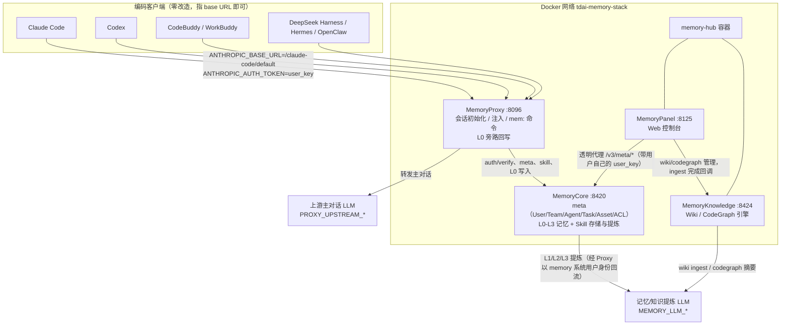
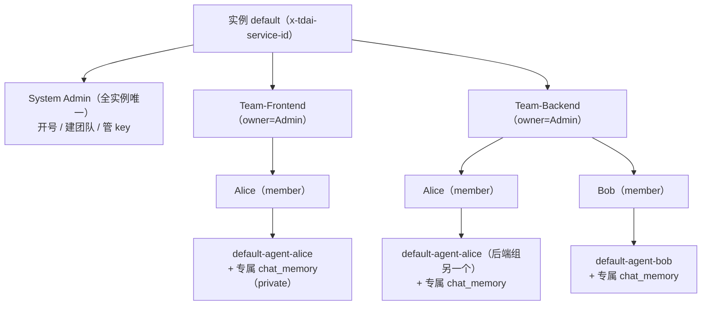
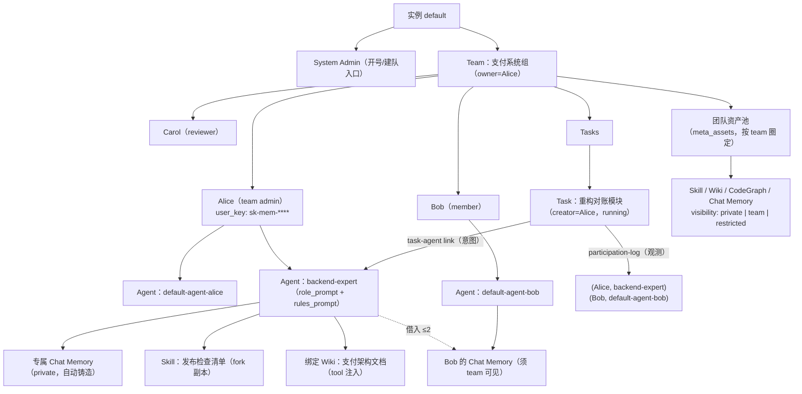
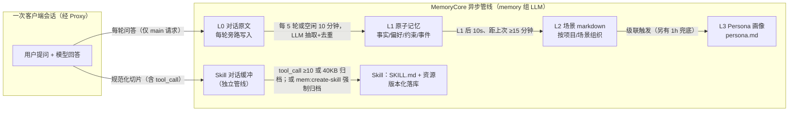

# TencentDB Agent Memory 上游能力调研报告（部署 / 团队 / 资产 / 记忆更新）

> 调研基线：`submodules/TencentDB-Agent-Memory`，上游 `TencentCloud/TencentDB-Agent-Memory` 默认分支 `feat/server_team` @ `97f9465`（`v2.0.1-beta.2` 之后 1 个文档提交，2026-08-15）。本地 `upstream` remote 已配置，三个上游分支（`main`、`feat/server`、`feat/server_team`）与全部 tag 已拉取，工作树已 fast-forward 到上游最新。
>
> 调研方法与验证状态：**Static**（纯源码 + 仓库文档静态调研，未启动任何服务）。所有断言以当前代码为准；文中 `文件:行号` 均为 submodule 内相对路径。与本仓库既有文档的关系：`docs/reference/tencentdb-agent-memory.md` 是 2026-08-10 基于 fork `c75ef58` 的架构参考快照，本报告不覆盖它，而是基于上游最新代码回答负责人提出的六个专题问题（部署方式、团队搭建模式、资产形式、管理员与成员差异、成员/Agent/Task 关系、记忆更新与管理入口）。

## 摘要

- 项目当前是一套多用户、多团队的 Agent 记忆中枢，分四个子系统：MemoryCore 记忆内核、MemoryProxy LLM 网关、MemoryPanel Web 控制台、MemoryKnowledge Wiki/CodeGraph 服务。客户端不用改造，把 Claude Code 等工具的 base URL 指向 Proxy 就能接入。
- 部署主路径是 `deploy/global-images` 一键拉起 Docker Hub 现成镜像三件套；另有单独部署 Hub、各模块本地 build、源码直跑、OpenClaw/Hermes 插件、SDK 直连等共七条路径（其中一条是仅存于旧文档的历史形态）。
- 组织模型：每个实例只有一个 System Admin，负责开号与建团队入口；团队内角色分 `admin / member / reviewer`；Agent 和 Task 都是 owner/creator 制。没有脱离团队的"个人资产"，个人与团队之分靠资产可见性（`private / team / restricted`，另有 `agent / task` 两档预留）表达。
- 记忆自动沉淀为四类资产（Chat Memory L0-L3、Skill、Wiki、CodeGraph），经 Fixed Binding 加 ACL 装配给 Agent。对话内可以读记忆（6 个只读工具）、触发 Skill 提炼（`mem:create-skill`）；编辑、删除、共享、构建知识库这类治理操作只能走 Web Panel 或 API，对话内的工具白名单不放行写操作。
- 几处边界要留意：资产审核工作流（`candidate/approved` 状态）只有枚举没有实现；`reviewer` 角色是半成品；根目录 `README.docker.md`/`README.deployment.md` 是 v1 旧文档，与当前树不符；有几处前端按钮可见性宽于内核的权限裁决。

---

## 1. 上游三个分支与产品形态

三个分支是并行维护的三条产品线，互不为祖先、各自有独立的同步提交，不是同一产品的三个开发阶段：

| 分支 | 形态 | 顶层结构 | 适用场景 |
| --- | --- | --- | --- |
| `main` | 单包插件形态（v0.x/v1.x 血统）：OpenClaw / Hermes 插件 + npm 包 `@tencentdb-agent-memory/memory-tencentdb`，本地 SQLite，聚焦"符号化短期记忆 + 分层长期记忆" | 顶层直接是 `src/`、`index.ts`、`openclaw.plugin.json`、`hermes-plugin/`、`bin/` | 单人单机，给 OpenClaw/Hermes 增强记忆 |
| `feat/server` | standalone 单用户 Server 版：Memory Gateway 独立进程（本地 `SQLite + BM25`），Docker Hub 有现成镜像 `agentmemory/hermes-memory` / `agentmemory/openclaw-memory`，配套 v2 SDK | 在 main 基础上增加 `sdk/`、`tdai-gateway.standalone.yaml`、`openclaw-plugin/` | 单人但想把记忆放独立服务/容器 |
| `feat/server_team`（默认分支，v2.0.x） | Team Memory 团队版：完整拆分为 `MemoryCore` / `MemoryKnowledge` / `MemoryPanel` / `MemoryProxy` 四子系统 + `deploy/` + `INSTALL_CN.md`，多用户、多团队、Web 控制台、多客户端经 Proxy 接入 | 四子系统目录 + `deploy/` + `sdk/` | 团队共享记忆，本报告调研主体 |

以下各节均基于 `feat/server_team` @ `97f9465`。

## 2. 部署与运行方式

### 2.1 方式总览

| # | 方式 | 镜像/代码来源 | 适用场景 |
| --- | --- | --- | --- |
| 1 | `deploy/global-images` 一键三件套（官方推荐主路径） | Docker Hub 在线拉取 `agentmemory/memory-core`、`agentmemory/memory-hub`、`agentmemory/memory-proxy`（`:latest` 或版本 tag，multi-arch amd64+arm64，公开免登录；腾讯内网备选 `mirrors.tencent.com/memory-team-control/*`） | 单机完整体验团队记忆 |
| 2 | 只装 Memory Hub（`agentmemory/memory-hub`） | Docker Hub 在线拉取 | 本机已有 Memory Core（8420），或对接云上 Memory 实例 |
| 3 | 各子系统单独 Docker（本地 `docker build`） | 各目录 Dockerfile | 定制单模块、开发调试 |
| 4 | 源码直跑（Node.js ≥ 22，不用 Docker） | 仓库源码 | 开发、二次开发 |
| 5 | OpenClaw npm 插件（两种）/ Hermes 插件 | npm 包 + 安装脚本 | 插件生态用户，不经 Proxy |
| 6 | SDK 直连（TypeScript / Python） | npm / pip 包 | 自研 Agent 或应用直接调 `/v3` API |
| 7 | （历史）K8s / Service 模式（TCVDB+COS+Redis） | `README.deployment.md` 描述 | 旧版 v1 文档，引用的部署清单在当前树中已不存在，标记"待验证"，不可按文档复现 |

### 2.2 方式 1：一键三件套（在线拉取 Docker 镜像）

```bash
git clone https://github.com/TencentCloud/TencentDB-Agent-Memory.git
cd TencentDB-Agent-Memory/deploy/global-images
cp .env.example .env
$EDITOR .env       # 填两组 LLM 参数（见下）
./verify.sh        # 可选：干跑校验，含真实 LLM 通路预检（--skip-llm 跳过）
./start-all.sh     # 一键起 3 个容器；PULL=1 可强制拉最新镜像
# 打开 Panel: http://localhost:8125
# 停止:      ./stop-all.sh          （保留数据卷）
# 彻底清理:  ./stop-all.sh --purge  （删卷+网络+.admin-key+生成的配置）
```

必填的两组 LLM 参数（`deploy/global-images/.env.example:34-45`）。两组可以是相同或完全不同的供应商，官方建议 memory 组用便宜模型、proxy 组用强模型：

- memory 组（记忆/知识提炼用，供 memory-core + memory-hub）：`MEMORY_LLM_BASE_URL` / `MEMORY_LLM_API_KEY` / `MEMORY_LLM_MODEL` / `MEMORY_LLM_PROTOCOL`（openai|anthropic）
- proxy 组（转发用户主对话的上游）：`PROXY_UPSTREAM_URL` / `PROXY_UPSTREAM_API_KEY` / `PROXY_UPSTREAM_MODEL`

`start-all.sh` 的完整流程（`deploy/global-images/start-all.sh:20-59`）：

1. 校验 `.env` 全部必填项，缺一不起；
2. 起 `tdai-memory-core`（8420）：从 `.env` 生成 gateway 配置挂入容器（`storeBackend: sqlite`、`embedding.provider: none` 即 BM25 召回），等健康后，首次启动生成随机 admin user_key（`sk-mem-<32 位>`），调 `POST /v3/internal/meta/user/init-admin` 创建全实例唯一的 System Admin，key 持久化到宿主 `deploy/global-images/.admin-key`；
3. 起 `tdai-memory-hub`（8125 Panel + 8424 Knowledge，单容器双进程）；
4. 起 `tdai-proxy`（8096，auth/sessionInit/injection 全开）；
5. 结束打印可直接复制的 Claude Code 一行命令（`start-all.sh:44-56`）：

```bash
export ANTHROPIC_BASE_URL=http://127.0.0.1:8096/claude-code/default
export ANTHROPIC_AUTH_TOKEN='sk-mem-<随机32位>'   # 即 .admin-key 内容
claude --model <PROXY_UPSTREAM_MODEL>
```

默认端口与持久化：

| 服务 | 宿主端口 | 用途 | 数据卷 |
| --- | --- | --- | --- |
| Memory Core | 8420 | 记忆内核 gateway（记忆读写、鉴权、skill、`/v3/meta/*`） | `tdai-memory-core-data` → `/data/tdai-memory`（SQLite + 记忆文件） |
| Panel UI | 8125 | 团队记忆管理面板（Web 登录入口） | `tdai-panel-data` → `/data/knowledge` |
| Knowledge | 8424 | Wiki / CodeGraph 服务（Swagger 在 `/docs`） | 同上（SQLite、git clone、wiki 文件） |
| Proxy | 8096 | LLM 请求代理（Anthropic/OpenAI 双协议） | 无状态（会话绑定存 Redis/KV 文件） |

### 2.3 方式 2-4：单独 Hub、单模块 Docker、源码直跑

- 只装 Hub：`docker run agentmemory/memory-hub`，用 `REMOTE_INSTANCE_URL` 指向已有 Core（如 `http://host.docker.internal:8420`），加 `LLM_MODE=custom` 与 LLM 三件（`INSTALL_CN.md:211-236`）；对接云实例时改挂 `metadata-instances.json`。
- 单模块本地 build：四个目录各有 Dockerfile。注意独立形态端口与 hub 合并形态不同：Panel 独立 8123（hub 内 8125）、Knowledge 独立 8421（hub 内 8424）。MemoryProxy 的上游 URL/key 只从挂载的 `config.yaml` 读取，不认环境变量（`MemoryProxy/README_CN.md:255-278`）。
- 源码直跑（Node.js ≥ 22，Core 严格 ≥ 22.16）：

| 子系统 | 启动 | 端口 | 依赖 |
| --- | --- | --- | --- |
| MemoryCore | `npm install` 后 `TDAI_GATEWAY_CONFIG=$PWD/tdai-gateway.standalone.yaml node --import tsx src/gateway/server.ts`（另需 `TDAI_LLM_*` 三件） | 8420 | 仅需 OpenAI 兼容 LLM；数据落 `~/.memory-tencentdb/` |
| MemoryProxy | `npm run start:config`（读 `config.yaml`）；本地无 Redis 时配 `redis.enabled: false` + sqlite 存储 | 8096 | 已运行的 Core |
| MemoryPanel | 后端 `pnpm dev`（8123）+ 前端 `cd web && npm run dev`（Vite 5173） | 8123 / 5173 | 可达的 Core；用知识库时需 KS |
| MemoryKnowledge | `pnpm install --ignore-workspace && pnpm dev`；需 `KNOWLEDGE_PUBLIC_BASE_URL`（含 `/v3`）与 `TMC_CALLBACK_URL`（Panel 地址） | 8421 | LLM（`custom` 直连或 `proxy` 经 Proxy） |

### 2.4 方式 5-6：插件与 SDK

- OpenClaw 完整插件：`MemoryCore` 目录本身就是 npm 插件包（插件 id `memory-tencentdb`）。`mode: local/function` 时在 OpenClaw 进程内跑完整四层记忆管线（用宿主 LLM），`~/.openclaw/openclaw.json` 里 `{"memory-tencentdb": {"enabled": true}}` 零配置启用；`client/gateway` 模式连外部 Gateway。
- OpenClaw 轻量客户端插件（`MemoryCore/openclaw-plugin/`，插件 id `memory-tencentdb-client`）：不本地跑管线，经 SDK 连远端 Gateway，提供 `tdai_memory_search` 等工具。`bash MemoryCore/scripts/install-openclaw-plugin.sh` 安装，server 模式用 `TDAI_MEMORY_ENDPOINT/TEAM_ID/AGENT_ID/USER_ID` 等环境变量指定隔离三元组。
- Hermes 插件：Python thin client，自动拉起 Node Gateway sidecar 子进程（默认 127.0.0.1:8420）。
- SDK：TypeScript `@tencentdb-agent-memory/memory-sdk-ts`（当前树内实际包名带 `-v2` 后缀）与 Python `tencentdb_agent_memory`。v3 客户端要求 `teamId/agentId/userId` 三元组隔离，覆盖 L0-L3 读写、memory-prompt、memory-generation-log 等全部 `/v3` API。README 中的包名与树内 `package.json`/`pyproject.toml` 实名不一致，线上 npm/pip 实际可装版本待验证。

### 2.5 服务拓扑



提炼流量默认配置下由 Core 经 Proxy 的 `/proxy/<instanceId>/v1` 回流，以 memory 系统用户身份统一鉴权与计量，模型凭证只留在服务端（`MemoryCore/src/gateway/llm-resolver.ts:42-98`）。

### 2.6 各客户端接入方式速览（`INSTALL_CN.md`）

统一模式：base URL = `http://<proxy>:8096/<agent-source>/<spaceId>`（本地 spaceId 固定 `default`），API key = 成员的 `sk-mem-*` user_key。首轮会话 Proxy 伪造表单让用户选 Team → Agent → Task，之后每轮自动注入记忆/Skill/知识工具。

| 客户端 | 协议 | 配置载体 |
| --- | --- | --- |
| Claude Code | Anthropic Messages | 环境变量 `ANTHROPIC_BASE_URL`（`/claude-code/default`）+ `ANTHROPIC_AUTH_TOKEN` |
| Codex CLI | OpenAI Responses | `~/.codex/config.toml` 自定义 provider（`wire_api="responses"`）；首次对话须先切 Plan 模式完成表单 |
| CodeBuddy | OpenAI Chat | `~/.codebuddy/models.json`（版本 ≥4.10.5 或 ≤4.10.1） |
| WorkBuddy | OpenAI Responses | `~/.workbuddy/models.json` |
| DeepSeek Harness (dsh) | OpenAI Chat | `~/.dsh/settings.yaml`（baseURL 结尾不能带 `/v1`） |
| Hermes / OpenClaw | OpenAI Chat | 各自 config 加 provider；用 `x-team-id/x-agent-id/x-task-id/x-conversation-id` 静态 header 免表单直登 |
| 其他平台 | 任一 | 伪装成上述 agent-source，必带 Bearer user_key + 四个身份 header |

## 3. 身份模型与团队搭建模式

### 3.1 身份与凭证：只有 user_key

- 唯一的用户凭证是 user_key（`sk-mem-` + 24 字节随机数，`MemoryCore/src/metadata/utils/crypto.ts:21-23`）。没有账号密码、没有 OAuth、没有服务端 Session。Panel 的"登录"就是选实例、粘贴 user_key、`POST /v3/meta/auth/verify` 校验通过后存进浏览器 localStorage（`MemoryPanel/web/src/lib/api/auth.ts`）。
- 一把 key 对应一个 User，不对应 Agent。每用户可持多把（默认上限 20），支持过期与吊销；明文只在创建时返回一次，之后仅显示掩码（`MemoryCore/src/metadata/utils/user-key.ts`）。
- Proxy 侧：客户端把 user_key 放 `Authorization: Bearer`，每个请求实时调内核 `auth/verify` 换 user_id（`MemoryProxy/src/auth.ts:53-119`）。Panel 侧：后端是无状态透明代理，每次转发都带用户自己的 key，权限裁决全部发生在内核。

### 3.2 角色体系：两层三值

| 层 | 角色 | 来源 |
| --- | --- | --- |
| 全局（每实例） | `system_admin` / `normal`（`UserType`，`MemoryCore/src/metadata/types.ts:16`） | DB 部分唯一索引保证每实例只有一个 system_admin（`sqlite-adapter.ts:143`），由首启 `init-admin` 创建 |
| 团队内 | `admin` / `member` / `reviewer`（`TeamRole`，`types.ts:18`） | `meta_team_members` 按 `(team_id, user_id)` 唯一，一人多团队、每团队角色独立 |

几处容易误判的行为，均为代码证实：

1. System Admin 的特权只在用户域：开号（`user/create`、`user/create-with-key`）、删号、跨团队列用户、管理任意人的 user_key。团队域的断言不给 system_admin 短路，它若不是某团队的 admin 成员，同样被 403（`metadata-service.ts:1664-1669`）。前端把"新建团队"按钮只给全局 admin 显示，但后端 `team/create` 本身对任何登录用户开放（owner 必须写自己）。
2. Team owner 恒为 team admin：建团队时同事务把 owner 以 `role="admin"` 写入成员表；owner 不可被降级、不可被移除（`metadata-service.ts:811-814,1744-1752`）。
3. `reviewer` 是半成品角色：后端资产权限与 member 完全等价（无专属分支），仅前端隐藏"成员管理"菜单；差异化需显式发 `team_role=reviewer` 的 ACL。
4. 团队角色变更没有独立 API：`team-member/add` 是 upsert 语义（`ON CONFLICT DO UPDATE SET role`），但当前 UI 的角色下拉固定为 `member` 且禁用（`MemberSection.tsx:390-400`）。提升某人为 team admin 目前只能直接调 API。
5. System Admin 账号对其他用户隐身：`user/list`、`user/get` 对非本人隐藏 system_admin 条目。

### 3.3 团队搭建链路（谁、用什么、做什么）

```text
前端 React（携带用户自己的 X-Tdai-User-Key）
  → Panel 后端 /api/v1/meta/{action}（透明代理 + 同名查重）
    → 内核 /v3/meta/*（Zod 校验 + 角色断言，最终裁决）
```

标准建队流程（对应 API）：

1. System Admin `user/create`（或 `user/create-with-key` 指定 key）开号，拿到 user_id 和一次性明文 user_key，线下发给成员；
2. 任意用户（实际入口给了 admin）`team/create` 建团队，owner 自动成为 team admin；
3. Team admin `team-member/add {user_id, role}` 拉人（默认 `member`）。每次入队自动为新成员在该团队创建一个 `default-agent-<username>`，Panel 再异步为其导入预置 Skill（`metadata-service.ts:827-858`、`proxy.ts:182-268`）；
4. 成员用自己的 user_key 登录 Panel、配置编码客户端，开始工作。

配额：每实例默认 ≤500 用户、≤100 团队（可配置覆盖）；无每团队 Agent/Task 数量上限。

### 3.4 一个最小的"多团队建设"案例

目标：1 个实例里建 2 个团队，同一成员跨团队复用，验证隔离与角色独立。共 3 个人：Admin（system_admin）、Alice、Bob。

```bash
# 0) ./start-all.sh 首启自动完成：创建 system_admin（key 在 .admin-key）
#    并自动生成 default-team + default-agent-admin
# 以下操作均可在 Panel UI 完成，等价 API 如下（Header 带各自 user_key）：

# 1) Admin 开两个号（仅 system_admin 可做）
POST /v3/meta/user/create        {"username":"alice"}   # → 返回 alice 的 user_key（仅此一次明文）
POST /v3/meta/user/create        {"username":"bob"}

# 2) Admin 建两个团队（owner 自动成为该团队 admin）
POST /v3/meta/team/create        {"name":"Team-Frontend","owner_user_id":"<admin>"}
POST /v3/meta/team/create        {"name":"Team-Backend","owner_user_id":"<admin>"}

# 3) 拉人：Alice 进前端组，Bob 进后端组，Alice 同时以 member 身份进后端组（多团队）
POST /v3/meta/team-member/add    {"team_id":"<frontend>","user_id":"<alice>","role":"member"}
POST /v3/meta/team-member/add    {"team_id":"<backend>","user_id":"<bob>","role":"member"}
POST /v3/meta/team-member/add    {"team_id":"<backend>","user_id":"<alice>","role":"member"}
# （如需让 Alice 管理前端组：再调一次 add 传 role:"admin"，upsert 生效；当前 UI 不提供该入口）

# 每次 add 成功都会自动生成 default-agent-alice / default-agent-bob（各团队一个）
```



隔离要点：Alice 在两个团队各有独立的 Agent 与记忆资产；所有资产/Agent/Task 都挂 `team_id`，权限判定按"该资产所在团队里 caller 的 membership"进行，跨团队零渗透；资产绑定强制同团队（`permission-checker.ts:159-171`）。

### 3.5 Team Admin 与普通 Member 的完整差异

后端强制（内核裁决，前端只是可见性）：

| 操作 | System Admin | Team Admin | Member | Reviewer |
| --- | --- | --- | --- | --- |
| 开号 / 删号 / 管他人 user_key | ✅（唯一入口） | ❌ | ❌ | ❌ |
| 建团队 | ✅（UI 入口） | ✅（API 层任何人可建，owner 写自己） | 同左 | 同左 |
| 团队 update / delete | 仅当其为该团队 owner/admin | ✅ | ❌ | ❌ |
| 加/移成员、改成员角色（upsert） | 仅当其为该团队 admin | ✅（不能动 owner，不能对自己） | ❌ | ❌ |
| 列团队成员（user/list + team_id） | ✅ 全量 | ✅ 全量可过滤 | 只见自己 | 只见自己 |
| 创建 Agent / Task | 须为该团队成员 | ✅（owner/creator 写自己） | ✅ | ✅ |
| 修改/删除他人的 Agent / Task / 资产元数据 | ❌（仅 owner/creator） | ❌（仅 owner/creator） | ❌ | ❌ |
| 读他人 `visibility=team` 资产 | 须为成员 | ✅ | ✅ | ✅ |
| 写/分配/共享他人 `team` 资产（角色默认） | 须为 admin 成员 | ✅（`read/write/assign/share`） | ❌（仅 `read`） | ❌（同 member） |
| 读他人 `private` 资产 | ❌ | ❌（admin 也不行） | ❌ | ❌ |
| 读他人 `restricted` 资产 | 走角色默认 | ✅ | 仅显式 ACL 命中 | 仅显式 ACL |
| 查看资产 ACL 清单 | owner 或 admin | ✅ | 仅自己 owner 的 | 同 member |
| 替他人补参与日志 | 须为 admin | ✅ | ❌ | ❌ |

这套权限的设计取向是 owner 制重于角色制：Agent/Task/资产的写权限只认 owner/creator；team admin 多出来的是成员管理、团队级共享资产的读写分配和可见性审计，接管不了成员的私有物。`private` 严格到连 team admin 都不可见（2026-07 收紧，`permission-checker.ts:66-82`）。

已知的前后端口径差异（前端按钮可见 ≠ 内核放行，实际操作会 403）：前端允许 team admin 删除他人 Agent、允许任意成员编辑 Task，内核分别只认 agent owner 与 task creator。

## 4. 团队成员、Agent 与 Task 的关系

### 4.1 三个实体

- 成员（User）：真人，持 user_key，可属多团队，每团队一个角色。
- Agent：成员在某团队内的"分身"，即角色化的工作单元。严格单团队、owner 制（创建后不可转让）；字段含 `name / description / prompt`（角色定位与规则两段拼接）。没有模型配置、没有独立密钥，模型由 Proxy 统一决定，身份靠成员的 user_key。入队自动获得 `default-agent-<username>`；每个 Agent 创建时自动铸造专属 Chat Memory 资产 `chat_memory-{team_id}-{agent_id}`，一个 Agent 对应一份记忆。
- Task：团队协作单元，creator 制；状态刻意简化为二态 `running | completed`；没有 assignee 字段。它与 Agent 的关联走两套并行语义：
  - `task-agent/link`（意图）：creator 手工声明"哪些 Agent 该干这个任务"（须同团队）；
  - `participation-log`（观测，append-only）：Proxy 在每次会话初始化完成时自动记一条 `(team, task, agent, user)`，即"谁实际用哪个 Agent 对这个任务开过工"。

### 4.2 客户端会话如何绑定到这套模型

一次 Claude Code 会话的身份链（`MemoryProxy/src/session/claude-code/init.ts`）：

1. `ANTHROPIC_AUTH_TOKEN`（= user_key）→ `auth/verify` → user_id；
2. 首条消息被 Proxy 拦截，伪造 AskUserQuestion 表单四问：是否关联团队资产 → 选 Team → 选 Agent → 选 Task（单一候选自动跳过；也可用 `x-team-id/x-agent-id/x-task-id` header 免表单）；
3. 候选 Agent 只列"自己 owner 的"（`meta/client.ts:230-238`），Task 列团队全部 running 任务。Team、Agent、Task 三者齐全才注入记忆，缺 Task 则整体旁路（`init.ts:444-467`，可选配"本次不关联任务"虚拟项）；
4. 绑定完成 → 每轮注入 `<session_context>`（Agent 的 prompt + Task 的标题描述）→ 追加参与日志 → 本轮问答旁路写入 L0，Skill 切片带全五元 id `(session, space, user, team, agent, task)`。

所以在产品语义上，Agent 不是共享执行体，而是"成员×团队"的记忆载体。共享发生在记忆层（他人 Agent 的 team 级 Chat Memory 可"借入"，见第 5 节），而不是共用同一个 Agent。

### 4.3 Workbench（工作台）

- Panel 首页即工作台：任务卡片网格（非多列看板）+ 详情抽屉。卡片显示状态、参与人数、实际参与 Agent 数（均来自参与日志去重）；服务端分页，聚合接口 `task/list-with-agents` 消 N+1。
- 详情抽屉可改标题/描述（内核仅 creator 放行）、二态切换、删除；创建弹窗不选 Agent（关联后置）。
- Task 完成没有"结算成资产"的钩子。资产沉淀是过程性的，对话进行中持续发生；`task_id` 作为审计字段落在 Skill 行与记忆记录上，支持事后溯源"这条经验产自哪个任务"。

### 4.4 一个团队的组织架构示例



## 5. 记忆资产：团队资产与个人资产

### 5.1 归属模型：没有"团队之外的个人资产"

所有资产统一登记在内核 `meta_assets` 一张表（`team_id` NOT NULL、`owner_user_id` NOT NULL），必须挂在某个团队下。"个人 vs 团队"由 `visibility` 字段表达，不由归属结构表达（`MemoryCore/src/metadata/store/sqlite-adapter.ts:230-250`）。前端把它折叠为两档 scope：`private`（个人）/ `team`（团队）。

可见性五档。代码枚举比 README 的四档多一个 `task`；`agent`/`task` 两档当前无生产创建入口，属预留：

| visibility | 语义 | 备注 |
| --- | --- | --- |
| `private` | 严格仅 owner，team admin 也不可见 | Chat Memory / Skill 自动登记的默认值 |
| `team` | 团队共享；角色默认 admin=`read/write/assign/share`，member/reviewer=`read` | Wiki / CodeGraph 登记的默认值 |
| `restricted` | 非 admin 仅显式 ACL 白名单可用 | ACL 主体：`user / team_role / agent` × 动作 `read/write/delete/assign/share/use` |
| `agent` | 预留（判定同 team） | 无创建入口 |
| `task` | 预留（非 admin 只读） | 无创建入口 |

写操作权限（内核强制）：资产元数据 update/delete/改可见性/touch-usage 仅 owner；ACL grant/revoke 仅 owner；ACL list 为 owner 或 team admin。

### 5.2 四类资产形式总表

| 资产类型（id 前缀） | 数据形式 | 主要用处与特点 | 归属与可见性 | 挂载/装配到 Agent | 更新/维护方式 |
| --- | --- | --- | --- | --- | --- |
| Chat Memory（`chat_memory-{team}-{agent}`，手工块 `mem-*`） | 四层：L0 原始对话（表）、L1 原子记忆（表+检索索引）、L2 场景 markdown 文件、L3 `persona.md` 画像；一个 Agent 一块 | 跨会话记住偏好/事实/决策/项目场景；注入时 L3 全文 + L2 索引，L0/L1 靠工具按需查 | 团队内，owner=agent owner；自动创建默认 `private`，owner 可切 team 共享 | 自有块创建时自动绑定且不可解绑；他人 team 共享块可借入（上限 2 个、须同团队）；对话中经 6 个只读记忆工具检索 | 对话自动逐层蒸馏（默认每 5 轮或空闲 10 分钟触发 L1，级联 L2/L3）；Panel 导入历史会话（≤100 条/次）；owner 可在 Panel 逐条编辑/删除 L1-L3、批删 L0/L1、`clear` 清空内容但保留资产壳 |
| Skill（`skl-*`） | `skills` 表多版本不可变快照：SKILL.md 正文 + manifest + 版本化资源目录（≤50MB）；FTS+向量索引 | 可复用的操作经验（SOP 型/背景型/偏好型三类均可），运行时注入 `<available_skills>` 清单，命中即强制 `skill_view` 加载 | 团队内，数据面归属到 owner agent；自动提炼默认 `private`，owner 可切 team | 不走绑定走 fork：把 skill 复制成 `owner_agent_id`=目标 Agent 的独立副本（记 `forked_from` 血缘）；因为运行时按 owner_agent 过滤 | 三种来源：目录导入 / 对话自动提炼（tool_call ≥10 或 40KB 归档触发）/ `mem:create-skill` 或 Panel 手动提炼；更新 = version+1 快照 + 乐观锁；导出 zip；删除 = 软删 + meta 级联 |
| Wiki（`wiki-*`） | KS 侧：raw 源文件 + LLM 生成的结构化页面（wikilink 图谱）+ 每 wiki 私有 SQLite 索引（FTS5 + graph） | 文档类团队知识；Agent 经 `<knowledge_tools>` 两步自发现（tools/list → tools/call），7 个只读工具（search/read_page/get_graph 等），不整库注入 | 团队内，owner=创建人；登记默认 `team` | Panel 上 allocate → `agent-fixed-asset/set`（`tool` 型注入）；unbind 移除；ready 状态才注入 | 上传文本文件（单文件 ≤512KB、单次 ≤10 个）→ 手动点"开始抽取"（ingest：`draft→pending→processing→ready/failed`，version+1，按 sha256 增量跳过未变源）；可直接改单页；不支持 URL/git 作为源 |
| CodeGraph（`cg-*`） | KS 侧：git 浅克隆 + 预建代码图谱（文件/符号/调用关系），带 repo/branch/commit/stats | 代码结构知识；9 个只读工具（search/explore/callers/callees/impact 等），改代码前查影响面 | 同 Wiki（登记默认 `team`） | 同 Wiki（`tool` 型绑定） | create 即入队建图；手动 sync（git fetch 增量，失败回退全量）；可选定时自动 sync（默认关，10 分钟扫描间隔）；当前仅支持公开 HTTPS git 仓库（SSH/私有仓库 coming soon） |

统一机制：四类资产的归属/可见性/状态在 `meta_assets`，Agent 装配在 `meta_agent_fixed_assets`（Fixed Binding：`injection_mode` + `priority`），授权在 `meta_asset_acl`。这就是 README 所说的 "Fixed Binding + ACL"。

### 5.3 装配与共享的三种机制（按资产类型分流）

1. Chat Memory 走借入（import）。他人把自己 Agent 的记忆切到 `team` 可见后，你可以把它"借入"自己的 Agent（上限 2、同团队、不可借自己的）；检索时 fan-out 到 `[self, ...imported]` 多个上下文并标注来源；对方切回 private 后靠读侧过滤失效。读可借入，写仅 owner。
2. Wiki / CodeGraph 走引用绑定（allocate）。团队成员把 ready 的知识资产 allocate 给自己 owner 的 Agent，注入为工具清单。
3. Skill 走 fork 复制。运行时按 `owner_agent_id` 过滤，因此共享等于 fork 一份归属目标 Agent 的副本（保留血缘），而不是引用。

## 6. 记忆如何产生、注入与更新到知识库

### 6.1 对话 → 记忆的自动流水线



要点，均为代码证实：

- 只有主对话（`main`）写 L0；客户端后台自发的 fork/sidequery 请求跳过副作用。首轮写入时自动登记该 Agent 的 chat_memory 资产并绑定。
- 触发参数默认：`everyNConversations=5`（含冷启动 warmup 1→2→4→5）、`l1IdleTimeoutSeconds=600`、`l2DelayAfterL1Seconds=10`、`l2MinIntervalSeconds=900`、`l2MaxIntervalSeconds=3600`（`MemoryCore/src/config.ts:562-570`）；worker 经 Redis Stream 竞争消费，agent 级分布式锁防并发撞写。
- L2/L3 提炼器是带文件工具的 LLM agent：L2 在沙箱目录里自主读写场景 md 文件；L3 增量读"上次以来变化的场景"重写 persona.md。
- Skill 提炼是另一条独立管线：round 切片进缓冲，达阈值归档后由 review-prompt 驱动的 LLM 直接调 skill 工具落库（"存疑默认捕获"，密钥/裸日志/一次性状态不捕获）。没有人工审核环节，治理靠 review prompt、版本化和 `protected` 标记。

### 6.2 记忆 → 下一次对话（注入与工具）

- 静态注入（会话初始化时缓存，保 KV cache 字节稳定）：`<tdai_profile_memory>`（自己 + 借入 Agent 的 L3 全文 + L2 场景索引）、`<available_skills>` 清单、`<knowledge_tools>` 资源清单、`<session_context>`（Agent prompt + Task 描述）。
- 动态工具（LLM 用 curl 调用，只读白名单）：
  - 记忆 6 件：`tdai_memory_search / tdai_atomic_query / tdai_conversation_search / tdai_conversation_query / tdai_scenario_ls / tdai_read_scene`（memory-bridge 强制从会话反查身份并覆写 body 的 user/team/agent id，防伪造；写操作一律不放行）；
  - Skill：读恒开（`skill_search/skill_view/skill_files_read/skill_extract`），写默认关（`skillRuntime.allowLlmWrite=false` 时提示"联系管理员"）；
  - Wiki 7 件 + CodeGraph 9 件：经 KS `/v3/tools/list` → `/v3/tools/call` 两步自发现；管理操作（create/delete/ingest/sync）不暴露给对话。

### 6.3 知识库（Wiki / CodeGraph）的构建与更新

- Wiki：Panel 建壳（即登记 meta 资产，默认 team 可见）→ 上传文本源文件 → 手动"开始抽取"（ingest）→ KS 状态机 `pending→processing→ready/failed`，进度实时回调 Panel 显示。ready 回调是注入的唯一闸门：Panel 收到 ready 才写内核知识明细，注入器才可见。再次上传或修改源后重新 ingest 即增量更新（sha256 未变的源跳过 LLM）；也可直接编辑、删除单个页面。
- CodeGraph：填公开 HTTPS git 仓库 + 分支 → 自动克隆建图；更新靠手动 sync 或可选的定时自动 sync（默认关闭）。
- 两者的 ingest LLM 按实例路由：`proxy` 模式（经 MemoryProxy 计量）或 `byo` 自带 key。

### 6.4 管理入口矩阵：网页 / 对话 / API 分别能做什么

三类入口的分工：Web Panel 是全功能治理入口，普通成员就能管理自己名下的一切；Agent 对话内可以读记忆、触发提炼、刷新注入，做不了治理类修改；HTTP API/SDK 覆盖全部能力，包括两个尚无 UI 的新模块。

| 操作 | Web Panel（页面） | Agent 对话内 | HTTP API / SDK | 所需身份（内核/Panel 强制） |
| --- | --- | --- | --- | --- |
| 导入历史会话 → 记忆 | ✅ Chat Memory 页「导入」（≤100 条/次） | —（正常对话即自动沉淀） | `/v3/conversation/add`；SDK；Opik 导入脚本 | agent owner |
| 查看四层记忆 | ✅ Chat Memory 页分层浏览 | ✅ 6 个只读记忆工具 | `/v3/{conversation,atomic}/query\|search` 等 | owner / team 共享 / 借入方 |
| 编辑、删除记忆条目 | ✅（L1 逐条改、L2 覆写、L3 整份改、L0/L1 批删） | ❌（bridge 只读白名单） | `/v3/atomic/update` 等 | 仅 owner |
| 清空整块记忆（保留资产壳） | ✅ `clear` | ❌ | `/v3/chat-memory/clear` | 仅 owner |
| 记忆共享 / 借入 | ✅ 切 private/team、借入他人记忆（≤2） | ❌ | meta `asset/update`、`agent-fixed-asset/set` | 切换=资产 owner；借入=agent owner |
| 提炼 Skill | ✅ Skills 页「对话导入」 | ✅ `mem:create-skill [提示词]` 或 LLM 调 `skill_extract` | `/v3/skill/extract`、force-archive | 会话本人 / agent owner |
| 编辑 / 删除 / Fork / 导出 Skill | ✅ Skills 页全功能 | 读 ✅；写默认 ❌（`allowLlmWrite` 开关） | `/v3/skill/*` 14 端点 | 写=owner agent |
| 构建 Wiki（建壳/传源/抽取） | ✅ Wiki 页（进度条） | ❌（工具白名单无管理操作） | KS `/v3/wiki/*` 15 端点 | 建=团队成员；ingest/删=有 `write` ACL（member 即可，无 admin 门槛） |
| 更新 Wiki（重 ingest / 改页） | ✅ | ❌ | 同上 | 同上 |
| 建 / 同步 CodeGraph | ✅ Code 页 | ❌（工具只读查询） | KS `/v3/code-graph/*`；auto-sync 环境变量 | 建=团队成员；sync/删=write ACL |
| 绑定知识资产 → Agent | ✅ Agent 编辑弹窗 / 资产页 allocate | ❌ | meta `agent-fixed-asset/set` | agent owner |
| 刷新本会话注入缓存 | — | ✅ `mem:sync` | `POST /v3/session/refresh-cache`（Proxy） | 会话本人 |
| 查看帮助 | — | ✅ `mem:help` | — | 会话本人 |
| 建团队 / 开号 / 发 key | ✅（入口仅 System Admin 可见） | ❌ | `/v3/meta/user/*`、`team/*` | 开号=system_admin；建队=任意（UI 收敛给 admin） |
| 自定义 L1/L2/L3 提炼 prompt（instance/team/agent 三级） | ❌ 暂无 UI | ❌ | `/v3/memory-prompt/*` 7 端点；TS/Py SDK | gateway 级凭据（管理员运维面） |
| 记忆生成溯源日志（哪次提炼、用哪版 prompt、输入输出引用） | ❌ 暂无 UI | ❌ | `/v3/memory-generation-log/list\|get`；SDK | 同上 |

对话内命令（mem-command）的完整语法（`MemoryProxy/src/mem-command/parser.ts`）：整条消息以 `mem:` 开头（大小写不敏感），命中即由 Proxy 直接应答，零上游 token。当前共 3 条：`mem:help`（帮助）、`mem:sync`（重拉 Agent/Task 详情并重跑全部注入缓存）、`mem:create-skill [可选提示词]`（立即归档当前对话触发 Skill 提炼）。普通成员即可使用，无额外权限门槛。

"普通成员和管理员分别怎么管知识更新"这个问题的答案：知识更新本身不是管理员特权。member 就能建 Wiki/CodeGraph、上传源、触发 ingest、提炼 Skill、管理自己 Agent 的记忆；team admin 多出来的是对他人 team 级资产的 `write/assign/share` 角色默认和成员管理；System Admin 只握开号与建队入口。网页登录（Panel + user_key）与 agent 对话两种方式都可用，分工如上表：对话侧偏使用与沉淀，网页侧偏治理与审核。

### 6.5 安全信任模型的一个重要注意点

内核 L0-L3 数据面与 `chat-memory/clear`、`memory-prompt` 等接口把 `Bearer <gateway key> + x-tdai-service-id` 视为可信管理员级凭据，不做用户级鉴权；"仅 Owner 可操作"的语义是 Panel 后端在转发前完成的（`MemoryCore/src/gateway/chat-memory-handlers.ts:13-22` 注释明确该信任模型）。直接持有 gateway key 的调用方可以绕过 Owner 校验，企业部署时 gateway key 必须当成最高运维凭据管理。

## 7. 能力边界与文档/实现不一致清单

调研中确认的滞后、预留与偏差，引用该项目能力时须注意：

1. 根目录 `README.docker.md` / `README.deployment.md` 是 v1 旧文档：引用的 `MemoryCore/deploy/k8s/`、`docker-compose.local.yaml`、Service 模式（TCVDB+COS+Redis+Shark）等在当前树中不存在；K8s/云内形态标"待验证"。
2. 资产审核工作流未实现：`AssetStatus` 的 `candidate/approved` 全仓库无生产写入路径；Skill 对话提炼的注释明确"直接落库，不经过审核"。README 中"审核后分享给团队"目前实际是"owner 手动切 visibility"。
3. `reviewer` 角色是半成品：后端与 member 等价，仅前端藏菜单。
4. 可见性 `agent`/`task` 两档，以及 `auto_assign_floating_assets`、`confidence`、`expires_at`、`risk_level`、`role_in_task` 等字段已建模未闭环（存储即全部，无消费逻辑）。
5. 内核自动登记路径写入 `status:"active"`，不在 `AssetStatus` 枚举内（类型/Schema/DB 实值三方不一致）；实际消费按"非 archived/deprecated/failed 即活跃"的排除法。
6. 数处前端按钮可见性宽于内核裁决（team admin 删他人 Agent、任意成员编辑 Task，都会在内核 403）。
7. 团队角色提升无 UI（upsert API 可用但角色下拉固定 member）；删除团队无 UI（内核 API 存在且级联删成员/Agent/Task/资产）。
8. Proxy 调 `auth/verify` 不带 Bearer（源码遗漏，部署脚本注释确认），因此启用内核 Layer1 `MEMORY_CORE_GATEWAY_API_KEY` 会打断 Proxy 鉴权。一键部署默认将其留空。
9. SDK/npm 包名：README 写 `memory-sdk-ts` / `tencentdb-agent-memory-sdk-python`，树内实名带 `-v2` 后缀；npm/pip 线上实际可装版本待验证。
10. `feat/server_team` 相对 v2.0.1-beta 的最新增量（本次 fast-forward 带入）：`memory-prompt`（instance/team/agent 三级自定义提炼策略 + 防护栏注入）与 `memory-generation-log`（每次提炼的不可变溯源日志，含 prompt 版本 hash、输入/输出记忆引用）。两者 API/SDK 已就绪、Panel 无 UI。另有 Codex/WorkBuddy/dsh 三个新客户端通道与 Wiki ingest 增量优化。

## 8. 结论（对本仓库第一目标的参照意义）

- 部署：`deploy/global-images` 在线镜像路径已相当成熟（随机 admin key、健康检查、一行命令接入、purge 清理）。与本仓库现有 Docker-first SOP 的差距主要在版本基线：本报告基于的 `97f9465` 尚未经过本仓库任何 Runtime Gate，现有运行记录仍只证明其各自 pin 的 SHA。
- 团队共享演示：上游原生已覆盖"两个用户、独立 Agent/user_key、team 可见性授权、借入验证共享、private 反例隔离"的全部机制点，与本仓库 A/B 双客户端演示目标一一对应；`x-team-id` 等 header 直登方式适合 headless 自动化 Gate。
- 治理映射：负责人思想中的"身份颗粒度管理 / 按披露程度交流 / AI 初步生成 + 查询人决定颗粒 / MCP 登录与跨级调取"，前三条在上游分别对应 user_key+owner 制、五档 visibility+ACL、L0-L3 分层+借入只读。第四条上游走的是 Proxy 透明代理而非 MCP，这是与负责人思想的结构性差异，后续方案取舍需负责人确认。

---

*报告生成：2026-08-18。调研方式：5 路并行源码调研，另对 6 项关键断言做主线抽查（可见性枚举、system_admin 唯一索引、mem 命令表、L1 触发参数、start-all 输出命令、借入上限），全部与源码一致。*
