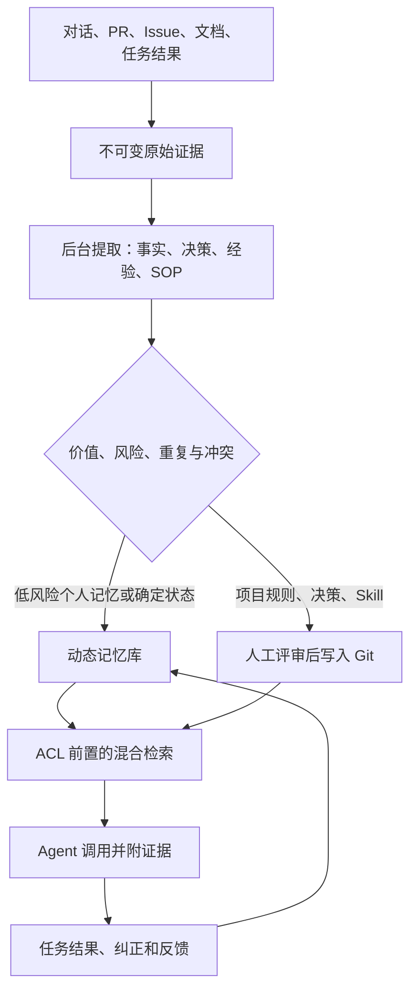

结论先行：公司需要建设的不是“把所有对话塞进向量库”，而是一个项目级“记忆控制面”：

> 原始证据 → 候选记忆 → 价值与风险判断 → 审核/晋升 → 权限检索 → 任务调用 → 用结果反向评价记忆。

截至 2026-08-03，没有一个开源项目同时把自动提取、团队治理、时间冲突、权限和结果价值学习都做完整。最稳妥的方案是：动态记忆库 + Git 审核知识库 + 统一 MCP/REST 调用层。

## 目前代表性尝试

| 项目 | 记忆方法 | 价值、提取和更新 | 团队适用性 |
| --- | --- | --- | --- |
| [Mem0](https://github.com/mem0ai/mem0)                                                                        | 从对话提炼原子事实，向量、BM25、实体、时间混合检索                                        | 实用的写入门槛是“未来有用、确实新增、具体事实、安全”；明确指出大部分对话应当零写入。当前 v3 自动提取为 ADD-only，显式 API 才负责更新/删除。[架构](https://github.com/mem0ai/mem0/blob/main/skills/mem0/references/architecture.md)、[筛选规则](https://github.com/mem0ai/mem0/blob/main/integrations/openclaw/skills/memory-triage/SKILL.md) | 用户、Agent、应用、会话范围较成熟；项目级审核、共享治理仍需应用层补齐                                                                                                                                            |
| [Letta Code](https://github.com/letta-ai/letta-code)                                                          | 后台 reflection Agent 从近期及历史会话提取纠错、偏好、项目事实和可复用流程，写入 Git 记忆文件系统       | 强调“泛化规律而不是复制事件”、去重、矛盾修正、归档和逐级披露。[reflection](https://github.com/letta-ai/letta-code/blob/main/src/agent/subagents/builtin/reflection.md)                                                                                                                                   | 很适合借鉴：组织拥有的共享 Git 记忆库可挂载给多个 Agent，每次修改有版本；用 `content_sha256` 做乐观并发控制。[共享记忆](https://github.com/letta-ai/letta-code/blob/main/src/skills/builtin/managing-shared-memory/SKILL.md) |
| [LangMem](https://github.com/langchain-ai/langmem)                                                            | 区分语义记忆、情景记忆、程序记忆；支持热路径和后台提取                                        | 可插入、更新、删除、合并；建议会话安静 30–60 分钟后异步反思，避免逐条消息产生碎片。[概念](https://github.com/langchain-ai/langmem/blob/main/docs/docs/concepts/conceptual_guide.md)、[延迟处理](https://github.com/langchain-ai/langmem/blob/main/docs/docs/guides/delayed_processing.md)                               | 灵活的开发工具箱，但租户权限、审核、版本和组织治理需要自行建设                                                                                                                                                  |
| [Graphiti](https://github.com/getzep/graphiti)                                                                | 时间知识图谱：实体、关系事实、原始 episode 和证据来源                                    | 事实带 `valid_at`、`invalid_at`、`expired_at`，新事实可使旧事实失效而不删除；适合动态状态和多跳关系。[数据结构](https://github.com/getzep/graphiti/blob/main/graphiti_core/edges.py)                                                                                                                            | 有 `group_id` 隔离，但完整 ACL、成员管理和审核不在 OSS 核心内；图数据库运维成本较高                                                                                                                             |
| [MemOS](https://github.com/MemTensor/MemOS) / [MemRL](https://github.com/MemTensor/MemRL)                     | MemCube 隔离和组合不同用户、项目、Agent 的记忆；MemRL 用结果反馈学习记忆效用                   | MemRL 先做语义筛选，再依据 Q-value 选择经验；成功/失败反馈更新记忆价值，而不只看相似度。[论文](https://arxiv.org/abs/2601.03192)、[代码](https://github.com/MemTensor/MemRL/blob/main/memrl/service/value_driven.py)                                                                                                | “受控共享 + 结果价值学习”方向很好，但生态较新；仓库自报 benchmark 不应直接当作采购结论                                                                                                                              |
| [Basic Memory](https://github.com/basicmachines-co/basic-memory) / [Serena](https://github.com/oraios/serena) | Markdown/Git 是人和 Agent 都能编辑的规范记忆；索引只是可重建投影                         | Basic Memory 把 project 作为严格隔离边界；Serena 用目录、引用、版本和渐进式加载管理项目记忆。[领域模型](https://github.com/basicmachines-co/basic-memory/blob/main/docs/DOMAIN_MODEL.md)、[Serena memories](https://github.com/oraios/serena/blob/main/docs/02-usage/045_memories.md)                           | 审计、PR、回滚非常好；连续自动提取相对较弱，适合作为“审核后记忆层”                                                                                                                                              |
| [TencentDB Agent Memory](https://github.com/TencentCloud/TencentDB-Agent-Memory)                              | 对话 L0→原子 L1→场景 L2→Persona L3；同时管理 Chat Memory、Skill、Wiki、CodeGraph | 可自动从历史会话、任务、文档和代码提取资产；管理版本、状态、来源、使用次数、Agent 绑定                                                                                                                                                                                                                             | 与公司项目组目标最接近：private/team/restricted/agent 可见性和 User/Role/Agent ACL。但团队功能仍是 Beta，自动路由仍在迭代，适合隔离 POC 而非直接定为公司标准                                                                     |

早期 [Generative Agents](https://arxiv.org/abs/2304.03442) 的经典做法是把“相关性、近期性、LLM 评出的 1–10 重要性”相加；累计重要性超过 150 时做一次高层反思。这适合作为启发，但静态“重要性”并不等于未来任务价值。

## 记忆的价值应如何衡量

建议把价值分成三个阶段，不要混成一个分数。

### 1. 写入前价值：值得留存吗

先过四个硬门槛：

* 未来几天或几周是否可能再次有用。
* 是否是新信息或对原信息的实质更新。
* 是否具体、可行动、可引用证据。
* 是否不包含密码、Token、私人敏感信息，且共享范围明确。

通过后再评分。POC 可以从下面的初始权重开始，所有输入取 0–100：

[
V_{pre}=0.30F+0.20L+0.15N+0.15C+0.10D+0.10E
]

其中：

* (F)：未来使用概率；
* (L)：项目杠杆，即能帮助多少成员/Agent；
* (N)：新颖性；
* (C)：可信度；
* (D)：耐久性；
* (E)：证据质量。

建议初始策略：

* 75 分以上：低风险个人记忆、来自 Git/工单的确定状态可自动生效。
* 55–74 分：进入候选审核队列。
* 55 分以下：保留在原始历史，不进入长期记忆。
* 项目规则、架构决策、SOP、Skill：无论多高分都要审核。
* Secret、ACL 不明：直接拒绝或隔离，不能靠降低分数解决。

这些只是 POC 起始阈值，之后应由项目实际接受率校准。

### 2. 调用时价值：现在是否应该取回

检索排序至少要综合：

* 当前任务相关性；
* 词法精确匹配；
* 来源权威性；
* 时间有效性；
* 可信度；
* 历史真实效用；
* 是否已经过期或被新版本替代。

ACL 必须在向量检索前过滤，不能先召回再遮盖，否则会产生跨项目信息泄漏。

### 3. 使用后价值：它真的改善任务了吗

这是最重要的一层。简化采用 MemRL 思路：

[
Q_{new}(m)=(1-\alpha)Q_{old}(m)+\alpha\cdot reward
]

但不能因为“被召回”就给正奖励。要记录完整链路：

`retrieved → shown → cited/used → accepted/corrected → task outcome`

奖励可来自任务成功、减少返工、缩短完成时间、避免已知错误；如果记忆导致错误操作、用户纠正或采用过时规则，则给负奖励并降低排名。定期用历史任务做有记忆/无记忆的回放或 A/B，才能估计边际贡献。

## 每日对话中的自动留存流程

建议采用四种触发时机：

1. 即时：用户明确说“记住”、纠正 Agent、形成明确决策或安全规则时，立即生成候选。
2. 会话安静期：最后一条消息后 30–60 分钟，后台统一处理完整会话，而不是每轮都写。
3. 事件触发：PR 合并、Issue 关闭、部署完成、事故复盘结束时提取“结果、原因、验证方式、踩坑”。
4. 每夜整理：实体归一、去重、补证据、处理矛盾和有效期，把多条 episode 合并为场景/SOP；每周由项目记忆负责人处理审核队列。

一条合格记忆应当是短小、自包含、没有代词歧义，并附原始证据。例如：

> 支付项目的 webhook 重试采用指数退避，最多 6 次；由 PR #184 在 2026-07-28 引入。旧的固定 30 秒策略已失效。

而不是保存整段对话、工具输出或“我们讨论了 webhook”。

## 推荐的公司级方案

### 1. 三层存储

* 原始证据层：对话、工具轨迹、PR、Issue、会议和文档；不可变、有留存策略。
* 动态记忆层：PostgreSQL + pgvector + 全文检索，存放事实、状态、经验、候选及反馈效用。
* 审核记忆层：每个项目一个 Git 目录或仓库，存放架构决策、规则、SOP、gotchas、Skills；通过 PR 审核和回滚。

图谱应放到第二阶段。先用 SQL 中的 `valid_from`、`valid_to`、`supersedes` 解决大部分时间和冲突问题；只有多跳关系确实成为瓶颈时再引入 Graphiti/Neo4j。

### 2. 统一范围和权限

建议 namespace：

`org / team / project / user / agent / session`

个人记忆默认私有；共享采用“晋升”而不是复制：

`个人候选 → 项目审核记忆 → 团队共享 → 组织标准`

Agent 通过绑定项目记忆库或运行时检索共享同一份规范记录，不能每个 Agent 各复制一份，否则版本会快速分叉。冲突优先级建议为：

`组织政策 > 项目已审核决策 > 团队约定 > 用户偏好 > 未审核经验`

### 3. 最小记忆数据结构

每条记录至少包含：

`memory_id、tenant/team/project、type、statement、evidence_refs、observed_at、valid_from/to、confidence、utility_Q、sensitivity/ACL、owner、status、version、supersedes、TTL`

要同时区分“事实何时成立”和“系统何时获知”，否则无法正确处理后来修正、历史状态和时间查询。

### 4. 不同类型采用不同更新策略

| 记忆类型      | 更新方式                             |
| --------- | -------------------------------- |
| 原始证据      | Append-only；不被摘要覆盖               |
| 当前状态、普通事实 | 新建版本，旧版本标记失效并保留时间区间              |
| 架构决策、规则   | 审核后 Git 合并；明确 owner 和 supersedes |
| 经验、踩坑     | 相似经验合并；按真实任务效用升降权；长期未使用可衰减       |
| SOP、Skill | 版本化、需要验证步骤或测试；废弃时指向替代版本          |
| 临时进度      | 自动 TTL，项目完成后删除或归档                |

## 评测与 POC

不能只测“能否回答旧对话”。[LongMemEval](https://arxiv.org/abs/2410.10813) 覆盖信息提取、多会话、时间、知识更新和拒答；[MemoryAgentBench](https://arxiv.org/abs/2507.05257) 增加测试时学习、长期理解和选择性遗忘。对公司的项目记忆，最贴近的是 [LongMemEval-V2](https://arxiv.org/abs/2605.12493)：它直接测静态状态、动态状态、工作流、环境 gotcha 和前提意识。[MemoryArena](https://arxiv.org/abs/2602.16313) 还表明，在 LoCoMo 上接近饱和，并不代表记忆能改善真实 Agent 行动。

建议先选一个 5–10 人项目组做 6–8 周 POC。建议目标值——不是行业标准——包括：

* 候选记忆人工接受率 ≥85%。
* 100 条项目问题上的 Recall@5 ≥80%。
* 所有共享回答都能追溯到证据。
* 任务成功率提升 ≥10 个百分点，或首次正确行动时间下降 ≥20%。
* 由错误/过时记忆导致的任务错误率低于 2%。
* 跨项目、跨用户 ACL 泄漏为 0。
* P95 检索低于 500 ms，单次注入控制在 2,000 tokens 内。

最终技术选择上，我建议：

* 用 Letta Code 的后台反思、Git 共享和并发控制作为治理参考；
* 用 LangMem 或 Mem0 完成候选提取和混合检索；
* 用 MemRL 思路学习真实任务效用；
* 用 Basic Memory/Serena 的 Markdown、项目隔离和版本审计模式承载审核记忆；
* TencentDB Agent Memory 可作为快速 POC 对照组，但因团队功能仍在 Beta，不宜未经安全和压力验证直接成为公司统一底座。
