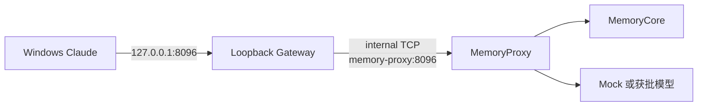

# ADR-2026-08-10：Windows Loopback Gateway 边界

> **ADR**：Architecture Decision Record，用于记录一项关键工程选择、依据与后果。

> **TCP**：应用请求底层使用的可靠字节流协议；Gateway 只转发字节，不理解 HTTP、Anthropic 或 Memory 协议。

> **Internal network**：Docker 中只允许同一隔离网络内服务互通的网络；接入其中的服务默认不能访问宿主或公网。

> **Bridge network**：由 Docker 在宿主上创建、允许容器互通的虚拟网络；非 internal 的 bridge 还可能给容器提供网络出口。

> **Loopback Gateway**：只在本机 `127.0.0.1` 接收 TCP 连接，并把字节原样转发到 Docker internal 网络中 MemoryProxy 的轻量容器。

> **宿主转发**：由 Windows 服务、路由或管理员配置把一个宿主端口转到容器目标的机器级规则，不属于 Compose 项目本身。

> **剩余风险**：已有控制降低了概率或影响、但尚未消除且必须继续记录的风险。

> **明文瞬时流量**：连接存续期间以未加密字节经过网络路径、但不应由 Gateway 落盘或写日志的请求与响应。

> **Static Integrated**：Gateway 的实现、编排和自动测试已经合入当前根仓库；不表示 Windows 宿主路径已经运行通过。

**状态：** Accepted

**验证状态：** Static Integrated；Windows runtime Pending

**日期：** 2026-08-10

## Context

运行 `windows-mock-20260810-093140-a664249f` 时，Mock 11 项、Standalone 12 项和 `agent-config-a` 已通过，但宿主 `127.0.0.1:8096` 没有监听。Compose 展开和容器 `HostConfig.PortBindings` 都声明了直接发布 MemoryProxy，容器的生效端口表却为空；Docker Desktop 同时报告 internal 网络中的容器没有可用于端口转发的容器 IP。普通 bridge 对照能以同一 Mock 镜像在宿主返回 HTTP 200。

非技术说明：Windows 只连接本机端口；Gateway 像一根固定接头的短网线，把请求交给隔离网络中的 Proxy。保存配置和业务数据的 Proxy 不必为了兼容 Docker Desktop 的端口转发而加入可对外通信的网络。

## Decision

1. Hardened 层新增独立 `loopback-gateway`，只有它发布 `127.0.0.1:8096`；MemoryProxy 继续只连接 internal `default` 网络。
2. Gateway 同时连接 internal `default` 与非 internal `loopback-ingress`，并只允许固定监听 `0.0.0.0:8096`、固定转发到 `memory-proxy:8096`。
3. Gateway 不挂载 volume 或 secret，也不通过配置注入业务凭证；它不解析协议、不保存经过连接的 payload 或认证 header，也不写请求日志。容器保持只读、非 root、drop 全部 capability 并启用 `no-new-privileges`。
4. 不让 MemoryProxy 直接加入普通 bridge。这样做虽可绕过 Windows 端口问题，却会同时给持有 Memory 用户配置、日志和会话数据的服务增加网络出口，扩大攻击面。
5. 不采用 Windows/WSL 宿主转发。机器级规则依赖宿主状态和管理员配置，不能由 Compose 项目完整重建，也更难在失败后审计与清理。

## 已确认事实

- Gateway 的转发器、Compose 网络/端口/权限契约和 Windows 健康依赖已通过静态自动测试。
- 旧 run 的宿主 loopback 失败发生在 Gateway 集成之前，不能证明新路径已运行，也不能由新的静态测试改写。
- 固定宿主端口意味着同一时刻只能有一个 hardened/Windows Compose project 占用 `127.0.0.1:8096`。

## 推断

- 把非 internal 网络成员缩小为无持久凭证、无业务 volume、固定目标的 Gateway，比让 MemoryProxy 直接获得同类出口更符合最小权限原则。
- Compose 内的 Gateway 比宿主转发更容易随 project 创建、检查和清理，但这仍不等于生产级网络隔离或访问控制。

## Consequences 与剩余风险

- `loopback-ingress` 必须是非 internal bridge，Gateway 因而具备潜在网络出口。固定目标、无 secret/volume 和容器加固会降低风险，但不能证明被攻陷的 Gateway 绝无其他出站能力。
- Windows Claude 到 MemoryProxy 的认证 header 和请求内容会以明文瞬时流量经过本机端口、Docker Desktop 转发和 Gateway。Gateway 不记录这些字节，但本方案没有加入 TLS，不能外推到 LAN、共享宿主或生产部署。
- Gateway 增加一个需同时检查健康状态的运行组件；容器 health 和 `docker port` 只能证明容器侧状态，不能替代宿主使用 `curl.exe --noproxy '*'` 取得 HTTP 200。
- Windows 新 runtime 必须创建唯一 project/run 并取得宿主 health、headless、服务端观察和人工 TUI 的新鲜证据；完成前状态保持 Pending，企业结论保持 No-Go。

## 建议

- 下一轮只启动 Mock、配置初始化、Core、Proxy、Bootstrap 与 Gateway，并显式 `--build` 更新 tools image；不要用裸 `up --build` 顺带启动 Hub。
- 若未来开放 LAN 或多宿主访问，应另行设计 TLS、认证、出口限制和端口并发策略，不复用本机 Mock 结论作为批准依据。
