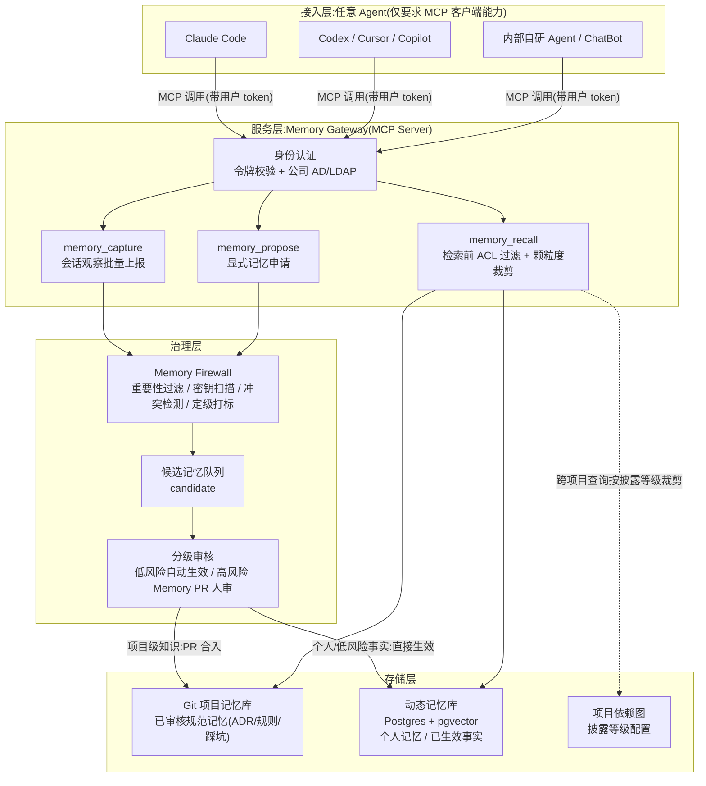
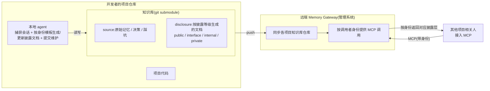
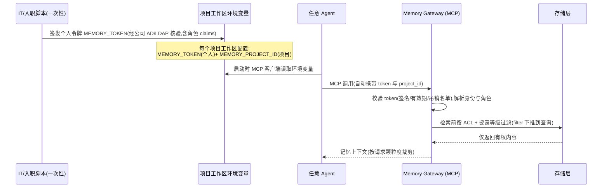
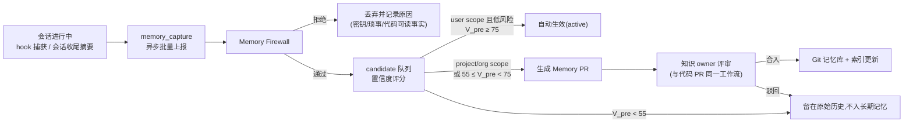
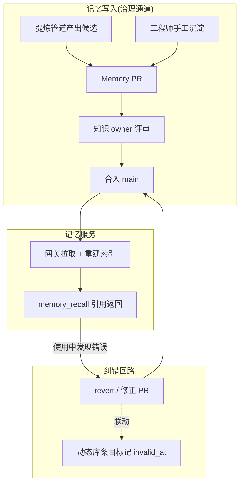
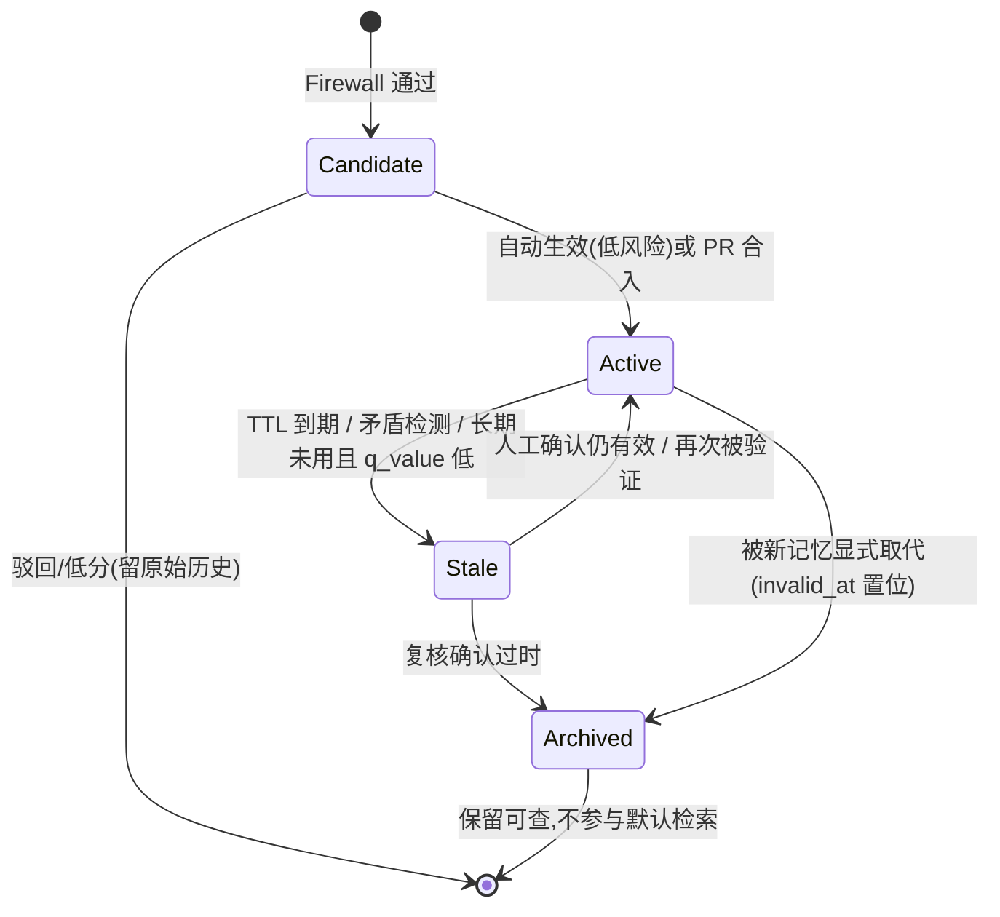
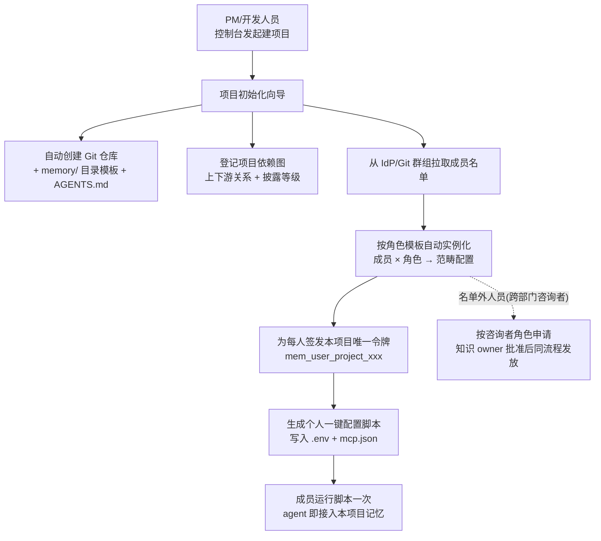

# 企业开发项目记忆管理方案设计

> 版本:v0.5(2026-08-07,待负责人评审)
> 变更:v0.2 依负责人反馈,身份链路改为环境变量预置凭证(使用 agent 时零登录,按项目工作区自动定位身份与项目);交互式 OAuth 降为备选通道
> 变更:v0.3 新增第 11 节管理平面(薄控制台:项目创建向导、角色模板自动配置、每人每项目唯一令牌);令牌粒度由"一人一令牌"细化为"(user, project, role) 三元组令牌"
> 变更:v0.4 对齐负责人思想(`comment.md` 重整后的方向 1/5),新增 §3.1 落地形态——知识库以 git submodule 挂在项目仓库,由本地 agent 按身份生成披露文档并维护,远端网关同步分发;§4.3 知识库结构改为按披露等级分层
> 变更:v0.5 第 12 节五个开放问题定为已确认决策(单项目试点 / 跨级由项目 owner 单批 / 离职有价值记忆转项目保留 / 部门自管服务器+AD/LDAP / 非代码资产用通用 asset 引用类型);相应更新 §4.2/§5.1/§5.2/§9/§10;纳入 comment 第 7 条——兼容多 agent 且保留 agent 不可用时的人工手动维护兜底(§6.1)
> 依据:`docs/repo-author-comment/comment.md`(负责人方案思想,最高优先级)、
> `docs/exa-results/agent-memory-management-2026-08-03.md`(Exa 主调研)、
> `docs/firecrawl-results/agent-memory-supplement-2026-08-06.md`(Firecrawl 补充调研)、
> `docs/exa-results/GPT-review.md` 与 `docs/GPT/GPT-report.md`(外部评审)

---

## 1. 背景与目标

### 1.1 场景

以 IC 部门多人协作开发为原型场景:

- **部门内多角色协作**:数字前端(RTL)、验证(DV)、后端(PD)、模拟设计、FPGA 原型等工程师在同一项目上并行工作,各自使用不同的 AI 编码助手(Claude Code、Codex、Cursor 等);
- **跨部门咨询**:软件/驱动、系统、应用工程师需要向 IC 项目咨询接口、寄存器、时序约束等问题,但不应看到实现细节;
- **项目管理**:PM 需要了解决策、风险、进度类信息,不需要代码级细节;
- **项目间依赖**:IP 项目 → SoC 集成项目 → 软件项目形成上下游链,记忆按披露程度沿链传递。

### 1.2 设计目标

1. **Agent 无关**:不绑定任何一家 agent 框架,只依赖当前主流 agent 的公共能力交集(MCP 客户端、项目规则文件、会话钩子);更换或混用 agent 不丢失记忆;
2. **无感使用**:使用者不需要手动"保存记忆"或"整理知识";调用 MCP 时自动完成记忆的检索注入与候选捕获;
3. **身份颗粒度**(负责人思想):不同身份可访问的记忆内容与颗粒度不同,查询人决定需要了解的颗粒程度;
4. **项目上下游披露**(负责人思想):记忆按项目依赖关系与披露等级跨项目流动;
5. **Git 承担治理主干**:已审核的项目记忆以 Git 管理,记忆的进入走 PR 评审,获得版本、回溯、问责能力;
6. **价值闭环**:记忆价值由 AI 初步生成,由使用结果反向修正。

### 1.3 非目标

- 不替代公司现有文档体系(Confluence/Wiki/规范库),只做"AI 可用记忆"层并与之互链;
- 不做通用聊天机器人平台;
- 第一期不追求全自动写入(自动写入必须先经过防火墙与审核通道)。

---

## 2. 方案选型对比

| 方案 | 描述 | 优点 | 缺点 | 结论 |
|------|------|------|------|------|
| A. 纯 Git 文件 | 各项目仓库放 AGENTS.md/知识目录,agent 直接读 | 零基础设施、天然 PR 治理 | 无身份颗粒度、无跨项目披露控制、上下文爆炸、跨 agent 个性化缺失 | 作为本方案的**第一层**保留,不单独成方案 |
| B. 商用记忆平台直连 | 各 agent 直连 Mem0/Zep 等 SaaS | 上手快、检索成熟 | 供应商绑定(与"不绑定"目标冲突)、身份/披露模型不满足 IC 保密要求、数据出域风险 | 不采用;其开源实现作为组件参考 |
| C. **自建记忆网关(MCP)+ Git 双层**(推荐) | 统一 Memory Gateway MCP 服务,后端 = Git 审核知识库 + 动态记忆库;所有 agent 以 MCP 客户端接入 | Agent 无关、身份/披露模型完全可控、数据不出域、渐进演进 | 需要自研网关与防火墙,建设周期较长 | **采用**,按第 9 节分四阶段落地 |

选 C 的关键依据(调研印证):MCP OAuth 2.1 + Enterprise-Managed Authorization 已稳定,可作身份底座;"团队共享 + 按角色分级披露"的企业级开源方案尚为空白,必须自建;检索前 ACL 过滤是业界共识。

---

## 3. 总体架构



要点:

- **接入层零改造**:任何支持 MCP 的 agent 即可接入;不支持 hook 的 agent 也能工作(见 6.1 的能力降级表);
- **网关是唯一入口**:身份、权限、披露、审计全部收敛在网关,agent 侧不做任何权限判断;
- **双存储**:Git 存"经过人审的项目规范记忆"(低频变更、高价值),动态库存"个人记忆与自动生效的低风险事实"(高频、可衰减);
- **依赖图**是跨项目披露的唯一依据,由 PM 维护(每项目一次性配置)。

### 3.1 记忆库的物理形态与双 agent 分工

落实负责人方向 5:记忆库不是一个额外系统,而是**挂在项目仓库里的一个 git submodule**;由**本地 agent**(随项目 agent 在开发者机器上运行)维护,**远端 Memory Gateway**(管理系统)统一同步并按身份对外提供。



- **本地 agent 负责生成,不只是被动捕获**:它读取身份模板(§11.3),把知识库内容按披露等级物化成 public/interface/internal/private 各层文档,内容更新时同步刷新——这是负责人方向 1"本地 agent 按身份生成和更新披露文档"的落点;生成的是 Git 侧静态披露视图(可 PR 审核),运行时仍由网关按身份做 ACL 过滤(§5.1),两层叠加;
- **submodule 让知识库与代码同仓解耦**:知识库有独立的提交历史与权限,又随项目仓库一起 clone;本仓库自身用 submodule 收录参考项目,正是同一手法;
- **远端网关只做同步与分发**:不产生知识,只把各项目知识库拉取汇聚、按调用者身份返回对应披露层——与 §3 的 Memory Gateway 是同一组件,§3.1 补充的是它面向 submodule 知识库的同步职责;
- **与双存储的关系**:submodule 知识库对应 §3 的"Git 项目记忆库";动态库仍存个人记忆与高频事实,由远端网关维护,不进 submodule。

---

## 4. 记忆模型

### 4.1 四层作用域(采纳 GPT 评审的四层模型)

| 作用域 | 内容 | 生命周期 | 存储 | 审核 |
|--------|------|---------|------|------|
| Organization | 公司/部门规范、通用流程、工具链标准 | 年级 | Git(org-memory 仓库) | 知识 owner 人审 |
| Project | 架构决策、接口约定、踩坑经验、验证策略 | 月~年 | Git(项目 memory 目录)+ 动态库索引 | Memory PR 人审 |
| User | 个人偏好、工作习惯、常用命令 | 月~年 | 动态库(个人命名空间) | 自动生效 |
| Runtime | 当前任务上下文、临时状态 | 小时~天 | 不入库(agent 会话内) | 不入库 |

### 4.2 记忆条目 Schema(动态库)

```json
{
  "id": "mem-2026-08-06-0042",
  "fact": "ChipA 项目 SPI 接口最大时钟为 50MHz,受 IO pad 限制",
  "type": "technical",            // runtime | technical | architecture | principle | asset
  "scope": "project",             // org | project | user
  "project_id": "ChipA",
  "disclosure": "interface",      // private | internal | interface | public
  "granularity": "L1",            // L0 原始记录 | L1 原子事实 | L2 场景摘要 | L3 结论/画像
  "source": {
    "kind": "conversation",       // conversation | adr | doc | correction
    "ref": "session-8f3a/turn-12",
    "author": "user:zhang3",
    "agent": "claude-code"
  },
  "confidence": 0.82,
  "status": "active",             // candidate | active | stale | archived
  "created": "2026-08-06",
  "valid_from": "2026-08-06",
  "invalid_at": null,             // 失效不删除(Graphiti 模式)
  "expires": "2027-02-06",        // TTL 按 type:runtime=天, technical=月, architecture=年, principle=永久
  "usage": { "recalls": 3, "q_value": 0.6 }
}
```

设计要点(均有调研依据):

- **disclosure 四级**是跨项目披露的开关:`private`(仅本人)、`internal`(仅本项目成员)、`interface`(下游项目可见)、`public`(全公司可见);
- **granularity 四级**借鉴 TencentDB Agent Memory 的 L0-L3 分层,同一知识可存多个颗粒度版本,查询人按需选择;
- **asset 类型**面向非代码资产(版图、仿真波形结论、测试报告):`type: asset` 只存结论文本 + `asset_ref` 指向外部文件(文件服务器 / PDM 路径),不把大文件本身入库(Q5 决策);
- **invalid_at 失效不删除**借鉴 Graphiti 双时间戳,保留历史可追溯;
- **TTL 按记忆类型区分**(GPT 评审修正意见),不照搬 Copilot 的统一 28 天;
- **q_value** 由使用结果反馈更新(MemRL 思路,Phase 3 启用)。

### 4.3 Git 知识库结构(项目仓库的 submodule)

```text
<project>/                          # 开发者的项目仓库
├── ...(项目代码)
└── memory/                         # 知识库:git submodule,独立仓库,随项目一起 clone
    ├── AGENTS.md                   # agent 引导(MCP 使用指引;各 agent 通用)
    ├── source/                     # 本地 agent 沉淀的原始记忆:决策(ADR)、踩坑、规则约定
    └── disclosure/                 # 本地 agent 按身份模板生成的披露层(可 PR 审核)
        ├── public/                 # 全公司可见
        ├── interface/              # 下游项目可见(接口 / 寄存器 / 时序约定)
        ├── internal/               # 仅本项目成员
        └── private/                # 仅个人(一般不入库,留动态库)
```

本地 agent 把 `source/` 的内容按披露等级物化到 `disclosure/` 各层;远端网关同步后,按调用者身份返回对应层。**目录即披露等级,PR 里移动文件就是调整披露**,不需要额外权限系统。这是 Git 侧的静态披露视图,运行时仍由网关做 ACL 过滤(§5.1),形成"静态披露视图 + 运行时过滤"两层。

---

## 5. 身份、权限与披露

### 5.1 身份链路:环境变量预置凭证,使用时零登录

**凭证不在使用 agent 时交互式获取,而是通过环境变量预置**:MCP 服务器配置(mcp.json)从环境变量读取个人令牌与项目标识,agent 启动即自动完成"登录",切换项目 = 切换工作区环境变量,全程无登录动作。



约定与安全边界:

- **令牌形态**:个人访问令牌(PAT 式),由 IT 入职脚本经公司 AD/LDAP 身份核验后一次性签发,绑定个人身份与角色;支持吊销与定期轮换(建议 90 天,轮换由脚本静默完成,使用者无感);
- **项目定位**:`MEMORY_PROJECT_ID` 随项目工作区配置(如项目目录的 `.env`,不入 Git);同一人在不同项目目录打开 agent,自动以对应项目身份接入,**多项目并行无需任何切换操作**;项目成员资格仍由服务端校验(token 身份 × 项目成员表),环境变量只是"声明",不是"授权";
- **权限仍全部在服务端**:环境变量只解决"我是谁、我在哪个项目"的传递;ACL 在检索前强制,权限条件作为向量/全文检索的 filter 下推,严禁"先召回再遮盖";嵌入内容按披露等级分索引存放;
- **令牌保护**:`.env` 加入 gitignore 模板,Firewall 对 memory_capture 内容做密钥扫描(令牌本身也在禁写清单);泄露时服务端一键吊销;
- **兼容交互式 OAuth**:对不便预置环境变量的场景(如临时咨询者、浏览器端 agent),保留 MCP OAuth 2.1 授权作为备选通道,两种方式在网关侧汇合为同一套身份模型;
- 项目成员关系不单独维护:**镜像 Git 仓库权限与 IdP 项目组**(Copilot 模式),人员变动自动生效。

### 5.2 角色-披露矩阵(IC 场景示例)

| 角色 | Org 记忆 | 本项目 internal | 本项目 interface | 上游项目 | 个人记忆 | 默认颗粒度 |
|------|:---:|:---:|:---:|:---:|:---:|:---:|
| 本项目工程师(RTL/DV/PD) | 读 | 读写 | 读写 | interface 级只读 | 读写(仅本人) | L1 事实 |
| 项目经理(PM) | 读 | 只读 | 只读 | interface 级只读 | 读写(仅本人) | L2/L3 摘要 |
| 下游项目成员(如 SoC 集成、软件) | 读 | 无 | 只读 | — | 读写(仅本人) | L1/L2 |
| 其他部门咨询者 | 读 | 无 | public 级只读 | 无 | 读写(仅本人) | L2 摘要 |
| 部门知识 owner | 读写 | 审核权 | 审核权 | 审核权 | — | — |

- "查询人决定颗粒程度":`memory_recall` 提供 `granularity` 参数,默认按角色给出上表默认值,查询人可在权限范围内上调(如 PM 追问细节时从 L3 下钻到 L1);
- **跨级调取**(负责人思想):超出默认权限的调取(如咨询者需要 internal 级信息)走网关的"跨级申请"通道——**由目标项目的 project owner 单人批准**(Q2 决策),申请、通知、批准全程审计,不做静默放行。

---

## 6. 无感使用设计

原则:**使用者接入零登录(凭证由环境变量预置),其余全部自动发生**。复杂度全部沉到网关与治理层。

### 6.1 Agent 公共能力与降级策略

只依赖三种公共能力,均为当前主流 agent 标配;缺失时逐级降级:

| 能力 | 用途 | 具备的 agent(示例) | 缺失时的降级 |
|------|------|---------------------|--------------|
| MCP 客户端 | 记忆读写唯一通道 | Claude Code、Codex、Cursor、Copilot、Windsurf | 无 MCP 则不接入(底线要求) |
| 项目规则文件(AGENTS.md) | 引导 agent 在任务开始时调用 memory_recall、结束时调用 memory_capture | 全部主流 agent | 无规则文件则靠 MCP 工具描述引导(工具 description 中写明调用时机) |
| 会话钩子(hook) | 自动捕获会话观察(claude-mem 模式) | Claude Code(hooks)、部分 agent | 无 hook 则由 AGENTS.md 引导 agent 在会话收尾时主动调用 memory_capture 上报摘要 |

**个性化跨 agent 共享的实现**:个人记忆(user scope)存于网关侧个人命名空间,与 agent 无关——同一人在 Claude Code 中被记住的偏好,换到 Codex 后经同一 token 检索到同一份记忆。

**agent 不可用时的人工兜底**(comment 第 7 条):知识库本体是纯 Markdown + Git,不依赖任何 agent。agent 全部不可用或某类 agent 未接入时,人可以直接编辑 `source/` 与 `disclosure/` 文件、走正常 PR 合入——记忆体系退化成一套普通 Git 文档库仍然可用。agent 只是让读写变无感的加速层,不是必需依赖。

### 6.2 读路径:调用 MCP 即得记忆

1. 使用者在任意 agent 内开始任务;
2. AGENTS.md(或工具描述)引导 agent 自动调用 `memory_recall(task_hint, granularity?)`;
3. 网关按身份过滤 + 颗粒度裁剪,合并三路结果注入上下文:Git 规范记忆(权威)> 动态库项目事实 > 个人偏好;
4. 返回内容附带来源标注(ADR 编号/会话引用),agent 可引用溯源。

单次注入预算建议 ≤2k tokens(避免 AGENTS.md 式上下文爆炸,调研中多次出现的教训)。

### 6.3 写路径:后台异步,永不打断使用者



- **Memory Firewall 规则**(借鉴 Mem0 memory-triage + GPT 评审):
  - 禁写:密钥/Token/个人敏感信息(直接拒绝,不靠降分);代码或文档可直接读出的事实(代码是 source of truth);未确认的推测;
  - 必写:决策及其理由(无法从代码恢复)、用户对 agent 的纠正(权重最高)、验证过的踩坑结论;
  - 写入前评分 V_pre 采用 GPT 报告公式(未来有用性 0.30 / 项目杠杆 0.20 / 新颖性 0.15 / 可信度 0.15 / 耐久性 0.10 / 证据质量 0.10),阈值 75/55 为 POC 起点,由实际接受率校准;
- **分级审核**是应对"人审瓶颈"(调研:代理 PR 使评审耗时 +91%)的关键:个人低风险记忆零人审,只有项目级知识走 PR;
- Memory PR 与代码 PR 走同一 Git 平台,评审人无需学习新工具。

### 6.4 使用者视角总结

| 使用者动作 | 需要做的 | 不需要做的 |
|-----------|---------|-----------|
| 初次接入 | 运行一次入职脚本(签发令牌并写入环境变量与 mcp.json) | 登录、装数据库、手配 API key、写规则 |
| 切换/并行多项目 | 无(项目目录环境变量自动定位项目) | 重新登录或手动切换 |
| 日常使用 | 正常对话干活 | 手动保存/整理/检索记忆 |
| 显式记忆 | 说"记住 X"(可选,触发 memory_propose) | — |
| 知识 owner | 每周评审 Memory PR 队列 | 手写知识文档 |
| PM | 维护一次项目依赖图与披露配置 | 逐条管理权限 |

---

## 7. Git 在流程中的作用

Git 不是可选组件,而是治理主干,承担五个职责:

1. **规范记忆的唯一权威存储**:项目级/组织级已审核记忆全部落在 Git(4.3 节结构),动态库中只存其索引;冲突时以 Git 为准;
2. **记忆进入的治理通道**:AI 产生知识 → Memory PR → 人审 → 合入(6.3 节),复用现有代码评审文化与平台,不新建审批系统;
3. **披露边界的载体**:`interfaces/` 目录即对下游披露的内容,移动文件 = 调整披露,PR diff 即披露变更审计记录;
4. **溯源与回滚**:`git blame` 回答"这条记忆谁写的、何时、为什么"(commit 关联来源会话/ADR);错误记忆 `git revert` 一步回滚,并触发动态库对应条目失效;
5. **权限的镜像源**:项目 Git 仓库的读写权限即记忆库 internal 级读写权限,人员变动零维护。



---

## 8. 记忆生命周期与价值闭环



价值闭环(分三阶段度量,采纳 GPT 报告框架):

- **写入前**:V_pre 评分决定进入路径(6.3 节);
- **调用时**:排序 = 语义相关性 + 时效有效性 + 来源权威性(Git > 动态库)+ 历史效用 q_value;
- **使用后**(Phase 3):采集使用信号(记忆被引用后任务是否成功、用户是否纠正)按 `Q_new = (1-α)Q_old + α·reward` 更新;q_value 持续走低的记忆加速进入 Stale。

运营指标(月度看板):Recall Accuracy >90%、Precision >80%、Staleness Rate <10%、同类纠正复发下降 80%、Human Override Rate <20%(目标值为 POC 起点,随运营校准)。

---

## 9. 落地路线

| 阶段 | 周期 | 交付物 | 验收标准 |
|------|------|--------|---------|
| Phase 0:Git 记忆库 | 2-4 周 | **单个 IC 项目试点**(Q1):建 memory/ submodule + AGENTS.md 模板;知识 owner 制度 | agent 首答正确率提升;新人上手时间下降 |
| Phase 1:只读网关 | 1-2 月 | Memory Gateway MCP(memory_recall)+ 环境变量令牌认证 + 检索前 ACL;入职脚本(签发令牌、写入 mcp.json 与 .env);**部署于部门自管服务器,身份对接公司 AD/LDAP**(Q4) | 两种以上 agent 无配置差异地取到同一份项目记忆;全程无登录动作 |
| Phase 2:无感写入 | 2-3 月 | memory_capture/propose + Firewall + candidate 队列 + Memory PR 自动化;动态库(Postgres+pgvector);薄控制台完整版(项目初始化向导 + 角色模板管理,见第 11 节) | 每周稳定产出可合入的 Memory PR;Firewall 拒绝率与误杀率可量化;新项目经向导 10 分钟内完成记忆接入 |
| Phase 3:价值与披露进阶 | 6 月+ | q_value 使用反馈;项目依赖图跨项目披露;跨级调取审批;(可选)Graphiti 式关系图谱 | 跨部门咨询走 interface 级自助解决;记忆 ROI 可核算 |

技术选型原则:Phase 0 零依赖;Phase 1-2 仅 Postgres + pgvector(调研结论:文件+简单检索已能打败复杂框架,复杂度必须由度量证明);图数据库延后到 Phase 3 且仅在多跳依赖查询成为真实需求时引入。TencentDB Agent Memory 可在 Phase 2 起作为隔离 POC 对照组。

---

## 10. 风险与对策

| 风险 | 对策 |
|------|------|
| 记忆污染(错误/过时记忆长期存在) | Firewall 前置 + 失效不删除 + Stale 复核 + revert 联动失效 |
| 人审瓶颈淹没知识 owner | 分级审核(个人低风险零人审);每周批量评审;PR 附证据与置信度降低评审成本 |
| 上下文爆炸 | 单次注入预算 ≤2k tokens;granularity 默认给摘要级;AGENTS.md 只放引导不放知识本体 |
| IC 保密与合规 | 数据不出域(部门自管服务器);嵌入分披露等级隔离存储;跨级调取全审计;密钥直接拒写 |
| 人员离职 / 岗位变动 | 移出 Git 群组即自动吊销令牌;个人记忆离职时由本人或 owner 甄别,有价值的转为项目记忆保留,其余删除(Q3) |
| agent 能力差异 / agent 不可用 | 6.1 降级表 + 人工兜底:知识库是纯 Markdown+Git,无任何 agent 也能直接编辑与 PR(comment 第 7 条) |
| 指标造假/自我感觉良好 | 厂商式自评不可信(调研教训),用固定内部测题集(仿 LongMemEval 五能力)做月度盲测 |

---

## 11. 管理平面:项目与角色配置系统

> 对应负责人提议:一个系统/网页平台,登录后由项目管理人员或开发人员建立项目,自动为不同人员配置既定角色,角色以提示词或既有了解范围建立知识库范畴,每人每项目有唯一环境变量凭证。本节采纳该框架,并按"更适合落地"的原则做两处修正(11.1、11.3)。

### 11.1 建设路径:薄控制台,不建第二套账号体系

| 路径 | 描述 | 问题/优势 |
|------|------|----------|
| 独立全功能网页平台 | 自建登录、项目管理、成员管理、角色管理 | 形成与 Git/IdP 平行的第二套账号与成员数据,必然漂移;开发与运维成本高 |
| **薄控制台 + Git 平台为事实源**(推荐) | 项目与成员的唯一事实源 = 公司 Git 平台(GitLab/Gitea 群组与仓库);控制台只做 Git 做不了的三件事 | 建项目 = 建仓库,加人 = 加成员,权限天然镜像(5.1 节既有设计);控制台无状态可重建 |

薄控制台(Web)只负责三件事:

1. **项目初始化向导**:一键完成建 Git 仓库(含 memory/ 目录模板)、登记项目依赖图与披露等级、按角色模板实例化角色;
2. **角色模板管理**:维护部门级角色模板库(11.3),项目实例化时可微调;
3. **凭证管理**:签发/吊销/轮换每人每项目唯一令牌(11.4),生成一键配置脚本。

登录:控制台本身走公司 SSO(管理动作是低频操作,交互式登录可接受);工程师日常使用 agent 仍然零登录(5.1 节环境变量通道),两者不冲突。

### 11.2 项目创建与角色自动配置流程



自动化程度:名单内成员全自动(建项目时角色按其在 Git 群组中的角色/子群组映射,如 rtl 子组 → RTL 工程师角色);拿捏不准的由向导列出待确认清单,PM 一次勾选。

### 11.3 角色模板:提示词定义范畴的正确用法

**修正**:提示词可以作为"定义知识库范畴"的**输入**,但不能作为权限的**执行机制**——提示词对 LLM 是软约束,不可证明、不可审计,权限必须落为结构化 filter(5.1 节检索前强制)。因此角色模板 = 三元组:

```yaml
# 角色模板示例:role-templates/dv-engineer.yaml
role: DV 工程师
# ① 权限范畴(硬约束,编译进检索 filter,审计对象)
access:
  org: read
  project_internal: read_write
  project_interface: read_write
  upstream: interface_readonly
  default_granularity: L1
  tag_allow: [verification, testbench, coverage, interface, build]
  tag_deny: [layout, analog_impl]          # 与本角色无关的实现细节默认不见
# ② 角色提示词(软引导,注入 memory_recall 的检索偏好与回答视角,不承担权限)
role_prompt: |
  你服务的是验证工程师:优先返回验证策略、testbench 约定、接口时序、
  历史 bug 及其根因;涉及设计意图时引用 ADR 而非转述。
# ③ 建库引导(项目初始化时,该角色记忆子库的种子结构)
seed_sections: [验证环境搭建, 用例与覆盖率约定, 常见回归失败]
```

"用提示词建立范畴"的落地方式:PM 在向导里用自然语言描述某角色的了解范围 → AI 将其**编译为上述结构化字段的草案**(tag 白名单、披露等级、颗粒度)→ PM 确认后生效。提示词是输入界面,结构化配置是执行真相。

部门级预置角色模板(IC 示例):RTL 工程师、DV 工程师、后端工程师、模拟工程师、项目经理(默认 L2/L3)、跨部门咨询者(仅 interface/public)、知识 owner(审核权)。

### 11.4 凭证体系:每人每项目唯一令牌

- 令牌绑定三元组 **(user, project, role)**,如 `mem_zhang3_chipa_dv_<random>`;相比 v0.2 的"一人一令牌 + 环境变量声明项目",**每项目独立令牌进一步缩小泄露爆炸半径**(泄露只影响单项目),且令牌本身即含角色,网关无需再查成员表即可执行范畴过滤(仍保留服务端校验兜底);
- 环境变量仍是 `MEMORY_TOKEN`(值为本项目令牌)+ 可省略的 `MEMORY_PROJECT_ID`(令牌已含项目,保留仅作声明校验);多项目并行 = 各项目目录 `.env` 各放各的令牌;
- 生命周期:随角色实例化自动签发 → 90 天静默轮换(配置脚本可重复运行)→ 成员移出 Git 群组时 webhook 触发自动吊销;
- 分发:控制台生成一键脚本(或二维码/内网链接),成员在项目目录运行一次即完成 `.env` + mcp.json 写入,此后无感。

### 11.5 与主架构的关系

管理平面不在记忆读写的数据路径上:它只生产**配置**(角色范畴、令牌、依赖图),Memory Gateway 消费这些配置执行过滤。控制台宕机不影响记忆服务;所有配置可从 Git 平台 + 模板库重建。

---

## 12. 已确认的关键决策

以下五项经负责人确认(2026-08-07),已落入对应章节:

| # | 决策 | 落点 |
|---|------|------|
| 1 | 试点从**单个 IC 项目**起步,跨项目披露留到 Phase 3 | §9 Phase 0/1 |
| 2 | 跨级调取由**目标项目 project owner 单人批准** + 全程审计 | §5.2 |
| 3 | 员工离职时,**有价值的个人记忆经甄别转为项目记忆保留**,其余删除;令牌随移出群组自动吊销 | §10 |
| 4 | 记忆网关**部署在部门自管服务器**,身份对接**公司 AD/LDAP** | §5.1、§9 Phase 1、§10 |
| 5 | 非代码资产(版图/仿真波形/测试报告)用**通用 `asset` 引用类型**:存结论文本 + 指向外部文件,不为每种资产单独建 schema | §4.2 |

仍待确认(非阻塞,可在 Phase 0 推进中并行敲定):试点项目的知识 owner 具体人选;是否对模拟设计等资产追加专用 seed_sections 模板。
