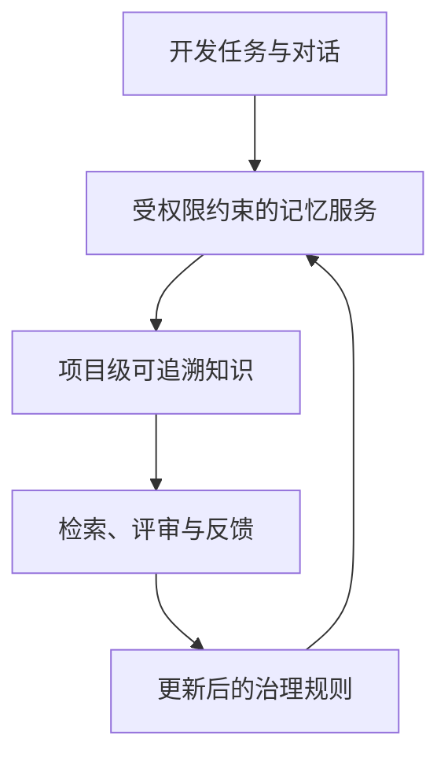
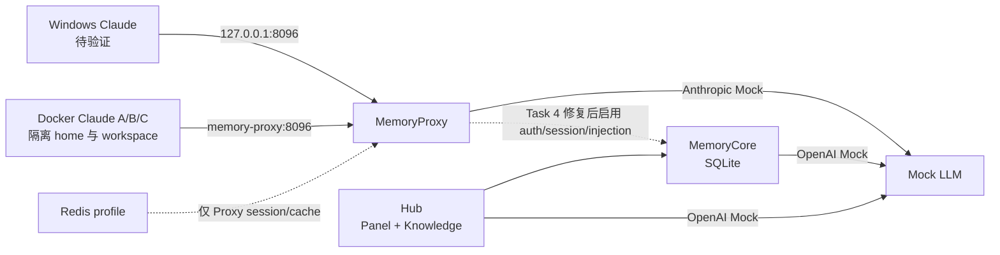

# 企业智能体记忆系统评估

**评估状态：** Static Passed；镜像构建 Failed；运行验证为 Not Run
**更新时间：** 2026-08-09

本页是管理者与开发者的主评估入口：把架构假设、已验证证据、风险与下一步集中在同一处。详细设计见 [企业记忆管理方案](design/2026-08-06-enterprise-memory-design.md)，本轮实施范围见 [Docker-first 规格](specs/2026-08-09-docker-memory-lab.md) 和 [决策记录](decisions/2026-08-09-docker-memory-lab.md)。

> **Docker Compose**：用一个 YAML 文件组声明多项服务、隔离网络和数据卷，并用统一命令解析、启动和停止实验环境。

> **Mock**：返回固定结果的模拟模型服务。它让协议和故障测试可重复，默认不会产生真实模型费用。

> **Profile**：必须显式选择才启用的服务组。本项目把 Redis、Docker Claude 和真实 DeepSeek 分别放在受控 profile 中。

> **记忆治理**：让知识写入、检索、共享、失效和追溯都受权限与审查约束，而不是把全部对话直接存入共享库。

这表示企业价值来自受控的知识循环：系统先判断谁能看到什么，再把可追溯的项目知识提供给合适的任务；管理者以证据决定是否扩大使用范围。

## 当前 Docker 实验架构

非技术说明：三个 Claude 测试客户端共享同一记忆服务地址，但不共享自己的 home 和工作目录。默认所有模型请求只到 Mock；Proxy 当前也不依赖 Hub 才能启动。记忆认证、会话初始化和注入要等 public fork 修复服务间认证后再打开，因此图中的 Proxy 到 Core 是未来启用的受控链路，不是当前已运行事实。

## 状态矩阵

| 评估项 | 状态 | 当前证据 | 不能证明的内容 |
| -- | -- | -- | -- |
| 架构和权限模型 | Static | 现有设计、Docker-first 规格与 ADR | 实际服务端 ACL 行为 |
| 默认 Mock 编排 | Static Passed / Runtime Not Run | 36 项 Node 测试；base/hardened/real `config --quiet` exit 0 | 镜像可构建、容器可启动和业务探针 |
| Windows 10 原生 Claude + Docker Linux Claude | Not Run | 客户端隔离与 Proxy 契约已定义 | 两客户端读写与身份隔离 |
| Codex / WSL / Win11 / LAN | Deferred / Not Run | 不在当前批准范围 | 跨客户端共享、Win11 和局域网行为 |
| 真实 DeepSeek 路径 | Blocked / Not Run | Gate、单一 Compose secret、服务端 wrapper 和 Agent secret 隔离已通过静态契约测试 | 协议兼容、质量、延迟和费用 |
| 效率评分 | Not Rated | 尚无 10 组成对任务 | 生产力收益或 ROI |

## 风险与控制

| 风险 | 控制 | 状态 |
| -- | -- | -- |
| 模型 key 泄漏到配置、日志或报告 | 工作区外 secret、脱敏模板、忽略规则与 Gate | Static |
| 默认运行产生付费或访问外网模型 | base network 为 internal 且仅配置 Mock；真实层需显式 `real-claude` profile 与 Gate | Static Passed |
| DeepSeek Anthropic 内容类型不兼容 | 以 Mock 契约和后续真实 Gate 分别记录 | Not Run |
| 统一费用硬上限缺失 | Gate 的输入验证已实现并通过单元测试；不能硬性限制 Core/Knowledge 后台费用 | Static Passed / Runtime Not Run |
| Public fork 变更不可审查 | 通用修复独立提交；当前未推送 | Not Run |

## 评分与后续证据

目前不得给出效率或 ROI 分数。后续至少收集 10 组成对任务，并同时记录任务类型、耗时、成功率、人工介入、检索命中、权限拒绝、费用和失败原因；在此之前保持 **Not Rated**。

优先顺序为：先验证 Docker 与默认 Mock 的端到端业务探针，再验证 Windows 10 原生 Claude 与 Docker Linux Claude 的隔离和共享，最后在用户提供工作区外新 secret 后执行受限真实 DeepSeek Gate。Codex、WSL、Win11 和 LAN 另行排期。每次结果应新增可复核的 reproduction 记录，不以 health check 代替业务流证据。

> **BuildKit named contexts**：Docker 构建镜像时从多个明确目录读取源码的机制；这里让 Hub 直接使用当前 Tencent fork 的 Panel 和 Knowledge，而不复制一份容易过期的源码快照。

当前镜像 Gate 的事实边界：Compose 的 BuildKit named contexts 已被本机 Compose 5.3.1 接受并通过静态解析，但 Hub/Claude 实际构建在获取 Docker Hub 下载认证令牌时网络超时，尚未执行到 named-context `COPY`。因此构建状态是 **Failed（镜像仓库网络阻塞）**，不是代码构建通过或 Docker 不可用。开发命令和当前限制见 [集成测试说明](../tests/integration/README.md)。
