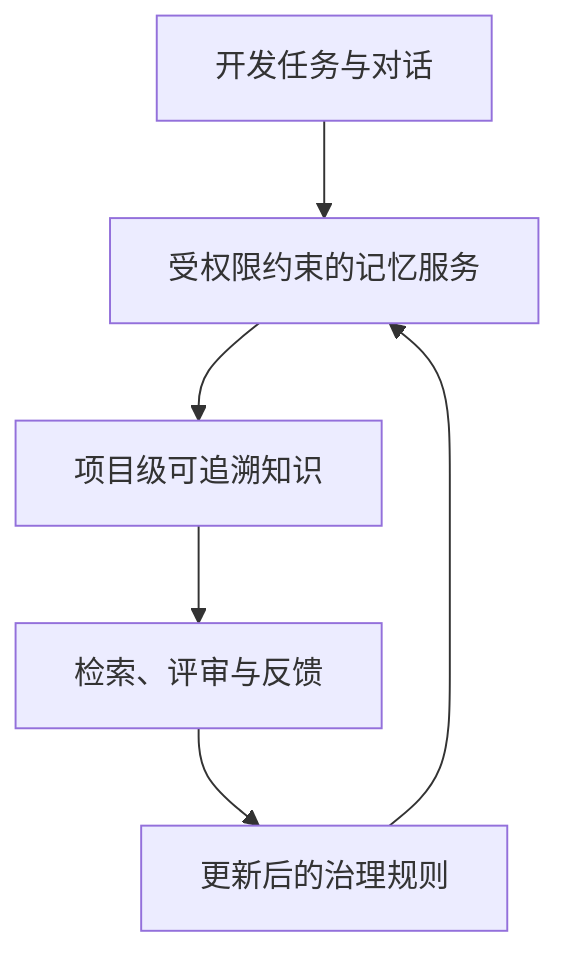
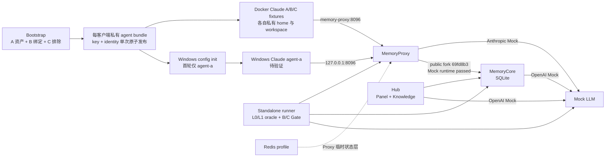
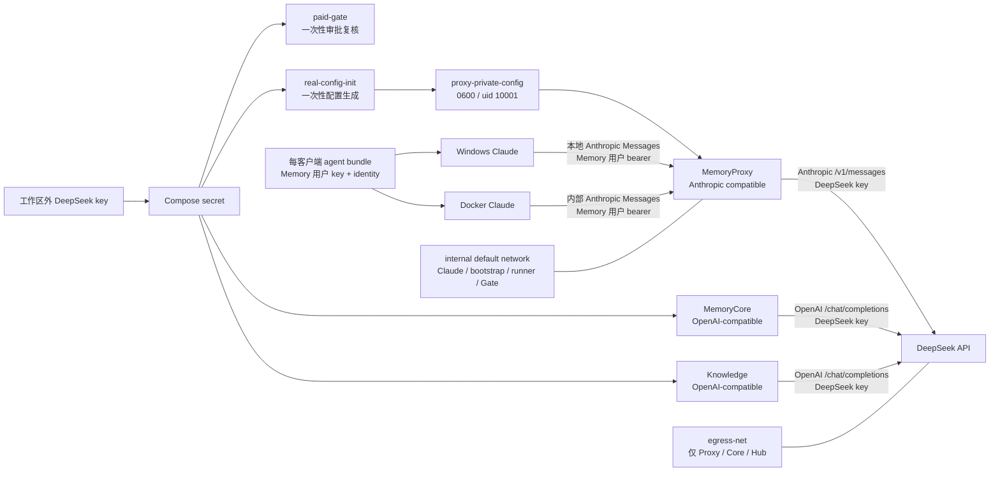

# 企业智能体记忆系统评估

> **Docker Compose**：用 YAML 文件统一定义、连接和启动多个 Docker 容器的工具。

> **Gate**：在受控操作开始前执行的检查；本项目分别检查付费模型输入和 Windows 宿主配置路径，任一检查失败就拒绝执行。

> **Canonical path**：操作系统解析符号链接和相对片段后得到的唯一绝对路径，用来防止同一文件换一种路径写法后绕过目录检查。

> **Attestation**：宿主预检成功后生成的短期核对记录，不是带签名的加密证明。它记录本次批准的 canonical 路径和参数，但不包含模型 key；它只在宿主账户、Compose 启动环境和实验证据目录可信时防止误配置、字段不一致与过期复用，不抵御能同时改写记录和环境变量的本地操作者。

> **Static Passed**：文件、渲染器、Gate 与 Compose 展开结果通过自动检查；不代表镜像或服务已经运行。

> **Docker client / engine**：client 是发出 Docker 命令的前端，engine 是实际构建镜像和运行容器的后台服务；能运行 client 不代表能连接 engine。

> **Engine Accessible（预检时）**：本轮预检曾确认 Docker client 与 engine 均为 29.6.2、Docker Desktop 为 4.85.0、context 为 `desktop-linux`，并可执行 Compose 5.3.1 命令；这项历史通过不表示故障发生后 engine 仍可用。

> **WSL**：Windows Subsystem for Linux，Windows 上运行 Linux 环境的系统组件；Docker Desktop 的 Linux 容器后端依赖它，但这不等于已经测试 WSL 中的 Claude Code。

> **HCS**：Host Compute Service，Windows 用来创建和管理虚拟机及容器计算实例的系统服务。

> **Docker image**：构建后用于启动容器的软件环境包；单个 image 通过不等于整套 Compose 已构建。

> **Runtime Blocked**：运行已开始准备，但被宿主或基础设施故障阻断，尚未取得容器业务结果；它既不是 Passed，也不是项目功能 Failed。

> **Runtime Passed（受限范围）**：列明的真实容器与业务请求已经通过；结论只适用于同一行明确列出的服务、协议和场景，不能外推到未运行项目。

> **TUI**：在终端中显示并接收键盘操作的交互界面；Claude Code 的主要交互界面属于 TUI。

> **Headless**：不进入交互界面的命令行验证，例如只执行 Claude Code 的版本检查。

> **Read-only business probe**：真实调用服务业务 API，但不修改业务状态的检查；容器健康状态本身不能替代它。

> **Mock**：返回固定结果的模拟模型服务。它让协议和故障测试可重复，默认不会产生真实模型费用。

> **ACL**：Access Control List，即服务端用来决定哪个 user、team 或 agent 可以读取某项记忆的访问控制规则。

> **Agent bundle**：只放在单个客户端私有 home 的 `0600` JSON 文件，把该客户端 Memory 用户 key 与身份作为一个整体切换。

> **Bootstrap**：一次性创建测试用户、团队、Agent、任务、资产绑定和客户端材料的初始化步骤；重复执行会拒绝覆盖旧场景。

> **Runner**：在隔离容器中执行 Mock 协议和 Standalone 业务断言的测试程序；它只发布脱敏的结构化证据。

> **Data plane**：实际承载客户端请求、记忆写入和读取的服务路径；本轮默认路径是 Proxy、Core 与 Mock。

> **Identity**：描述当前客户端 service、team、user、agent、task、session 和显示名的身份记录。

> **Fingerprint**：从敏感值稳定派生、可跨记录关联的标识。本项目的报告禁止保存 key fingerprint。

> **Sentinel**：故意注入的非凭证标记，用来判断内部字段是否误传到模型上游；只记录“是否出现”。

> **SHA / gitlink**：SHA 是 Git 提交的唯一标识；gitlink 是根仓库固定 submodule 提交的指针。子目录有新 commit，不等于根仓库已采用。

> **Runtime Not Run**：尚未执行服务启动、业务探针、故障恢复、Claude TUI 或真实模型请求。

> **Static Integrated**：独立复审通过的 public fork 精确 SHA 已写入根 gitlink、镜像标签和静态测试；不代表镜像、服务或业务流已经运行。

> **Verified Fact**：已由当前源码、配置展开或自动测试直接确认的事实。

> **Reported Claim**：来自项目说明或外部资料、但尚未由本地实验独立复核的说法。

> **User Confirmed**：用户直接观察并确认的界面结果；它是人工验收证据，但不能替代自动化日志或未执行的功能验证。

> **Inference**：根据已有证据推导的判断，不能当作运行事实。

> **Recommendation**：面向下一步决策的建议，不表示已经实施。

> **Go / Conditional Go / No-Go**：分别表示可进入目标阶段、满足列明条件后才可进入、以及当前不得进入。

**评估状态：** Windows 重启后 Docker 已恢复；完整所选镜像构建、默认无付费 Mock/Standalone 两级业务 Gate、Hub health 与只读业务探针、Docker Claude `2.1.207` headless、TUI 启动与 Mock 文本往返 Runtime Passed；真实 DeepSeek 与 Windows Claude Not Run
**更新时间：** 2026-08-10

**当前决策：** 对公司试点或部署仍为 **No-Go**；对继续本机、无付费、默认 Mock 的开发为 **Conditional Go**。当前运行已证明受控 A 写/B 共享/C 隔离、Docker headless 与 TUI Mock 文本往返；但真实 DeepSeek 协议与 key 安全、Windows Claude、stream/tool/thinking、故障恢复和备份等硬 Gate 仍未通过。

本页是管理者与开发者的主评估入口：把架构假设、已验证证据、风险与下一步集中在同一处。详细设计见 [企业记忆管理方案](design/2026-08-06-enterprise-memory-design.md)，本轮实施范围见 [Docker-first 规格](specs/2026-08-09-docker-memory-lab.md)、[Standalone 业务 Gate 决策](decisions/2026-08-09-standalone-memory-gate.md)、[public fork 集成决策](decisions/2026-08-10-public-fork-integration.md)和[集成记录](reproduction/2026-08-10-public-fork-integration-static.md)。本轮不可变运行链为：[002427 WSL 阻塞](reproduction/2026-08-10-docker-mock-20260810-002427-wsl-resource-blocked.md) → [015646 Bootstrap 重放](reproduction/2026-08-10-docker-mock-20260810-015646-bootstrap-replay-blocked.md) → [024419 forged contract](reproduction/2026-08-10-docker-mock-20260810-024419-forged-contract-failed.md) → [030443 session 前置条件](reproduction/2026-08-10-docker-mock-20260810-030443-session-precondition-failed.md) → [033636 无付费运行通过](reproduction/2026-08-10-docker-mock-20260810-033636-no-paid-runtime-passed.md) → [TUI 用户确认](reproduction/2026-08-10-docker-mock-20260810-033636-tui-user-confirmed.md) → [TUI 文本往返](reproduction/2026-08-10-docker-mock-20260810-033636-tui-message-passed.md)。完整静态证据索引保留在[集成说明](../tests/integration/README.md)。

> **Profile**：必须显式选择才启用的服务组。本项目把 Redis、Docker Claude 和真实 DeepSeek 分别放在受控 profile 中。

> **记忆治理**：让知识写入、检索、共享、失效和追溯都受权限与审查约束，而不是把全部对话直接存入共享库。

> **Fixture**：为自动测试预先定义的客户端样本。A/B/C 用于检查隔离关系，不表示首轮会同时人工启动三个 Claude。

> **L0/L1 oracle**：直接读取 Core 的对话层与原子记忆层作为权威证据，不根据模型回答猜测是否记住。

这表示企业价值来自受控的知识循环：系统先判断谁能看到什么，再把可追溯的项目知识提供给合适的任务；管理者以证据决定是否扩大使用范围。

## Tencent 公开 standalone 基线

> **Standalone**：把必要服务部署在同一套本地环境中的独立运行形态，不依赖腾讯内部托管平台。

> **Process**：容器内正在运行的程序实例；一个容器可以同时管理多个 process。

> **SQLite**：应用直接读写的单文件数据库，不需要单独启动数据库服务器。

> **PostgreSQL / vector database / Redis**：分别是独立关系数据库、向量相似度检索数据库和内存键值服务；它们常见于大型平台，但不是当前公开基线的 Core 必需组件。

**Verified Fact：** 当前 fork 基线由 `memory-core`、`memory-hub`、`memory-proxy` 三个主要服务容器组成；Hub 容器同时运行 Panel 与 Knowledge 两个 process。Core、Knowledge、Proxy 的公开 standalone 路径主要使用内嵌 SQLite。默认 Compose 没有 PostgreSQL、独立 vector database 或 Core Redis，Proxy 也没有到 Hub 的运行时依赖。

**Inference：** 因此首轮评估应先验证三容器原有数据面与 SQLite 持久化，不能把尚未实施的 PostgreSQL/pgvector、TCVDB/COS 或 Core Redis 当成现成功能。Redis profile 目前只用于 Proxy session/cache 等临时状态实验。

## 当前 Docker 实验架构

非技术说明：Bootstrap 会创建三套测试身份，每套 key 与 identity 只以单个私有 bundle 整体切换；A 的团队可见记忆显式共享给 B，C 不绑定。Runner 直接查询 Core 的 L0/L1，不用“模型看起来记住了”代替证据；Mock 只保留泄漏布尔值。Run `docker-mock-20260810-033636` 已真实证明 A 写入、B 共享读取、C 隔离以及 Hub 只读业务 API；Docker Claude agent-a 又完成了用户可见的 `mock text` 往返，服务端确认新增观察中列明的敏感诱饵、凭证形态和内部 header 泄漏检查均为 0，且 L0 owner 一致。Windows Claude 尚未启动，真实 DeepSeek 不在本图已验证范围内。

## DeepSeek 三层协议与凭证边界

> **Protocol**：两个系统交换请求和响应时共同遵守的 URL、header 与数据格式约定。

> **Compose secret**：Docker Compose 只挂给指定服务的敏感文件；它比把 key 写入 YAML 或环境变量更容易限制可见范围。

> **Egress network**：允许容器主动访问外部网络的专用网络；未接入该网络的客户端和一次性工具不能直接把数据发往公网。

> **Sensitive named volume**：Docker 管理并在普通 `down` 后继续保留的数据卷；写入 key 后必须按仍持有效凭证的敏感存储管理。

非技术说明：Claude 客户端只知道 Memory 用户 key，并始终先访问本地 Proxy；它们既不持有 DeepSeek key，也不接入外网网络。付费 Gate 与配置生成器会短暂读取 Compose secret，但没有外网出口。长期运行服务中，Core 与 Knowledge 直接从 secret 读取 key，Proxy 只从自己的私有配置卷读取；该卷不挂给 bootstrap、runner 或 Claude。只有 Proxy、Core、Hub 可通过 `egress-net` 联系 DeepSeek。以上是 **Verified Fact（静态配置与测试）**，真实协议请求仍为 **Runtime Not Run**。

## 状态矩阵

| 评估项 | 状态 | 当前证据 | 不能证明的内容 |
| -- | -- | -- | -- |
| 架构与权限模型 | Partial Runtime Passed | A/B/C 身份绑定、冲突身份、缺失/forged source 和共享/隔离已在真实容器 data plane 通过 | 撤销、跨 team、旧库 scrub、生产身份源与完整文件权限 |
| 默认 Mock 编排 | Runtime Passed（受限范围） | 58/58 Node tests；完整所选镜像 build；Mock 11 项、Standalone 12 项、Hub health、两项只读业务 probe 与 Docker TUI 文本往返 | 故障恢复、Redis、长时并发、生产负载 |
| Standalone 业务 Gate | Runtime Passed | A 写、Core L0/L1 oracle、B 显式共享、C 隔离、4 项拒绝负测 zero model side effect 与上游 hygiene | 撤销、恶意记忆、跨 team 和生产数据治理 |
| Windows 10 原生 Claude + Docker Linux Claude | Partial Runtime Passed | Docker Claude config precheck、`2.1.207` headless、TUI 启动和 Mock 文本往返 Passed | Windows Claude、两客户端真实会话、真实模型协议 |
| Codex / WSL Claude / Win11 / LAN | Deferred / Not Run | 不在当前批准范围；Docker Desktop 使用 WSL 后端不等于 WSL Claude 已测试 | 跨客户端共享、Win11 和局域网行为 |
| 真实 DeepSeek 路径 | Blocked / Runtime Not Run | Host canonical preflight、短期 attestation、Compose secret、Proxy 私有配置卷、internal/egress 双网络和 Agent secret 隔离已通过静态契约测试 | 协议兼容、质量、延迟和费用 |
| 效率评分 | Not Rated | 尚无 10 组成对任务 | 生产力收益或 ROI |

## 风险与控制

| 风险 | 控制 | 状态 |
| -- | -- | -- |
| DeepSeek key 或 Memory key 泄漏到受跟踪模板、非本客户端配置、日志或报告 | 工作区外 secret、host attestation、脱敏模板、忽略规则与 Gate；每客户端私有 runtime `settings.json` 中的 `ANTHROPIC_AUTH_TOKEN` 是 Memory key 的预期落点，不保存其 hash/前缀/长度 | Static Passed / Runtime Not Run |
| Gateway service token、Memory 用户 key 或内部身份进入模型 header/body | 根 runner 注入非凭证诱饵并检查三个布尔结果；public fork `69fd8b31e3fd4362af6c65407b92b26dfabebd0c` 使用上游 allowlist；最终 Mock/Standalone evidence 与项目日志扫描未发现凭证形态或内部值 | Runtime Passed in Mock Scope |
| Windows config 写入仓库或目录链接目标 | 工具推导真实 root；只允许仓库外 canonical absolute path；host/runtime attestation；持久 home 逐层拒绝跟随链接 | Static Passed / Runtime Not Run |
| 默认运行产生付费或客户端绕过 Proxy 访问外网 | base/real 默认网络均为 internal；真实层需显式 profile 与 Gate，且只有 Proxy/Core/Hub 加入 egress network | Mock Runtime Passed；不是 packet capture |
| Proxy 配置内嵌 DeepSeek key 被 bootstrap/runner/Claude 间接读取 | DeepSeek 配置独立写入 `proxy-private-config`；只有一次性 renderer 与 Proxy 挂载，其他服务只能挂不含 DeepSeek key 的 Core 配置卷 | Static Passed / Runtime Not Run |
| 普通 `down` 或删除宿主 secret 后，凭证与业务数据仍留在 Docker volumes | 各 run 使用唯一 project；失败 run 的普通 `down` 实证保留 volumes，最终 TUI project 的 6 个卷仍保留；只允许对精确 project 清理，禁止全局 prune | Runtime Confirmed / Cleanup Recovery Not Run |
| 宿主证据目录挂载指向目录链接 | 容器内 writer 拒绝符号/硬链接并原子写文件；最终 evidence 目录和两个文件均验证为 ordinary/non-link，但 Docker 仍先解析宿主挂载源 | Known Trust Boundary / Runtime Checked |
| Windows HCS/WSL 系统资源分配失败 | 002427 保留为空证据的 Blocked run；重启后以新 ID 重做预检并最终完成无付费运行 | Recovered；根因未确定 |
| 旧部署数据库仍含历史 `user_key` | 已集成的 public fork 阻止新 L1/L2/hydrate 持久化并在点查时清除命中的旧值，但没有全库扫描；旧部署必须离线 scrub 后轮换全部 Memory 用户 key | Legacy Data No-Go / Runtime Not Run |
| DeepSeek Anthropic 内容类型不兼容 | 以 Mock 契约和后续真实 Gate 分别记录 | Not Run |
| 统一费用硬上限缺失 | budget/turn 仅是声明性审批输入；对 Claude、Proxy、Core、Knowledge 都不是硬限额 | Static Passed / Runtime Not Run |
| Public fork 提交只存在本机 | 从首个本地修复 `c75ef58` 起至当前修复，共 27 个本地 public commit；active pin `69fd8b31e3fd4362af6c65407b92b26dfabebd0c` 已独立复审并更新根 gitlink/`fork-69fd8b` tag，但没有 push 授权；新 clone 暂时无法获取 | Local Evidence Only / Reproduction Blocked for Fresh Clone |

## 评分与后续证据

> **0–5 分**：0 表示已有证据证明不具备该能力，3 表示受控场景基本可用，5 表示达到可审计的企业生产要求。证据不足时写 `Not Rated`，不以主观印象补分。

> **证据可信度**：High 表示真实业务运行和可复现故障证据，Medium 表示源码加自动测试，Low 表示设计或静态配置为主。

| 评估维度 | 当前分数 | 证据可信度 | 硬门槛 | 当前依据 | 升级所需证据 |
| -- | -- | -- | -- | -- | -- |
| 可靠性 | Not Rated | Medium | No-Go | 已有完整 build、一次成功 run 与三次可定位失败，但尚未执行任何服务 stop/restart/recreate 或 backup/restore | Core/Proxy/Hub/Redis 故障、恢复、持久化与备份还原的真实结果 |
| 安全性 | 2/5 | High | No-Go | 真实 Mock data plane 中 auth、身份冲突、missing/forged source、B/C ACL、zero-side-effect 与上游 hygiene 通过 | 旧库离线清理、真实 DeepSeek secret 隔离、跨 team、key 撤销、inspect/log 扫描与恶意记忆 |
| 使用便利性 | 2/5 | Medium | Conditional | 完整镜像、readiness、两级 Gate、Hub probe、headless 与 TUI 文本往返已跑通；失败链可定位 | 由另一操作者从干净环境复现、停止和恢复 |
| Claude Code 适配性 | 2/5 | Medium | No-Go | Docker config precheck、固定版本 `2.1.207` headless、TUI 启动和 Mock 文本往返 Passed | Windows Claude、真实模型、stream、tool use、thinking 与长会话 |
| 跨平台兼容性 | 1/5 | Low | No-Go | Windows 10 宿主上的 Docker Linux runtime Passed，但 Windows Claude 尚未启动 | Windows 10 双客户端后，再做 Windows 11、WSL Claude 与 LAN |
| 记忆治理能力 | 2/5 | High | No-Go | A 写、Core L0/L1、B 显式共享、C 隔离和身份负测已在真实容器业务 Gate 通过 | 撤销、审计、生命周期、跨 team、冲突写入和恶意记忆测试 |
| 效率 | Not Rated | Low | Conditional | 尚无 10 组成对任务 | 至少 10 组“启用/关闭记忆”任务的成功率、turns、延迟和重复纠正率 |
| 成本 | Not Rated | Low | Conditional | 真实模型未调用，且没有统一硬费用上限 | 分别记录 Proxy/Core/Knowledge 请求、token、单次成功成本与预算停止行为 |

**No-Go（公司试点/部署）：** 安全与可靠性是硬门槛。无付费 Mock/Standalone/Hub/headless 与 Docker Claude TUI 文本往返已经运行通过；但真实 DeepSeek 协议与 secret 隔离、Windows Claude、stream/tool/thinking、服务故障恢复、备份还原和旧库离线 scrub 均未验证。真实协议和安全 Gate 未通过前仍为 No-Go。任何总分都不能覆盖这些缺口。

**Conditional Go（继续本机开发）：** 可以继续锁定 `69fd8b31e3fd4362af6c65407b92b26dfabebd0c`、默认 Mock、无付费、internal network 的本地开发，并使用保留的 `mem-it-20260810-033636` project 验证 Windows Claude。不得加载真实 secret，不得把受限 Mock Runtime Passed 扩写为真实 DeepSeek、Windows、可靠性或企业部署通过。该 SHA 未 push，当前只在本工作区可复现。

**Recommendation：** 下一步使用工作区外项目专用配置目录验证 Windows 10 原生 Claude 接入同一 MemoryProxy，不覆盖用户全局 `.claude`。真实 DeepSeek 仍等待工作区外新 secret 与用户单独批准，并须单独验证 Anthropic/OpenAI、stream/tool/thinking、secret 不泄漏和费用记录。故障恢复、Win11、WSL Claude 与 LAN 另行排期。

> **BuildKit named contexts**：Docker 构建镜像时从多个明确目录读取源码的机制；这里让 Hub 直接使用当前 Tencent fork 的 Panel 和 Knowledge，而不复制一份容易过期的源码快照。

当前镜像 Gate 的事实边界：002427 的 HCS/WSL 阻塞在 Windows 重启后恢复；015646 的完整所选镜像 build exit 0，五个 exact local image ID 已记录；最终 033636 只重建 tools image 为 `sha256:3d4853b4e098c6a163ff87f98c942a7d9f2a7d4fd1439ea755f61152a9b000bb`，其余服务镜像保持锁定。Mock 11 项、Standalone 12 项、Hub 只读业务 probe、Docker Claude `2.1.207` headless 与 TUI 文本往返均 Runtime Passed；新增观察中列明的敏感诱饵、凭证形态和内部 header 泄漏检查均为 0，MemoryCore L0 提示 owner 一致。这个受限无付费结论仍不包含 Windows Claude、真实 DeepSeek、stream/tool/thinking、故障恢复或生产可靠性。开发命令与精确证据见[集成说明](../tests/integration/README.md)、[最终运行报告](reproduction/2026-08-10-docker-mock-20260810-033636-no-paid-runtime-passed.md)、[TUI 用户确认](reproduction/2026-08-10-docker-mock-20260810-033636-tui-user-confirmed.md)和[TUI 文本往返](reproduction/2026-08-10-docker-mock-20260810-033636-tui-message-passed.md)。
