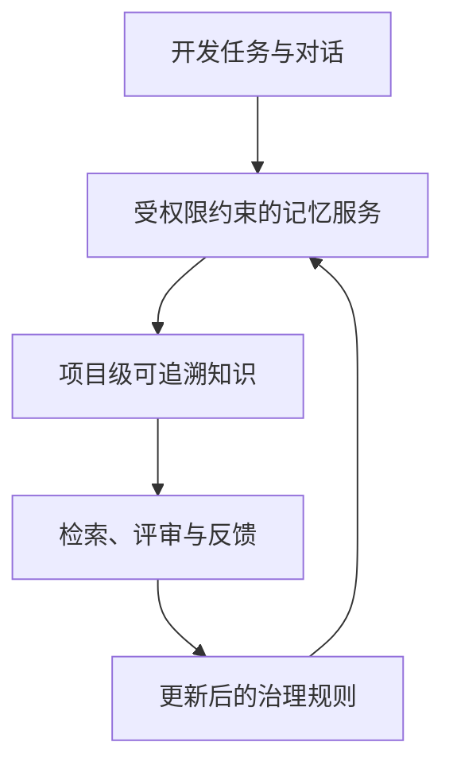
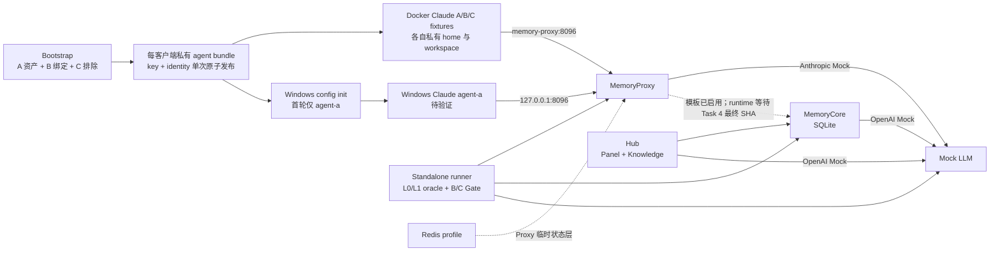
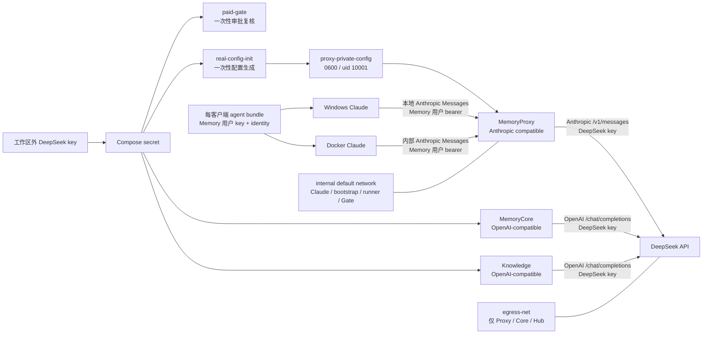

# 企业智能体记忆系统评估

> **Docker Compose**：用 YAML 文件统一定义、连接和启动多个 Docker 容器的工具。

> **Gate**：在受控操作开始前执行的检查；本项目分别检查付费模型输入和 Windows 宿主配置路径，任一检查失败就拒绝执行。

> **Canonical path**：操作系统解析符号链接和相对片段后得到的唯一绝对路径，用来防止同一文件换一种路径写法后绕过目录检查。

> **Attestation**：宿主预检成功后生成的短期核对记录，不是带签名的加密证明。它记录本次批准的 canonical 路径和参数，但不包含模型 key；它只在宿主账户、Compose 启动环境和实验证据目录可信时防止误配置、字段不一致与过期复用，不抵御能同时改写记录和环境变量的本地操作者。

> **Static Passed**：文件、渲染器、Gate 与 Compose 展开结果通过自动检查；不代表镜像或服务已经运行。

> **Docker client / engine**：client 是发出 Docker 命令的前端，engine 是实际构建镜像和运行容器的后台服务；能运行 client 不代表能连接 engine。

> **Current agent context: Engine Inaccessible**：本轮 Codex 执行账户能运行 Docker client 29.6.2，但没有 engine 响应，且读取配置、连接本机 Docker 通信通道均被拒绝。这只说明当前 Codex 执行环境无法访问 engine，不外推为用户会话中的 Docker Desktop 一定无法启动。

> **TUI**：在终端中显示并接收键盘操作的交互界面；Claude Code 的主要交互界面属于 TUI。

> **Mock**：返回固定结果的模拟模型服务。它让协议和故障测试可重复，默认不会产生真实模型费用。

> **ACL**：Access Control List，即服务端用来决定哪个 user、team 或 agent 可以读取某项记忆的访问控制规则。

> **Agent bundle**：只放在单个客户端私有 home 的 `0600` JSON 文件，把该客户端 Memory 用户 key 与身份作为一个整体切换。

> **Identity**：描述当前客户端 service、team、user、agent、task、session 和显示名的身份记录。

> **Fingerprint**：从敏感值稳定派生、可跨记录关联的标识。本项目的报告禁止保存 key fingerprint。

> **Sentinel**：故意注入的非凭证标记，用来判断内部字段是否误传到模型上游；只记录“是否出现”。

> **SHA / gitlink**：SHA 是 Git 提交的唯一标识；gitlink 是根仓库固定 submodule 提交的指针。子目录有新 commit，不等于根仓库已采用。

> **Runtime Not Run**：尚未执行服务启动、业务探针、故障恢复、Claude TUI 或真实模型请求。

> **Expected Blocked**：测试契约已经定义，但依赖修复尚未合入当前根仓库；此时不得把未运行或预期失败写成通过。

> **Verified Fact**：已由当前源码、配置展开或自动测试直接确认的事实。

> **Reported Claim**：来自项目说明或外部资料、但尚未由本地实验独立复核的说法。

> **Inference**：根据已有证据推导的判断，不能当作运行事实。

> **Recommendation**：面向下一步决策的建议，不表示已经实施。

> **Go / Conditional Go / No-Go**：分别表示可进入目标阶段、满足列明条件后才可进入、以及当前不得进入。

**评估状态：** Static Passed；Current agent context: Engine Inaccessible；本轮 Build Not Run；Runtime Not Run；最近一次有证据的 Build 为 registry network 阶段 Failed
**更新时间：** 2026-08-09

**当前决策：** 对公司试点或部署为 **No-Go**；对继续本机、无付费、默认先使用 Mock 的开发为 **Conditional Go**。原因不是已经证明系统失败，而是共享 ACL、安全隔离、持久化恢复和 Claude 交互等硬 Gate 仍为 Expected Blocked 或 Runtime Not Run，尚无资格进入试点。

本页是管理者与开发者的主评估入口：把架构假设、已验证证据、风险与下一步集中在同一处。详细设计见 [企业记忆管理方案](design/2026-08-06-enterprise-memory-design.md)，本轮实施范围见 [Docker-first 规格](specs/2026-08-09-docker-memory-lab.md)、[Standalone 业务 Gate 决策](decisions/2026-08-09-standalone-memory-gate.md)、[默认边界决策](decisions/2026-08-09-docker-memory-lab.md)、[凭证与 attestation 决策](decisions/2026-08-09-credential-fanout-and-paid-attestation.md)、[host path/no-follow 决策](decisions/2026-08-09-host-path-and-no-follow-hardening.md)、[attestation 信任边界补充决策](decisions/2026-08-09-attestation-trust-boundary.md)、[Standalone 静态契约记录](reproduction/2026-08-09-standalone-memory-static-contract.md)、[初始静态运行记录](reproduction/2026-08-09-docker-compose-static.md)、[安全 Gate 静态复验](reproduction/2026-08-09-docker-compose-security-gates-static.md) 和 [该复验的证据边界勘误](reproduction/2026-08-09-docker-compose-security-gates-static-errata.md)。

> **Profile**：必须显式选择才启用的服务组。本项目把 Redis、Docker Claude 和真实 DeepSeek 分别放在受控 profile 中。

> **记忆治理**：让知识写入、检索、共享、失效和追溯都受权限与审查约束，而不是把全部对话直接存入共享库。

> **Fixture**：为自动测试预先定义的客户端样本。A/B/C 用于检查隔离关系，不表示首轮会同时人工启动三个 Claude。

> **L0/L1 oracle**：直接读取 Core 的对话层与原子记忆层作为权威证据，不根据模型回答猜测是否记住。

这表示企业价值来自受控的知识循环：系统先判断谁能看到什么，再把可追溯的项目知识提供给合适的任务；管理者以证据决定是否扩大使用范围。

## Tencent 公开 standalone 基线

> **Standalone**：把必要服务部署在同一套本地环境中的独立运行形态，不依赖腾讯内部托管平台。

> **Process**：容器内正在运行的程序实例；一个容器可以同时管理多个 process。

> **SQLite**：应用直接读写的单文件数据库，不需要单独启动数据库服务器。

> **PostgreSQL / vector database / Redis**：分别是独立关系数据库、向量相似度检索数据库和内存键值服务；它们常见于大型平台，但不是当前公开基线的 Core 必需组件。

**Verified Fact：** 当前 fork 基线由 `memory-core`、`memory-hub`、`memory-proxy` 三个主要服务容器组成；Hub 容器同时运行 Panel 与 Knowledge 两个 process。Core、Knowledge、Proxy 的公开 standalone 路径主要使用内嵌 SQLite。默认 Compose 没有 PostgreSQL、独立 vector database 或 Core Redis，Proxy 也没有到 Hub 的运行时依赖。

**Inference：** 因此首轮评估应先验证三容器原有数据面与 SQLite 持久化，不能把尚未实施的 PostgreSQL/pgvector、TCVDB/COS 或 Core Redis 当成现成功能。Redis profile 目前只用于 Proxy session/cache 等临时状态实验。

## 当前 Docker 实验架构

非技术说明：Bootstrap 会创建三套测试身份，每套 key 与 identity 只以单个私有 bundle 整体切换，不会出现新 key 配旧身份；A 的团队可见 chat-memory asset 显式追加给 B，C 不绑定。Runner 直接查询 Core 的 L0 对话与 L1 原子记忆，不用“模型看起来记住了”代替证据；Mock 对 header/body 只保留三项泄漏布尔值，不保存 key fingerprint。Windows 项目配置必须位于真实仓库外，并由 host attestation 与容器 runtime 二次核对。A/B/C 是自动测试样本，首轮人工交互只运行一个 Docker Claude agent-a 和一个 Windows Claude agent-a。默认模型请求只到 Mock；Proxy 不依赖 Hub 才能启动。图中业务运行行为仍是 Not Run，B shared bridge 在 Task 4 最终 SHA 集成前是 Expected Blocked。

## DeepSeek 三层协议与凭证边界

> **Protocol**：两个系统交换请求和响应时共同遵守的 URL、header 与数据格式约定。

> **Compose secret**：Docker Compose 只挂给指定服务的敏感文件；它比把 key 写入 YAML 或环境变量更容易限制可见范围。

> **Egress network**：允许容器主动访问外部网络的专用网络；未接入该网络的客户端和一次性工具不能直接把数据发往公网。

> **Sensitive named volume**：Docker 管理并在普通 `down` 后继续保留的数据卷；写入 key 后必须按仍持有效凭证的敏感存储管理。

非技术说明：Claude 客户端只知道 Memory 用户 key，并始终先访问本地 Proxy；它们既不持有 DeepSeek key，也不接入外网网络。付费 Gate 与配置生成器会短暂读取 Compose secret，但没有外网出口。长期运行服务中，Core 与 Knowledge 直接从 secret 读取 key，Proxy 只从自己的私有配置卷读取；该卷不挂给 bootstrap、runner 或 Claude。只有 Proxy、Core、Hub 可通过 `egress-net` 联系 DeepSeek。以上是 **Verified Fact（静态配置与测试）**，真实协议请求仍为 **Runtime Not Run**。

## 状态矩阵

| 评估项 | 状态 | 当前证据 | 不能证明的内容 |
| -- | -- | -- | -- |
| 架构与权限模型 | Design Only / Runtime Not Run | 现有设计、Docker-first 规格与 ADR | 实际服务端 ACL、文件所有权和越权拒绝行为 |
| 默认 Mock 编排 | Static Passed / Runtime Not Run | 57/57 Node tests；base/hardened/real/Windows override `config --quiet` exit 0 | 镜像可构建、容器可启动和业务探针 |
| Standalone 业务 Gate | Static Passed / Expected Blocked / Runtime Not Run | A/B/C 单 bundle 身份、asset binding、L0/L1 oracle、冲突身份、header/body sentinel 与宿主证据目录挂载已有自动测试 | public fork 最终 ACL/envelope runtime；B shared bridge 通过 |
| Windows 10 原生 Claude + Docker Linux Claude | Static Passed / Runtime Not Run | 私有 agent bundle 单点发布、路径防链接绕过、Windows host/runtime attestation 与 Proxy 契约已定义 | 两客户端真实读写、TUI；Windows memory tool URL 可达性 |
| Codex / WSL / Win11 / LAN | Deferred / Not Run | 不在当前批准范围 | 跨客户端共享、Win11 和局域网行为 |
| 真实 DeepSeek 路径 | Blocked / Runtime Not Run | Host canonical preflight、短期 attestation、Compose secret、Proxy 私有配置卷、internal/egress 双网络和 Agent secret 隔离已通过静态契约测试 | 协议兼容、质量、延迟和费用 |
| 效率评分 | Not Rated | 尚无 10 组成对任务 | 生产力收益或 ROI |

## 风险与控制

| 风险 | 控制 | 状态 |
| -- | -- | -- |
| DeepSeek key 或 Memory key 泄漏到受跟踪模板、非本客户端配置、日志或报告 | 工作区外 secret、host attestation、脱敏模板、忽略规则与 Gate；每客户端私有 runtime `settings.json` 中的 `ANTHROPIC_AUTH_TOKEN` 是 Memory key 的预期落点，不保存其 hash/前缀/长度 | Static Passed / Runtime Not Run |
| Gateway service token、Memory 用户 key 或内部身份进入模型 header/body | 根 runner 注入非凭证诱饵并检查三个布尔结果；`x-tdai-agent-source`、`x-vertex-ai-session-id` 等列入禁止集。真正的服务端模型上游允许字段清单仍等待 public fork 最终 SHA 更新根 gitlink | Static contract Passed / Expected Blocked / Runtime Not Run |
| Windows config 写入仓库或目录链接目标 | 工具推导真实 root；只允许仓库外 canonical absolute path；host/runtime attestation；持久 home 逐层拒绝跟随链接 | Static Passed / Runtime Not Run |
| 默认运行产生付费或客户端绕过 Proxy 访问外网 | base/real 默认网络均为 internal；真实层需显式 profile 与 Gate，且只有 Proxy/Core/Hub 加入 egress network | Static Passed / Runtime Not Run |
| Proxy 配置内嵌 DeepSeek key 被 bootstrap/runner/Claude 间接读取 | DeepSeek 配置独立写入 `proxy-private-config`；只有一次性 renderer 与 Proxy 挂载，其他服务只能挂不含 DeepSeek key 的 Core 配置卷 | Static Passed / Runtime Not Run |
| 普通 `down` 或删除宿主 secret 后，凭证与业务数据仍留在 Docker volumes | `runtime-config`/`real-core-config`、`bootstrap-state`、Claude homes 和 `proxy-private-config` 按凭证卷管理；Core/Hub/Proxy data 与 Claude workspaces 按业务数据卷管理。每个 run 使用唯一 Compose project，证据归档后只对该精确项目执行 `down -v --remove-orphans`；普通 `down` 保留全部卷，禁止全局 prune | Static Contract / Runtime Not Run |
| 宿主证据目录挂载指向目录链接 | 容器内 writer 会拒绝符号/硬链接并原子写文件，但 Docker 会先在宿主解析挂载源；基础 Mock run 仍信任本地账户与人工确认的 `EVIDENCE_DIR`，不能把容器内检查宣称为宿主防护 | Known Trust Boundary / Runtime Not Run |
| 旧部署数据库仍含历史 `user_key` | public fork 本地提交 `f0eccf9` 已阻止新 L1/L2/hydrate 持久化并在点查时清除命中的旧值，但没有全库扫描，且根 gitlink 尚未更新；旧部署必须离线 scrub 后轮换全部 Memory 用户 key | Legacy Data No-Go / Root Expected Blocked |
| DeepSeek Anthropic 内容类型不兼容 | 以 Mock 契约和后续真实 Gate 分别记录 | Not Run |
| 统一费用硬上限缺失 | budget/turn 仅是声明性审批输入；对 Claude、Proxy、Core、Knowledge 都不是硬限额 | Static Passed / Runtime Not Run |
| Public fork 变更不可审查 | 通用修复使用独立本地 commit；当前未推送、根 gitlink 未更新，Task 4 仍有后续 commit | Local Evidence Only |

## 评分与后续证据

> **0–5 分**：0 表示已有证据证明不具备该能力，3 表示受控场景基本可用，5 表示达到可审计的企业生产要求。证据不足时写 `Not Rated`，不以主观印象补分。

> **证据可信度**：High 表示真实业务运行和可复现故障证据，Medium 表示源码加自动测试，Low 表示设计或静态配置为主。

| 评估维度 | 当前分数 | 证据可信度 | 硬门槛 | 当前依据 | 升级所需证据 |
| -- | -- | -- | -- | -- | -- |
| 可靠性 | Not Rated | Low | No-Go | [规格](specs/2026-08-09-docker-memory-lab.md)仅静态定义持久卷、业务 Gate 和恢复场景 | Core/Proxy/Hub/Redis stop、restart、recreate、backup/restore 的真实结果 |
| 安全性 | 1/5 | Medium | No-Go | [静态契约](reproduction/2026-08-09-standalone-memory-static-contract.md)证明根编排的 secret、bundle、最小 egress 与负测；服务端修复尚未更新 gitlink | public fork 最终 ACL/identity fail-closed 集成、旧库离线清理、真实越权/key 撤销、日志/inspect 扫描 |
| 使用便利性 | 1/5 | Low | Conditional | [集成说明](../tests/integration/README.md)已有两步 Gate 与 Windows 配置命令，但当前 agent context 无法访问 Docker engine | 镜像构建成功、一个命令复现、失败提示和清理/恢复由非开发者实际操作 |
| Claude Code 适配性 | 1/5 | Low | No-Go | [决策记录](decisions/2026-08-09-standalone-memory-gate.md)已有 settings、Anthropic path 与协议契约 | Docker/Windows headless 通过并由用户确认 TUI、stream、tool use、thinking 和长会话 |
| 跨平台兼容性 | 1/5 | Low | No-Go | Windows path Gate 与 Docker Linux 配置仅静态通过 | Windows 10 实机双客户端后，再做 Windows 11、WSL 与 LAN |
| 记忆治理能力 | 1/5 | Medium | No-Go | [静态契约](reproduction/2026-08-09-standalone-memory-static-contract.md)覆盖 A 资产、B 绑定、C 排除、owner oracle；共享 ACL 未集成 | B shared/C isolation 真实业务 Gate、撤销、审计、生命周期和恶意记忆测试 |
| 效率 | Not Rated | Low | Conditional | 尚无 10 组成对任务 | 至少 10 组“启用/关闭记忆”任务的成功率、turns、延迟和重复纠正率 |
| 成本 | Not Rated | Low | Conditional | 真实模型未调用，且没有统一硬费用上限 | 分别记录 Proxy/Core/Knowledge 请求、token、单次成功成本与预算停止行为 |

**No-Go（公司试点/部署）：** 安全与可靠性是硬门槛。当前 B shared bridge 依赖的 public fork 最终修复尚未更新到根 gitlink，当前 agent context 无法访问 Docker engine，runtime、恢复、Claude TUI 和真实 DeepSeek 均未执行。已有部署还必须先离线清理历史数据库中的 `user_key` 并轮换 Memory 用户 key；`f0eccf9` 的点查清除不等于全库已清除。任何总分都不能覆盖这些缺口。

**Conditional Go（继续本机开发）：** 可以继续默认 Mock、无付费、internal network 的静态与本地开发，但条件是不得加载真实 secret、不得把 Expected Blocked 写成通过、不得更新 gitlink/镜像标签为未完成的 public fork 状态，且每次变更同步测试和复现记录。

**Recommendation：** 优先集成 public fork Task 4 最终 SHA、镜像标签与根 gitlink，并由用户会话确认 Docker Desktop engine 可访问；随后先运行 `mock-contract`，再运行 `standalone-memory`。只有两级 Gate 和脱敏证据都通过，才以一个 Docker Claude agent-a 和一个 Windows Claude agent-a 验证交互，最后在用户提供工作区外新 secret 后执行受限真实 DeepSeek Gate。A/B/C 仅是自动化 fixture；Codex、WSL、Win11 和 LAN 另行排期。每次结果新增不可变 reproduction 记录，不以 health check 代替业务流证据。

> **BuildKit named contexts**：Docker 构建镜像时从多个明确目录读取源码的机制；这里让 Hub 直接使用当前 Tencent fork 的 Panel 和 Knowledge，而不复制一份容易过期的源码快照。

当前镜像 Gate 的事实边界：本轮 Codex 执行环境无法访问 Docker engine，所以 **本轮 Build Not Run、Runtime Not Run**。最近一次已有记录的构建在获取 Docker Hub 下载认证令牌时网络超时，状态是 **Failed at registry network**，尚未执行到 named-context `COPY`；这项历史结果不能冒充本轮重试，也不能证明代码构建成功。Compose 的 BuildKit named contexts 已被 Compose 5.3.1 接受并通过静态解析。MemoryPanel 还缺少收窄 build context 的 `.dockerignore`，作为 Medium 项留到下一次 Task 4 public fork commit；本轮没有用 root preflight 掩盖该问题。Windows/Docker tool URL 的根 settings 静态契约已分别固定为 loopback 与 Compose service 地址，但 public fork 消费 `TDAI_MEMORY_PROXY_BASE_URL` 的最终 commit 尚未更新根 gitlink，因此仍是 **Expected Blocked / Runtime Not Run**。开发命令、静态证据和当前限制见 [集成测试说明](../tests/integration/README.md)、[Standalone 静态契约记录](reproduction/2026-08-09-standalone-memory-static-contract.md)、[初始静态运行记录](reproduction/2026-08-09-docker-compose-static.md)、[最新安全复验](reproduction/2026-08-09-docker-compose-security-gates-static.md) 与 [证据边界勘误](reproduction/2026-08-09-docker-compose-security-gates-static-errata.md)。
