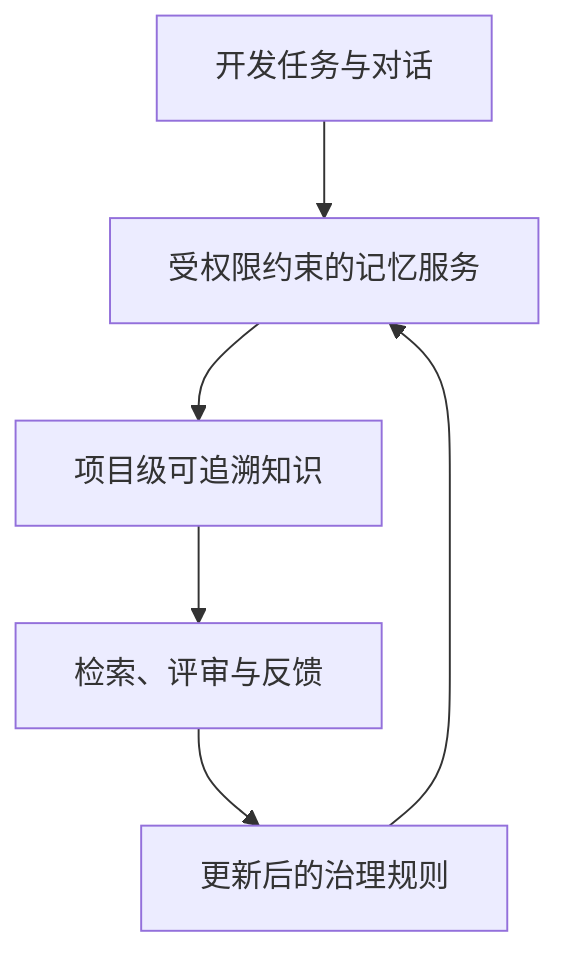
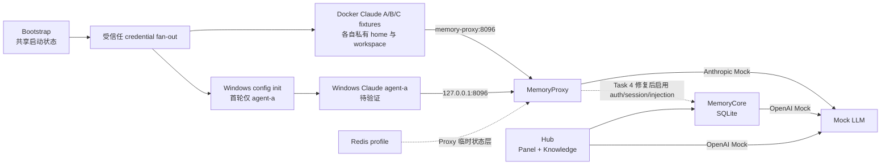

# 企业智能体记忆系统评估

> **Docker Compose**：用 YAML 文件统一定义、连接和启动多个 Docker 容器的工具。

> **Gate**：在受控操作开始前执行的检查；本项目分别检查付费模型输入和 Windows 宿主配置路径，任一检查失败就拒绝执行。

> **Canonical path**：操作系统解析符号链接和相对片段后得到的唯一绝对路径，用来防止同一文件换一种路径写法后绕过目录检查。

> **Attestation**：宿主预检成功后生成的短期核对记录，不是带签名的加密证明。它记录本次批准的 canonical 路径和参数，但不包含模型 key；它只在宿主账户、Compose 启动环境和实验证据目录可信时防止误配置、字段不一致与过期复用，不抵御能同时改写记录和环境变量的本地操作者。

> **Static Passed**：文件、渲染器、Gate 与 Compose 展开结果通过自动检查；不代表镜像或服务已经运行。

> **Build Failed**：镜像构建在镜像仓库认证网络阶段失败，尚未执行到项目 Dockerfile 的关键构建步骤。

> **Runtime Not Run**：尚未执行服务启动、业务探针、故障恢复、Claude TUI 或真实模型请求。

**评估状态：** Static Passed；Build Failed；Runtime Not Run
**更新时间：** 2026-08-09

本页是管理者与开发者的主评估入口：把架构假设、已验证证据、风险与下一步集中在同一处。详细设计见 [企业记忆管理方案](design/2026-08-06-enterprise-memory-design.md)，本轮实施范围见 [Docker-first 规格](specs/2026-08-09-docker-memory-lab.md)、[默认边界决策](decisions/2026-08-09-docker-memory-lab.md)、[凭证与 attestation 决策](decisions/2026-08-09-credential-fanout-and-paid-attestation.md)、[host path/no-follow 决策](decisions/2026-08-09-host-path-and-no-follow-hardening.md)、[attestation 信任边界补充决策](decisions/2026-08-09-attestation-trust-boundary.md)、[初始静态运行记录](reproduction/2026-08-09-docker-compose-static.md)、[安全 Gate 静态复验](reproduction/2026-08-09-docker-compose-security-gates-static.md) 和 [该复验的证据边界勘误](reproduction/2026-08-09-docker-compose-security-gates-static-errata.md)。

> **Mock**：返回固定结果的模拟模型服务。它让协议和故障测试可重复，默认不会产生真实模型费用。

> **Profile**：必须显式选择才启用的服务组。本项目把 Redis、Docker Claude 和真实 DeepSeek 分别放在受控 profile 中。

> **记忆治理**：让知识写入、检索、共享、失效和追溯都受权限与审查约束，而不是把全部对话直接存入共享库。

> **Fixture**：为自动测试预先定义的客户端样本。A/B/C 用于检查隔离关系，不表示首轮会同时人工启动三个 Claude。

这表示企业价值来自受控的知识循环：系统先判断谁能看到什么，再把可追溯的项目知识提供给合适的任务；管理者以证据决定是否扩大使用范围。

## 当前 Docker 实验架构

非技术说明：Bootstrap 会创建三套测试身份，但受信任的一次性进程只把每套凭证交给对应的私有目录；写入前还会拒绝 junction、symlink 和 hard-link escape。Windows 项目配置必须位于真实仓库外，并由 host attestation 与容器 runtime 二次核对。A/B/C 是自动测试样本，首轮人工交互只运行一个 Docker Claude agent-a 和一个 Windows Claude agent-a。默认所有模型请求只到 Mock；Proxy 当前也不依赖 Hub 才能启动。Redis 仅是 Proxy 的 session、cache、rate limit、binding 和 version pin 临时状态层，不是 Core 数据库。图中所有运行行为仍待 Task 5 验证。

## 状态矩阵

| 评估项 | 状态 | 当前证据 | 不能证明的内容 |
| -- | -- | -- | -- |
| 架构与权限模型 | Design Only / Runtime Not Run | 现有设计、Docker-first 规格与 ADR | 实际服务端 ACL、文件所有权和越权拒绝行为 |
| 默认 Mock 编排 | Static Passed / Runtime Not Run | 45 项 Node 测试；base/hardened/real/Windows override `config --quiet` exit 0 | 镜像可构建、容器可启动和业务探针 |
| Windows 10 原生 Claude + Docker Linux Claude | Static Passed / Runtime Not Run | 私有凭证 fan-out、no-follow、Windows host/runtime attestation 与 Proxy 契约已定义 | 两客户端真实读写、TUI 与身份隔离 |
| Codex / WSL / Win11 / LAN | Deferred / Not Run | 不在当前批准范围 | 跨客户端共享、Win11 和局域网行为 |
| 真实 DeepSeek 路径 | Blocked / Runtime Not Run | Host canonical preflight、短期 attestation、单一 Compose secret、服务端 wrapper 和 Agent secret 隔离已通过静态契约测试 | 协议兼容、质量、延迟和费用 |
| 效率评分 | Not Rated | 尚无 10 组成对任务 | 生产力收益或 ROI |

## 风险与控制

| 风险 | 控制 | 状态 |
| -- | -- | -- |
| 模型 key 泄漏到配置、日志或报告 | 工作区外 secret、host attestation、脱敏模板、忽略规则与 Gate；Proxy key 只写入受保护运行时配置 | Static Passed / Runtime Not Run |
| Windows config 写入仓库或 junction 目标 | 工具推导真实 root；只允许仓库外 canonical absolute path；host/runtime attestation；持久 home 逐层 no-follow | Static Passed / Runtime Not Run |
| 默认运行产生付费或访问外网模型 | base network 为 internal 且仅配置 Mock；真实层需显式 `real-claude` profile 与 Gate | Static Passed |
| DeepSeek Anthropic 内容类型不兼容 | 以 Mock 契约和后续真实 Gate 分别记录 | Not Run |
| 统一费用硬上限缺失 | budget/turn 仅是声明性审批输入；对 Claude、Proxy、Core、Knowledge 都不是硬限额 | Static Passed / Runtime Not Run |
| Public fork 变更不可审查 | 通用修复独立提交；当前未推送 | Not Run |

## 评分与后续证据

目前不得给出效率或 ROI 分数。后续至少收集 10 组成对任务，并同时记录任务类型、耗时、成功率、人工介入、检索命中、权限拒绝、费用和失败原因；在此之前保持 **Not Rated**。

优先顺序为：先解除 Docker Hub 网络阻塞并验证默认 Mock 的端到端业务探针，再以一个 Docker Claude agent-a 和一个 Windows Claude agent-a 验证隔离与共享，最后在用户提供工作区外新 secret 后执行受限真实 DeepSeek Gate。A/B/C 仅是自动化 fixture；Codex、WSL、Win11 和 LAN 另行排期。每次结果应新增可复核的 reproduction 记录，不以 health check 代替业务流证据。

> **BuildKit named contexts**：Docker 构建镜像时从多个明确目录读取源码的机制；这里让 Hub 直接使用当前 Tencent fork 的 Panel 和 Knowledge，而不复制一份容易过期的源码快照。

当前镜像 Gate 的事实边界：Compose 的 BuildKit named contexts 已被本机 Compose 5.3.1 接受并通过静态解析，但 Hub/Claude 实际构建在获取 Docker Hub 下载认证令牌时网络超时，尚未执行到 named-context `COPY`。因此构建状态是 **Failed（镜像仓库网络阻塞）**，不是代码构建通过或 Docker 不可用。MemoryPanel 还缺少收窄 build context 的 `.dockerignore`，作为 Medium 项留到下一次 Task 4 public fork commit；本轮没有用 root preflight 掩盖该问题。开发命令、静态证据和当前限制见 [集成测试说明](../tests/integration/README.md)、[初始静态运行记录](reproduction/2026-08-09-docker-compose-static.md)、[最新安全复验](reproduction/2026-08-09-docker-compose-security-gates-static.md) 与 [证据边界勘误](reproduction/2026-08-09-docker-compose-security-gates-static-errata.md)。
