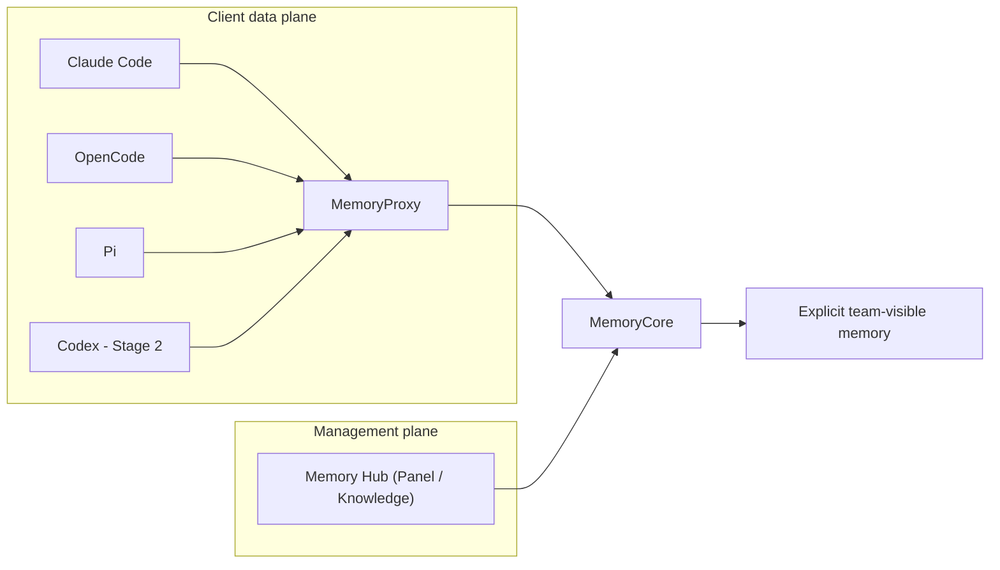

# 企业智能体记忆系统评估

## 结论

当前 active 目标是四 Docker CLI 共享记忆实验。Task 5 的 Proxy→Core auth service-token、Mock fixture、Claude EROFS/tmpfs 与 OpenCode fixed-title 缺口均已完成 TDD、replacement images 与 scoped review。`opentitle-4f056ee6` 的单次 full Mock launcher 在 fixed step 9 fail-stop；steps 1–8 exit `0`，唯一脱敏 aggregate probe 看到 OpenCode main request 精确一次，但未定位 step 9 的具体失败项。exact project 已 cleanup 为 `0/0/0`。OpenCode typed diagnostic 已在 `c163b6c...` 完成 TDD/static review，全新 `89398d1d` tuple 的 preflight 为 **Ready / Not Run**；当前业务 Gate 仍为 **Blocked**。三写六读、final、TUI 与真实 API/模型仍未获得通过证明。

旧 Windows 原生 Claude + Docker Claude 证据一律是 **Legacy**：保留原文供追溯，但不用于推断新的四 CLI 架构已通过。

2026-08-10 经负责人明确授权，Legacy 路线的 3 个 Compose project、20 个容器、4 个网络、27 个卷和 6 个旧镜像候选已完成精确清理。旧 runtime resources 与卷内容不可恢复；Git ref、ADR 和 reproduction 仍保留历史可追溯性。该清理不改变四 CLI 服务、Mock、真实 API、TUI 和跨客户端业务流的 `Not Run` 状态。

## 固定事实

| 项目 | 值 | 证据边界 |
| --- | --- | --- |
| Tencent upstream base | default `feat/server_team@0a568c328ea1aae3f22ed3656e7900da7ea565c1` | Task 2 的 pristine RED/基线；upstream 前移前必须审查 |
| Tencent committed source | `codex/four-agent-memory-upstream@9e456a5b7bb47ae40596237d0f0b87c1edfc098f` | 当前根 gitlink；auth service-token fix review CLEAN；local-only，origin 仍为 `38ced16...`，fresh clone 暂不可取得 |
| Fixed images | Core `sha256:fded9d48...`；Proxy `sha256:55fedae3...`；Hub `sha256:a6037724...`；tools `sha256:8ca1a2a8...`；OpenCode `sha256:263a6d0e...` | replacement images Ready；`opentitle-4f056ee6` cleanup 后 active images 7/7 retained；full Mock Blocked |
| Container user metadata | Core/Hub root-default（UID 0）；Proxy `app`（UID 10001） | source-build evidence；本轮不扩大为权限改造 |
| Legacy preservation | `codex/legacy-proxy-hardening-69fd8b@69fd8b31e3fd4362af6c65407b92b26dfabebd0c` | local-only、未 push；fresh clone 不可取得，未经授权不得 push；跨 clone 可重建保全仍未完成 |
| Legacy runtime lifecycle | 3 projects / 20 containers / 4 networks / 27 volumes / 6 image candidates absent | 2026-08-10 Runtime Cleanup Passed；旧栈需从 Git 历史重新构建并创建新资源 |
| Claude Code | `2.1.226` / image `sha256:261a917376f791d9b5e092040c2f488f23588b7103a27606226426f273b040dd` | EROFS classifier、version/help、UID10001、host/image hash/export、64MiB hardened tmpfs runtime probe 与 single diagnostic Passed；完整 Mock/TUI Not Run |
| OpenCode | `1.18.16` / image `sha256:263a6d0eade24b72b4b2627984a930fc69a3e621519b1ec050a0320398b890a1` | fixed-title TDD、单次 rebuild、version/help、UID10001、host/image hash、evidence ownership/writability Passed；full Mock step 9 Blocked；typed diagnostic `89398d1d` Ready/Not Run |
| Pi | `0.84.1` / image `sha256:56582fd216db259342f4414ebdc6c9c9188229678d77eb2f360959c9af2e4538` | rebuild、version/help、UID 10001、evidence ownership/writability、headless assets Passed；prompt/TUI Not Run |
| Codex | `0.147.0` | 固定版本；Not Run |

## 架构与阶段

- **Fact**：Stage 1 使用 Claude Code、OpenCode、Pi；它们分别经 `/claude-code/<space>/v1/messages`、`/opencode/<space>/v1/messages`、`/pi/<space>/v1/messages` 接入，不能伪造平台身份。
- **Fact**：Stage 2 才增加 Codex 的 `/codex/<space>/v1/responses` 契约。
- **Fact**：每个客户端的 Memory user、Agent、Session、user key、home、workspace 和 evidence 必须彼此独立；共享只限相同 Team/Task 内显式 team-visible memory。
- **Recommendation**：先在 deterministic Mock 下验证真实 source、身份、共享、隔离、header/credential hygiene 和客户端卷隔离，再考虑真实模型。

## 状态矩阵

| Gate | 状态 | 说明 |
| --- | --- | --- |
| Task 1 历史保全、active docs、gitlink | Static baseline | 本轮文档/指针工作；不是服务运行 |
| Stage 1 upstream source-build | Runtime Passed | 全部 tracked/image shell、Core/Proxy 新构建与必要 runtime assets Passed；Hub 保持原 Passed 镜像；不等于服务/业务 Runtime Passed |
| Stage 1 Claude/OpenCode/Pi 原生路由 | Runtime Passed | Task 3 route 证据保持；active product auth fix 的 fresh full 为 38/38 suites / 276/276 tests，仍不等于服务/客户端业务流 Passed |
| Stage 1 client Compose/bootstrap/config/images | Runtime Passed | tools 与三 client 原 build/assets、Claude EROFS replacement、OpenCode fixed-title replacement；version/help、UID10001、evidence ownership/writability、headless assets；仅 client build/config assets |
| Stage 1 Task 5 root harness | Static/contract Passed | root Node 239/239、active Compose config 7/7 与 OpenCode diagnostic overlay 1/1；fixture array text-block、固定 step allowlist、typed client diagnostic、固定 epoch/path、strict fixture、逐 operation oracle、outsider、exact project freshness、run/build/evidence 与 request-local credential 合同，不是业务运行 |
| Stage 1 Proxy privacy/build | Runtime Passed | reviewed `9e456a5` auth service-token fix、38/38 suites / 276/276 tests、exact six baseline typecheck errors、Proxy `sha256:55fedae3...`；replacement image Ready，product tests + build/assets only |
| Stage 1 Mock identity/share/isolation/leak | Blocked | `opentitle-4f056ee6` 单次 launcher fixed step 9 fail-stop且 exact cleanup；OpenCode main request 精确一次到达 Mock，但复合 step 的具体失败项未定位；typed diagnostic `89398d1d` Ready/Not Run |
| Stage 1 TUI | Not Run | 仅在 headless Gate 通过后由用户确认 |
| Stage 1 真实模型 | Not Run | 需完整 Mock Gate 与明确授权 |
| Stage 2 Codex Responses | Not Run | 在 Stage 1 后执行 |
| Legacy Windows + Claude runs | Legacy | 历史证据，不进入本矩阵的通过计数 |

## 风险与控制

| 风险 | 控制 |
| --- | --- |
| 将 legacy 运行扩大为新架构通过 | active 入口、ADR 与 reproduction 显式标为 Legacy / Not Run |
| 清理后误认为旧栈仍可原样复现 | 精确清理记录固定销毁范围；历史可追溯不等于 runtime resources 可恢复 |
| 平台身份伪造或跨客户端泄漏 | literal route-bound source；unknown/unbound/conflict/missing/invalid fail closed；独立 identity/key/home/workspace/evidence |
| 凭证扩散 | 模型 key 只在服务端；不读取/记录 `.env`、settings、secret、home 或 runtime 原文 |
| 上游 SHA 或修复边界漂移 | upstream base 固定 `0a568c3`，active gitlink 固定 `9e456a5`；该提交 local-only 且 origin 仍为 `38ced16`，前移/发布必须单独授权 |
| privacy 结论越过已测范围 | header allowlist、credential origin/redirect、结构化 sink 与 active/auxiliary/injection diagnostics 已有产品测试；Claude/OpenCode 已有 partial CLI→Proxy→Mock 与脱敏 aggregate runtime 证据，但完整 evidence chain/end-to-end Gate 未通过，不能扩写为端到端通过 |
| terminal session cache 跨 identity 复用 | reviewed full-identity key/validation 修复与替代 Proxy 已通过限定 product/build Gate；root launcher 从私有 bundle 覆盖 request-local key；live forged outsider oracle 仍必须在 Mock runtime 复验 |
| fixed launcher step 仍无法定位 client 子阶段 | 不读取 raw logs/evidence；使用全新 tuple 的 typed OpenCode diagnostic 区分 CLI、bounded scan、aggregate postcheck 与 evidence publish |
| Windows EOL 或硬编码 Shell Gate 漏检 runtime asset | 动态枚举全部 tracked `*.sh`，并递归验证镜像内全部 `*.sh` 无 CR 且 `bash -n` Passed |
| producer 部分输出后 nonzero 被误判完整枚举 | 先写临时 NUL manifest 并显式检查 producer 成功，再由主 shell 读取；失败输出固定且不消费 partial manifest |
| Core/Hub root-default 扩大权限面 | 当前只如实记录 UID 0；后续权限改造必须另立设计与行为 Gate，不能混入 source-build 证明 |
| 付费或破坏性操作越权 | 未经明确授权不得做真实 API、push、PR、remote 修改、prune 或 `down -v` |

## 下一 Gate

[opentitle-4f056ee6 OpenCode write Blocked](reproduction/2026-08-12-task5-mock-20260812-opentitle-4f056ee6-opencode-write-blocked.md) 固定单次 step 9 fail-stop 与脱敏 aggregate 边界；[exact cleanup](reproduction/2026-08-12-task5-mock-20260812-opentitle-4f056ee6-exact-cleanup-passed.md) 已使该 project 为 `0/0/0`。[OpenCode typed diagnostic `89398d1d` Ready](reproduction/2026-08-12-task5-diag-opencode-20260812-89398d1d-ready.md) 已固定 TDD/review、全新 run/project/evidence tuple 与 preflight。下一 Gate 唯一动作是单次运行 tracked `run-task5-opencode-diagnostic.mjs`；不得 build、retry、复用旧 tuple、读取 raw logs/evidence、进入 full Mock/TUI 或真实模型。仅在 coordinator freshness 通过且本次运行创建 exact project 后执行 exact cleanup；label collision/preflight failure 必须保留资源并先审计。真实 API、TUI 与 Codex Stage 2 仍为 Not Run。active gitlink 在获得独立 push/归档授权前仍无法由 fresh clone 获取。
