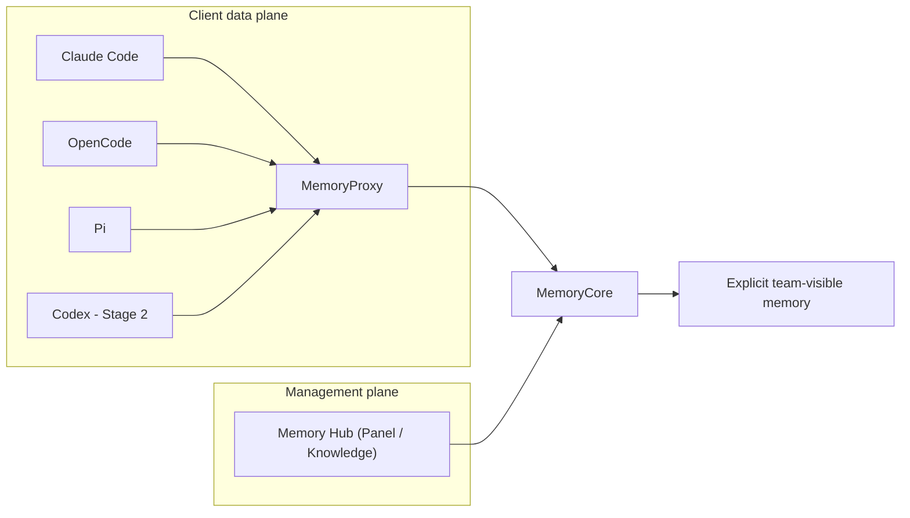

# 企业智能体记忆系统评估

## 结论

当前 active 目标是四 Docker CLI 共享记忆实验。Task 2 已完成 Core、Proxy、Hub source-build 与无网络 runtime asset Gate；状态是 **Runtime Passed（build/assets only）**。尚无服务健康、Mock、真实 API、TUI 或跨客户端业务流的 Runtime Passed 证据。

旧 Windows 原生 Claude + Docker Claude 证据一律是 **Legacy**：保留原文供追溯，但不用于推断新的四 CLI 架构已通过。

## 固定事实

| 项目 | 值 | 证据边界 |
| --- | --- | --- |
| Tencent upstream base | default `feat/server_team@0a568c328ea1aae3f22ed3656e7900da7ea565c1` | Task 2 的 pristine RED/基线；upstream 前移前必须审查 |
| Tencent active source | `codex/four-agent-memory-upstream@3db2b7d60a3b6162118cad1090d1872f1410835a` | 根 gitlink；仅含 LF 与 public stub validity 两笔 TDD 最小修复 |
| Legacy preservation | `codex/legacy-proxy-hardening-69fd8b@69fd8b31e3fd4362af6c65407b92b26dfabebd0c` | local-only、未 push；fresh clone 不可取得，未经授权不得 push；跨 clone 可重建保全仍未完成 |
| Claude Code | `2.1.226` | 固定版本；Not Run |
| OpenCode | `1.18.16` | 固定版本；Not Run |
| Pi | `0.84.1` | 固定版本；Not Run |
| Codex | `0.147.0` | 固定版本；Not Run |

## 架构与阶段

- **Fact**：Stage 1 使用 Claude Code、OpenCode、Pi；它们分别经 `/claude-code/<space>/v1/messages`、`/opencode/<space>/v1/messages`、`/pi/<space>/v1/messages` 接入，不能伪造平台身份。
- **Fact**：Stage 2 才增加 Codex 的 `/codex/<space>/v1/responses` 契约。
- **Fact**：每个客户端的 Memory user、Agent、Session、user key、home、workspace 和 evidence 必须彼此独立；共享只限相同 Team/Task 内显式 team-visible memory。
- **Recommendation**：先在 deterministic Mock 下验证真实 source、身份、共享、隔离、header/credential hygiene 和客户端卷隔离，再考虑真实模型。

## 状态矩阵

| Gate | 状态 | 说明 |
| --- | --- | --- |
| Task 1 历史保全、active docs、gitlink | Static baseline | 本轮文档/指针工作；不是服务运行 |
| Stage 1 upstream source-build | Runtime Passed | Core、Proxy、Hub source-build 与必要 runtime assets Passed；不等于服务/业务 Runtime Passed |
| Stage 1 Claude/OpenCode/Pi 原生路由 | Not Run | 产品路由与契约尚未实现/验证 |
| Stage 1 Mock identity/share/isolation/leak | Not Run | 不执行 Docker workload |
| Stage 1 TUI | Not Run | 仅在 headless Gate 通过后由用户确认 |
| Stage 1 真实模型 | Not Run | 需完整 Mock Gate 与明确授权 |
| Stage 2 Codex Responses | Not Run | 在 Stage 1 后执行 |
| Legacy Windows + Claude runs | Legacy | 历史证据，不进入本矩阵的通过计数 |

## 风险与控制

| 风险 | 控制 |
| --- | --- |
| 将 legacy 运行扩大为新架构通过 | active 入口、ADR 与 reproduction 显式标为 Legacy / Not Run |
| 平台身份伪造或跨客户端泄漏 | 独立 identity/key/home/workspace/evidence；未知或未绑定 source fail closed |
| 凭证扩散 | 模型 key 只在服务端；不读取/记录 `.env`、settings、secret、home 或 runtime 原文 |
| 上游 SHA 或修复边界漂移 | upstream base 固定 `0a568c3`，active gitlink 固定 `3db2b7d`；前移先审查，不批量迁移 legacy |
| 付费或破坏性操作越权 | 未经明确授权不得做真实 API、push、PR、remote 修改、prune 或 `down -v` |

## 下一 Gate

完成 Task 2 的最终静态/Git/镜像元数据复核并固定产品修复与根 gitlink 后，进入 Task 3：为 Claude Code、OpenCode、Pi 写原生 source/session/route RED，再实现最小 Stage 1 Messages 路由。当前 source-build Runtime Passed 只覆盖镜像构建与无网络 runtime assets；服务健康、Mock、业务流、真实 API 与 TUI 仍为 Not Run。
