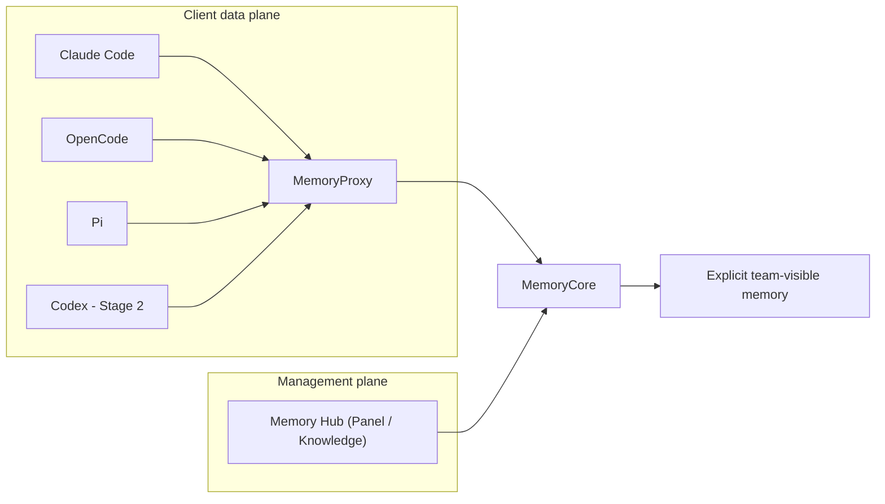

# 企业智能体记忆系统评估

## 结论

当前 active 目标是四 Docker CLI 共享记忆实验。Task 5 pre-runtime review round 1 修正后的 root harness 已把 epoch/path aggregate、完整 Anthropic fixture、逐 operation owner oracle、outsider bracketing、build/run 与 headless evidence 固定为 **Static/contract Passed**。原 `d6afcd8` privacy tests/build image 仍只在原范围内有效；新发现的跨 identity terminal L1 session cache 风险使产品修复、替代镜像与 scoped re-review 保持 Pending。尚无服务健康、真实 CLI headless、Mock 三写六读、live outsider/management、真实 API、TUI 或跨客户端业务流的 Runtime Passed 证据。

旧 Windows 原生 Claude + Docker Claude 证据一律是 **Legacy**：保留原文供追溯，但不用于推断新的四 CLI 架构已通过。

2026-08-10 经负责人明确授权，Legacy 路线的 3 个 Compose project、20 个容器、4 个网络、27 个卷和 6 个旧镜像候选已完成精确清理。旧 runtime resources 与卷内容不可恢复；Git ref、ADR 和 reproduction 仍保留历史可追溯性。该清理不改变四 CLI 服务、Mock、真实 API、TUI 和跨客户端业务流的 `Not Run` 状态。

## 固定事实

| 项目 | 值 | 证据边界 |
| --- | --- | --- |
| Tencent upstream base | default `feat/server_team@0a568c328ea1aae3f22ed3656e7900da7ea565c1` | Task 2 的 pristine RED/基线；upstream 前移前必须审查 |
| Tencent committed source | `codex/four-agent-memory-upstream@d6afcd835467c56a29d89e9befcb796ab612da78` | 当前根 gitlink；既定 privacy 范围曾 review CLEAN，但新 session-cache 风险的修复尚未成为 active commit |
| Fixed images | Core `sha256:fded9d48...`；旧 Task 5 Proxy `sha256:d79751b6...`；Hub `sha256:a6037724...` | 旧 Proxy 保留 113/113 与 build-assets 历史证据，但禁止用于本轮 runtime；替代镜像 Pending |
| Container user metadata | Core/Hub root-default（UID 0）；Proxy `app`（UID 10001） | source-build evidence；本轮不扩大为权限改造 |
| Legacy preservation | `codex/legacy-proxy-hardening-69fd8b@69fd8b31e3fd4362af6c65407b92b26dfabebd0c` | local-only、未 push；fresh clone 不可取得，未经授权不得 push；跨 clone 可重建保全仍未完成 |
| Legacy runtime lifecycle | 3 projects / 20 containers / 4 networks / 27 volumes / 6 image candidates absent | 2026-08-10 Runtime Cleanup Passed；旧栈需从 Git 历史重新构建并创建新资源 |
| Claude Code | `2.1.226` / image `sha256:440d744ef794a29340622f920458fb533c9bff3d3db0b9ce01d3c5947c68492b` | base digest + npm integrity、build、version/help、UID 10001 Passed；prompt/TUI Not Run |
| OpenCode | `1.18.16` / image `sha256:8cdd9dfe249acc1888cb8c6fd8d00bfe46091cc4802fc44f3102adfd976886ab` | base digest + npm integrity、build、version/help、UID 10001 Passed；prompt/TUI Not Run |
| Pi | `0.84.1` / image `sha256:8d3275d699e20f9ab0e91f69f2eb50bcdf6b8722e331ba995c94444ebe56bc82` | base digest + Release SHA-256、build、version/help、UID 10001 Passed；prompt/TUI Not Run |
| Codex | `0.147.0` | 固定版本；Not Run |

## 架构与阶段

- **Fact**：Stage 1 使用 Claude Code、OpenCode、Pi；它们分别经 `/claude-code/<space>/v1/messages`、`/opencode/<space>/v1/messages`、`/pi/<space>/v1/messages` 接入，不能伪造平台身份。
- **Fact**：Stage 2 才增加 Codex 的 `/codex/<space>/v1/responses` 契约。
- **Fact**：每个客户端的 Memory user、Agent、Session、user key、home、workspace 和 evidence 必须彼此独立；共享只限相同 Team/Task 内显式 team-visible memory。
- **Recommendation**：先在 deterministic Mock 下验证真实 source、身份、共享、隔离、header/credential hygiene 和客户端卷隔离，再考虑真实模型。

## 状态矩阵

| Gate | 状态 | 说明 |
| --- | --- | --- |
| Task 1 历史保全、active docs、gitlink | Static baseline | 本轮文档/指针工作；不是服务运行 |
| Stage 1 upstream source-build | Runtime Passed | 全部 tracked/image shell、Core/Proxy 新构建与必要 runtime assets Passed；Hub 保持原 Passed 镜像；不等于服务/业务 Runtime Passed |
| Stage 1 Claude/OpenCode/Pi 原生路由 | Runtime Passed | Task 3 的 31/31 route 证据保持；Task 5 新镜像 full suite 113/113，仍不等于服务/客户端业务流 Passed |
| Stage 1 client Compose/bootstrap/config/images | Runtime Passed | root Node 86/86、Compose matrix、owner/outsider cardinality、binding post-set 全字段验证、config/bundle no-follow、三 owner+outsider、六 cross-owner binding、三镜像 build/version/help/UID；仅 client build/config assets |
| Stage 1 Task 5 root harness | Static/contract Passed | round 1 corrections 后 root Node 143/143 与 Compose config 6/6；固定 epoch/path、strict fixture、逐 operation oracle、outsider、run/build 与 evidence 合同，不是 Docker 业务运行 |
| Stage 1 Proxy privacy/build | Blocked / fix pending | `d6afcd8` 的既定 privacy suite/build-assets 仍是历史 Passed；跨 identity terminal L1 风险已复现，产品修复、替代镜像与 scoped re-review 未完成 |
| Stage 1 Mock identity/share/isolation/leak | Not Run | 业务栈尚未启动；product build/assets 不替代该 Gate |
| Stage 1 TUI | Not Run | 仅在 headless Gate 通过后由用户确认 |
| Stage 1 真实模型 | Not Run | 需完整 Mock Gate 与明确授权 |
| Stage 2 Codex Responses | Not Run | 在 Stage 1 后执行 |
| Legacy Windows + Claude runs | Legacy | 历史证据，不进入本矩阵的通过计数 |

## 风险与控制

| 风险 | 控制 |
| --- | --- |
| 将 legacy 运行扩大为新架构通过 | active 入口、ADR 与 reproduction 显式标为 Legacy / Not Run |
| 清理后误认为旧栈仍可原样复现 | 精确清理记录固定销毁范围；历史可追溯不等于 runtime resources 可恢复 |
| 平台身份伪造或跨客户端泄漏 | literal route-bound source；unknown/unbound/conflict/missing/invalid fail closed；独立 identity/key/home/workspace/evidence |
| 凭证扩散 | 模型 key 只在服务端；不读取/记录 `.env`、settings、secret、home 或 runtime 原文 |
| 上游 SHA 或修复边界漂移 | upstream base 固定 `0a568c3`，active gitlink 固定 `d6afcd8`；前移先审查，不批量迁移 legacy |
| privacy 结论越过已测范围 | header allowlist、credential origin/redirect、结构化 sink 与 active/auxiliary/injection diagnostics 已有产品测试；live Proxy→Mock、真实 CLI 与脱敏 evidence chain 仍 Not Run，不能扩写为端到端通过 |
| terminal session cache 跨 identity 复用 | root forged Gate 固定 outsider key + 完整 victim tuple、403/409 与同 epoch all-model delta 0；产品 full-identity key/validation 修复和替代镜像通过前禁止 runtime |
| Windows EOL 或硬编码 Shell Gate 漏检 runtime asset | 动态枚举全部 tracked `*.sh`，并递归验证镜像内全部 `*.sh` 无 CR 且 `bash -n` Passed |
| producer 部分输出后 nonzero 被误判完整枚举 | 先写临时 NUL manifest 并显式检查 producer 成功，再由主 shell 读取；失败输出固定且不消费 partial manifest |
| Core/Hub root-default 扩大权限面 | 当前只如实记录 UID 0；后续权限改造必须另立设计与行为 Gate，不能混入 source-build 证明 |
| 付费或破坏性操作越权 | 未经明确授权不得做真实 API、push、PR、remote 修改、prune 或 `down -v` |

## 下一 Gate

Task 5 round 1 root contracts 已通过静态层级。下一步必须先完成产品 full-identity session-cache 修复、完整产品验证与替代 Proxy build，再重建 tools/三个 client 并通过同一 reviewer 的 scoped re-review；在此之前不启动业务栈。全部前置通过后，deterministic Mock 才按 protocol/leak → management/outsider → 三次顺序写入 → 六次有序跨 owner 读取 → final oracle 执行。三个真实 headless 全绿后才进入用户 TUI 确认；服务健康、Mock 业务流、真实 API 与 TUI 当前仍为 Not Run。
