> **状态：Historical** — 本计划属于已归档的 2026-08 实验，不应直接执行。

# TencentDB Agent Memory 改造计划书(企业记忆方案落地)

> **For agentic workers:** REQUIRED SUB-SKILL: Use superpowers:subagent-driven-development (recommended) or superpowers:executing-plans to implement this plan task-by-task. Steps use checkbox (`- [ ]`) syntax for tracking.

> **状态（2026-08-07）：待重新校准，禁止直接执行。** 当前 fork 快照为 `fe3230f`，实际顶层目录是 `MemoryCore/`、`MemoryKnowledge/`、`MemoryPanel/`、`MemoryProxy/` 和 `sdk/`；本文中的 `services/*`、`packages/*` 路径并不存在。先完成 Windows + Claude Code 原样复现，再基于真实失败点和当前源码重写实施步骤。

**Goal:** 以 `submodules/TencentDB-Agent-Memory`(分支 `feat/server_team`)为模板,fork 后改造成 `docs/design/2026-08-06-enterprise-memory-design.md`(v0.5)描述的企业记忆方案——按角色分级披露、Git 化审计、记忆价值闭环、环境变量凭证 + MCP 接入。

**Architecture:** 保留 TencentDB 已工程化好的部分(L0-L3 提炼管线、隔离下推、混合检索、MCP 骨架),只在其上叠加缺失的四层能力:身份维度扩展(project/role/disclosure/granularity)→ 治理落真(private by default + Memory Firewall)→ Git submodule 知识库与 Memory PR → 价值闭环(失效不删除 + q_value)。全部以可独立评审、可 `vitest` 验证的 PR 推进。

**Tech Stack:** TypeScript / Node(pnpm workspace);`better-sqlite3`(同步 API,SQL 参数占位符 `@name`);`zod`(schema 校验);`@xenova/transformers`(本地嵌入);`openai`(LLM);`@modelcontextprotocol/sdk`(MCP);`vitest`(测试)。

## Global Constraints

- **工作基线**:在 fork 上开发,不推改上游;每个 PR = 一个 feature 分支 + 一次评审 + 可合入,PR 内 TDD、频繁提交。
- **构建/测试命令**(各服务包内):`pnpm build`=`tsc`;`pnpm test`=`vitest run`;`pnpm typecheck`=`tsc --noEmit`;`pnpm dev`=`tsx watch src/index.ts`。测试文件放对应模块的 `__tests__/` 目录,命名 `*.test.ts`。
- **数据库**:沿用 `better-sqlite3`,同步 API,SQL 命名参数用 `@name`;不引入新数据库引擎。
- **schema 校验**:新增结构一律用 `zod` 定义并导出类型;列迁移写在各服务现有迁移机制内(实施首步先定位迁移目录)。
- **命名对齐 design v0.5**:`disclosure` ∈ {`private`,`internal`,`interface`,`public`};`granularity` ∈ {`L0`,`L1`,`L2`,`L3`};`scope` ∈ {`org`,`project`,`user`};记忆 `type` 增加 `asset`。
- **向后兼容**:所有新增身份维度与列必须可选、有默认值,不破坏现有 `IsolationContext` 调用点与现有数据。
- **保密默认**:推翻 TencentDB 的 `memorySharedWithTeam = true` 默认,改为 **private by default**(design §10、comment「谁能看」)。
- **凭证安全**:令牌只经环境变量传入,永不写进记忆内容或 LLM 可见 prompt;令牌串在 Firewall 禁写清单内。

---

## 不改动项及理由(记录,不做大规模修改)

> comment.md 要求:仓库某些方面已有更好方案或不适合大改的,不动但记录。以下五项经代码核对确认保留。

| 保留项 | 位置 | 为什么不动 |
|--------|------|-----------|
| L0-L3 异步提炼管线 | `services/memory-core/src/core/record/l1-extractor.ts`、`l1-dedup.ts`、`core/scene/scene-extractor.ts`、`core/persona/persona-generator.ts` | 已完整工程化(单次 LLM 场景切分+抽取、批量冲突检测、延迟指标上报),正是 design 的 granularity L0-L3。只在 PR-3 消费其分层输出,不重写管线。 |
| 隔离下推范式 | `services/memory-core/src/core/store/isolation.ts` 的 `buildIsolationWhere` / `assertIsolation` | "写入强制身份、查询 filter 下推 SQL"与 design「检索前过滤、严禁先召回再遮盖」同构。PR-1 **扩展维度**而非重写。 |
| 混合检索 + 三重预算 | `services/memory-core/src/core/tools/memory-search.ts`(FTS5 + 向量 + RRF,条数/字符/超时上限) | 检索与上下文预算已达标,直接复用;PR-3 只在其入口加一层角色颗粒度过滤。 |
| MemoryProxy 透明代理内部 | `services/memory-proxy/` | 全量 LLM 流量过代理在企业里是高敏单点(reference 缺点 4)。**不重写其内部**,方案主推 `packages/memory-mcp` 通道(PR-10),Proxy 降为可选兼容层——以"少改+旁路"替代"大改"。 |
| MemoryKnowledge(Wiki/CodeGraph) | `services/memory-knowledge/` | 引擎栈较深、与本方案核心(记忆治理)弱相关。冷启动导入留待 Phase D 之后单独评估,本计划不触碰。 |

---

## 汲取其他方案的亮点(在对应 PR 落地)

| 亮点 | 来源 | 落地 PR |
|------|------|---------|
| 写入分诊「大部分对话不该记 + 密钥/代码可读事实禁写」 | Mem0 memory-triage(`docs/reference/mem0.md`) | PR-5 |
| 事实带时间戳、变更标失效不删除(`invalid_at`) | Graphiti(`docs/reference/graphiti.md`) | PR-8 |
| Markdown+Git 为正本、索引只是可重建投影 | basic-memory(`docs/reference/basic-memory.md`) | PR-6 |
| 用任务成败反馈更新 q_value、没用的沉底、不如不给 | MemRL(`docs/reference/memrl.md`) | PR-9 |
| hook 无感捕获、抓取出错静默退出不打断人 | claude-mem(`docs/reference/claude-mem.md`) | PR-10(捕获侧) |

---

## PR 依赖与阶段

```mermaid
flowchart LR
    subgraph A["Phase A 记忆模型对齐"]
        PR1["PR-1 隔离维度扩展"] --> PR2["PR-2 disclosure/granularity 列"]
        PR2 --> PR3["PR-3 角色颗粒度检索"]
    end
    subgraph B["Phase B 治理落真"]
        PR4["PR-4 governance 落真 + private 默认"]
        PR5["PR-5 Memory Firewall 写入分诊"]
    end
    subgraph C["Phase C Git 化审计"]
        PR6["PR-6 submodule 知识库 + 披露文档生成"]
        PR7["PR-7 Memory PR 合入流程"]
    end
    subgraph D["Phase D 价值闭环"]
        PR8["PR-8 失效不删除"]
        PR9["PR-9 q_value + 生命周期"]
    end
    subgraph E["Phase E 接入形态"]
        PR10["PR-10 MCP 工具 + 环境变量凭证"]
    end
    PR3 --> PR4 --> PR5 --> PR6 --> PR7 --> PR8 --> PR9 --> PR10
```



每个 Phase 可作为一个里程碑分批合入并上线试点(Phase A+B 即可让"按角色分级披露 + 私有默认 + 写入分诊"跑起来,对应 design Phase 1)。

---

## Phase A:记忆模型对齐

### Task PR-1:隔离上下文扩展 project / role / disclosure 维度

**Files:**
- Modify: `services/memory-core/src/core/store/isolation.ts`
- Test: `services/memory-core/src/core/store/__tests__/isolation.test.ts`(已存在,追加用例)

**Interfaces:**
- Consumes: 现有 `IsolationContext { userId; agentId; sessionId?; taskId?; teamId? }`、`buildIsolationWhere(filter, tablePrefix?)`、`assertIsolation(context)`、`isolationToFields(context)`。
- Produces: 扩展后的 `IsolationContext` 与 `IsolationFilter` 新增可选字段 `projectId?`、`role?`、`disclosure?`;`buildIsolationWhere` 支持这些维度下推;`isolationToFields` 输出 `project_id`/`created_by_role`/`disclosure` 列。供 PR-2、PR-3 消费。

- [ ] **Step 1:写失败测试**(追加到现有 `isolation.test.ts`):

```typescript
import { describe, it, expect } from 'vitest';
import { buildIsolationWhere, isolationToFields } from '../isolation';

describe('isolation 扩展维度', () => {
  it('projectId 过滤下推 SQL', () => {
    const { clause, params } = buildIsolationWhere({ userId: 'u1', projectId: 'ChipA' });
    expect(clause).toContain('project_id = @projectId');
    expect(params.projectId).toBe('ChipA');
  });
  it('disclosure 集合过滤下推 IN 子句', () => {
    const { clause, params } = buildIsolationWhere({ projectId: 'ChipA', disclosure: ['public', 'interface'] });
    expect(clause).toContain('disclosure IN (@disclosure_0,@disclosure_1)');
    expect(params.disclosure_0).toBe('public');
  });
  it('isolationToFields 输出 project_id 与 created_by_role', () => {
    const f = isolationToFields({ userId: 'u1', agentId: 'a1', projectId: 'ChipA', role: 'dv' });
    expect(f.project_id).toBe('ChipA');
    expect(f.created_by_role).toBe('dv');
  });
});
```

- [ ] **Step 2:运行确认失败** — Run: `cd services/memory-core && pnpm test -- isolation` → Expected: FAIL(新字段未定义 / clause 不含 project_id)。

- [ ] **Step 3:扩展类型与函数**(在 `isolation.ts` 内,新字段全部可选)。给 `IsolationContext` 追加:

```typescript
  /** 项目 ID(design scope=project 的定位维度) */
  projectId?: string;
  /** 产生记忆者的角色(用于按角色定披露颗粒度) */
  role?: string;
  /** 该条记忆的披露等级 */
  disclosure?: 'private' | 'internal' | 'interface' | 'public';
```

给 `IsolationFilter` 追加 `projectId?: string;` 与 `disclosure?: Array<'private' | 'internal' | 'interface' | 'public'>;`。在 `buildIsolationWhere` 团队隔离块之后、`return` 之前追加:

```typescript
  if (filter.projectId) {
    conditions.push(`${prefix}project_id = @projectId`);
    params.projectId = filter.projectId;
  }
  if (filter.disclosure && filter.disclosure.length > 0) {
    const placeholders = filter.disclosure.map((d, i) => {
      params[`disclosure_${i}`] = d;
      return `@disclosure_${i}`;
    });
    conditions.push(`${prefix}disclosure IN (${placeholders.join(',')})`);
  }
```

在 `isolationToFields` 返回对象追加 `project_id: context.projectId, created_by_role: context.role, disclosure: context.disclosure,`。

- [ ] **Step 4:运行确认通过** — Run: `cd services/memory-core && pnpm test -- isolation && pnpm typecheck` → Expected: PASS。

- [ ] **Step 5:提交**

```bash
git add services/memory-core/src/core/store/isolation.ts services/memory-core/src/core/store/__tests__/isolation.test.ts
git commit -m "feat(core): isolation 增加 project/role/disclosure 维度并下推查询"
```

---

### Task PR-2:记忆表新增 disclosure / granularity / project_id 列

**Files:**
- Modify: memory-core 建表/迁移文件(实施第 1 步用 `grep -rn "CREATE TABLE" services/memory-core/src` 定位 L0/L1 表 DDL)
- Modify: 记忆条目写入函数(`isolationToFields` 的消费点)
- Test: `services/memory-core/src/core/store/__tests__/disclosure-columns.test.ts`

**Interfaces:**
- Consumes: PR-1 的 `isolationToFields`。
- Produces: 记忆表含 `project_id TEXT`、`disclosure TEXT DEFAULT 'private'`、`granularity TEXT`、`created_by_role TEXT` 列;写入路径持久化这些值。供 PR-3、PR-8。

- [ ] **Step 1:定位迁移机制** — Run: `cd services/memory-core && grep -rn "CREATE TABLE\|ALTER TABLE\|migration" src | head` → 记录 L0/L1 表 DDL 与迁移注册点路径。

- [ ] **Step 2:写失败测试**(建库 → PRAGMA 查列):

```typescript
import { describe, it, expect } from 'vitest';
import Database from 'better-sqlite3';
import { runMigrations } from '../<迁移入口，Step1 确定>';

describe('disclosure 列', () => {
  it('迁移后记忆表含 disclosure 且默认 private', () => {
    const db = new Database(':memory:');
    runMigrations(db);
    const cols = db.prepare(`PRAGMA table_info(memory_atom)`).all() as Array<{ name: string; dflt_value: string }>;
    const disclosure = cols.find((c) => c.name === 'disclosure');
    expect(disclosure).toBeDefined();
    expect(String(disclosure!.dflt_value)).toContain('private');
    expect(cols.some((c) => c.name === 'project_id')).toBe(true);
    expect(cols.some((c) => c.name === 'granularity')).toBe(true);
  });
});
```

> 表名 `memory_atom` 为占位,Step 1 确认真实 L0/L1/scene/persona 表名后逐张加列。

- [ ] **Step 3:运行确认失败** — Run: `cd services/memory-core && pnpm test -- disclosure-columns` → Expected: FAIL。

- [ ] **Step 4:在迁移中为每张记忆表追加列**(幂等):

```sql
ALTER TABLE memory_atom ADD COLUMN project_id TEXT;
ALTER TABLE memory_atom ADD COLUMN disclosure TEXT NOT NULL DEFAULT 'private';
ALTER TABLE memory_atom ADD COLUMN granularity TEXT;
ALTER TABLE memory_atom ADD COLUMN created_by_role TEXT;
CREATE INDEX IF NOT EXISTS idx_memory_atom_project_disc ON memory_atom(project_id, disclosure);
```

写入函数把 `isolationToFields` 新字段拼进 INSERT;`granularity` 由层级决定(L0=conversation→`L0`,atom→`L1`,scene→`L2`,persona→`L3`)。

- [ ] **Step 5:运行确认通过** — Run: `cd services/memory-core && pnpm test -- disclosure-columns && pnpm typecheck` → Expected: PASS。

- [ ] **Step 6:提交** — `git commit -am "feat(core): 记忆表新增 disclosure/granularity/project_id/created_by_role 列(默认 private)"`

---

### Task PR-3:检索前按角色裁剪披露等级与颗粒度

**Files:**
- Create: `services/memory-shared/src/access/role-disclosure.ts`
- Modify: `services/memory-core/src/core/tools/memory-search.ts`(入口注入 disclosure + granularity 上限)
- Test: `services/memory-shared/src/access/__tests__/role-disclosure.test.ts`、`services/memory-core/src/core/tools/__tests__/memory-search-role.test.ts`

**Interfaces:**
- Consumes: PR-1 `IsolationFilter.disclosure`;PR-2 列;design §5.2 矩阵。
- Produces: `resolveDisclosure(role): { visible: Disclosure[]; maxGranularity: Granularity }`;`memory_search` 接受可选 `role`/`granularity`,默认按角色取值、允许在权限内上调。

- [ ] **Step 1:写失败测试**

```typescript
import { describe, it, expect } from 'vitest';
import { resolveDisclosure } from '../role-disclosure';

describe('resolveDisclosure', () => {
  it('本项目工程师可见 internal、默认 L1', () => {
    const r = resolveDisclosure('engineer');
    expect(r.visible).toEqual(expect.arrayContaining(['public', 'interface', 'internal']));
    expect(r.maxGranularity).toBe('L1');
  });
  it('跨部门咨询者只到 public、默认 L2', () => {
    const r = resolveDisclosure('consultant');
    expect(r.visible).toEqual(['public']);
    expect(r.maxGranularity).toBe('L2');
  });
  it('未知角色回退最小权限', () => {
    expect(resolveDisclosure('unknown-x').visible).toEqual(['public']);
  });
});
```

- [ ] **Step 2:运行确认失败** — Run: `cd services/memory-shared && pnpm test -- role-disclosure` → Expected: FAIL。

- [ ] **Step 3:实现映射**(对齐 design §5.2,默认最小权限):

```typescript
export type Disclosure = 'private' | 'internal' | 'interface' | 'public';
export type Granularity = 'L0' | 'L1' | 'L2' | 'L3';

const MATRIX: Record<string, { visible: Disclosure[]; maxGranularity: Granularity }> = {
  engineer:   { visible: ['public', 'interface', 'internal'], maxGranularity: 'L1' },
  pm:         { visible: ['public', 'interface', 'internal'], maxGranularity: 'L2' },
  downstream: { visible: ['public', 'interface'],             maxGranularity: 'L1' },
  consultant: { visible: ['public'],                          maxGranularity: 'L2' },
  owner:      { visible: ['public', 'interface', 'internal', 'private'], maxGranularity: 'L0' },
};

export function resolveDisclosure(role: string): { visible: Disclosure[]; maxGranularity: Granularity } {
  return MATRIX[role] ?? { visible: ['public'], maxGranularity: 'L3' };
}
```

- [ ] **Step 4:运行确认通过** — Run: `cd services/memory-shared && pnpm test -- role-disclosure` → Expected: PASS。

- [ ] **Step 5:接入 memory-search**。先读 `memory-search.ts` 确认它如何构造 IsolationFilter;入口把 `resolveDisclosure(role).visible` 写入 `filter.disclosure`,请求的 `granularity`(默认 `maxGranularity`,上调不得超上限)转成 `granularity IN (...)`。加集成测试 `memory-search-role.test.ts`:两条记忆(internal 与 public),`role='consultant'` 检索只召回 public 那条。

- [ ] **Step 6:运行通过并提交** — `cd services/memory-core && pnpm test -- memory-search-role && pnpm typecheck` → `git commit -am "feat: 检索前按角色裁剪披露等级与颗粒度(design §5.2 矩阵)"`

---

## Phase B:治理落真 + 私有优先

### Task PR-4:governance 落真字段 + 默认 private

**Files:**
- Modify: `services/memory-panel/src/panel/domain/chat-memory-governance.ts`
- Modify: memory-panel 迁移(新建 `chat_memory_policy` 表,替代塞 `Agent.metadata_json`)
- Test: `services/memory-panel/src/panel/domain/__tests__/chat-memory-governance.test.ts`

**Interfaces:**
- Consumes: 现有 `ChatMemoryVisibility`(`'private'|'team'|'restricted'|'agent'`)、`ChatMemoryGovernancePolicy`、`DEFAULT_CHAT_MEMORY_REL`。
- Produces: 策略持久化到真实表(`asset_id`、`visibility`、`memory_shared_with_team`、`allowed_roles` JSON、`allowed_agents` JSON);新默认 **private**;`allowedRoles` 真正参与 ACL。

- [ ] **Step 1:写失败测试**

```typescript
import { describe, it, expect } from 'vitest';
import { DEFAULT_CHAT_MEMORY_REL } from '../chat-memory-governance';

it('默认 private、不与团队共享(推翻演示期默认)', () => {
  expect(DEFAULT_CHAT_MEMORY_REL.visibility).toBe('private');
  expect(DEFAULT_CHAT_MEMORY_REL.memorySharedWithTeam).toBe(false);
});
```

- [ ] **Step 2:运行确认失败** — Run: `cd services/memory-panel && pnpm test -- chat-memory-governance` → Expected: FAIL(现值为 `team` / `true`)。

- [ ] **Step 3:改默认并落真表**。`DEFAULT_CHAT_MEMORY_REL` 改为 `{ memorySharedWithTeam: false, visibility: 'private', allowedRoles: [], allowedAgents: [] }`;新建迁移建表 `chat_memory_policy(asset_id TEXT PRIMARY KEY, visibility TEXT NOT NULL DEFAULT 'private', memory_shared_with_team INTEGER NOT NULL DEFAULT 0, allowed_roles TEXT DEFAULT '[]', allowed_agents TEXT DEFAULT '[]')`;读写策略函数从 `Agent.metadata_json` 切到该表(删掉文件头"暂存于 metadata_json"注释)。

- [ ] **Step 4:运行通过 + typecheck** — Run: `cd services/memory-panel && pnpm test -- chat-memory-governance && pnpm typecheck` → Expected: PASS。

- [ ] **Step 5:提交** — `git commit -am "feat(panel): 治理策略落真表 + 默认 private(去演示期 shared_with_team=true)"`

---

### Task PR-5:Memory Firewall 写入分诊

**Files:**
- Create: `services/memory-shared/src/firewall/memory-firewall.ts`、`services/memory-shared/src/firewall/rules.ts`
- Modify: memory-core 回写入口(L0→L1 提炼前先过 firewall)——实施第 1 步定位回写函数
- Test: `services/memory-shared/src/firewall/__tests__/memory-firewall.test.ts`

**Interfaces:**
- Consumes: 会话切片文本 + `IsolationContext`。
- Produces: `screen(input): { decision: 'accept' | 'reject' | 'candidate'; reason?: string; scorePre?: number }`;reject 丢弃记原因,candidate 待审(PR-7 消费),accept 走原管线。

- [ ] **Step 1:写失败测试**

```typescript
import { describe, it, expect } from 'vitest';
import { screen } from '../memory-firewall';

describe('Memory Firewall', () => {
  it('含疑似密钥 → reject', () => {
    const r = screen({ text: 'export MEMORY_TOKEN=sk-abcd1234efgh5678', ctx: { userId: 'u', agentId: 'a' } });
    expect(r.decision).toBe('reject');
    expect(r.reason).toMatch(/secret|token|密钥/i);
  });
  it('用户对 agent 的纠正 → 高分,不 reject', () => {
    const r = screen({ text: '不要再用 pip,请统一用 uv', ctx: { userId: 'u', agentId: 'a' }, kind: 'correction' });
    expect(r.decision).not.toBe('reject');
    expect(r.scorePre ?? 0).toBeGreaterThanOrEqual(75);
  });
});
```

- [ ] **Step 2:运行确认失败** — Run: `cd services/memory-shared && pnpm test -- memory-firewall` → Expected: FAIL。

- [ ] **Step 3:实现规则 + 评分**。`rules.ts` 用正则集(`sk-`、`token=`、`password`、私钥头等)做禁写;`memory-firewall.ts` 先跑禁写(命中即 reject),再算 V_pre(design §6.3 权重:未来有用性 0.30/项目杠杆 0.20/新颖性 0.15/可信度 0.15/耐久性 0.10/证据质量 0.10,`kind==='correction'` 时可信度拉满),≥75 低风险→accept,55–74→candidate,<55→reject。评分先给确定性启发式版(基于 kind/长度/是否含决策词),LLM 打分留 TODO(接 openai 后增强)。

- [ ] **Step 4:运行通过** — Run: `cd services/memory-shared && pnpm test -- memory-firewall && pnpm typecheck` → Expected: PASS。

- [ ] **Step 5:接入回写入口**。先读 memory-core 回写函数,在 L0 落库→L1 提炼间插入 `screen()`,reject 记日志丢弃、candidate 打状态;补集成测试断言含密钥切片不进 L1。

- [ ] **Step 6:提交** — `git commit -am "feat: Memory Firewall 写入分诊(密钥/代码可读事实禁写 + V_pre 分级,借鉴 Mem0 triage)"`

---

## Phase C:Git 化审计(submodule 知识库 + Memory PR)

### Task PR-6:导出 submodule 知识库 + 本地 agent 生成披露文档

**Files:**
- Create: `packages/memory-cli/src/commands/export-kb.ts`
- Create: 知识库模板 `packages/memory-cli/templates/kb-skeleton/`(`source/`、`disclosure/{public,interface,internal,private}/`、`AGENTS.md`)
- Test: `packages/memory-cli/src/commands/__tests__/export-kb.test.ts`

**Interfaces:**
- Consumes: memory-core 记忆(含 PR-2 disclosure/granularity)。
- Produces: CLI `memory kb export --project <id> --out <dir>`,记忆写成 `disclosure/<level>/<topic>.md`(design §4.3);正本是 Markdown+Git(汲取 basic-memory),DB 降为索引。

- [ ] **Step 1:写失败测试**

```typescript
import { describe, it, expect } from 'vitest';
import { exportKb } from '../export-kb';
import { mkdtempSync, readdirSync } from 'node:fs';
import { tmpdir } from 'node:os';
import { join } from 'node:path';

it('按 disclosure 落到对应目录', () => {
  const out = mkdtempSync(join(tmpdir(), 'kb-'));
  exportKb({ memories: [
    { fact: 'SPI 最大 50MHz', disclosure: 'interface', granularity: 'L1', topic: 'spi' },
    { fact: '内部时钟树折衷', disclosure: 'internal', granularity: 'L1', topic: 'clock' },
  ], outDir: out });
  expect(readdirSync(join(out, 'disclosure', 'interface'))).toContain('spi.md');
  expect(readdirSync(join(out, 'disclosure', 'internal'))).toContain('clock.md');
});
```

- [ ] **Step 2–4**:确认失败 → 实现 `exportKb`(建骨架目录、按 disclosure 分组写 Markdown、每条附来源与 granularity front-matter)→ 确认通过。命令:`cd packages/memory-cli && pnpm test -- export-kb && pnpm typecheck`。

- [ ] **Step 5:提交** — `git commit -am "feat(cli): memory kb export 按披露等级物化 submodule 知识库(Markdown 为正本,汲取 basic-memory)"`

---

### Task PR-7:Memory PR 合入流程

**Files:**
- Create: `packages/memory-cli/src/commands/propose-pr.ts`
- Modify: memory-panel 审核视图改为"生成 Memory PR 链接",不再面板内直接改库
- Test: `packages/memory-cli/src/commands/__tests__/propose-pr.test.ts`(临时 git repo,PR 创建走 dry-run)

**Interfaces:**
- Consumes: PR-5 candidate 记忆;PR-6 知识库结构。
- Produces: `proposePr({ memory, kbDir, dryRun })`:user scope 低风险直接 commit 默认分支;project/org scope 建 `memory/<date>-<slug>` 分支 + 写文件 + `gh pr create`(dryRun 只返回动作)。补 design §7、reference 缺点 5「无 Git 审计链」。

- [ ] **Step 1:写失败测试**

```typescript
import { describe, it, expect } from 'vitest';
import { proposePr } from '../propose-pr';

it('project scope 记忆走 PR 分支(dryRun)', async () => {
  const plan = await proposePr({
    memory: { fact: 'DDR 时序 corner 选 SS', scope: 'project', disclosure: 'internal', topic: 'ddr' },
    kbDir: '/tmp/kb', dryRun: true,
  });
  expect(plan.branch).toMatch(/^memory\/\d{4}-\d{2}-\d{2}-ddr/);
  expect(plan.writes[0].path).toContain('disclosure/internal/ddr.md');
  expect(plan.opensPr).toBe(true);
});
```

- [ ] **Step 2–4**:确认失败 → 实现 `proposePr`(git 用 `simple-git` 或 `child_process` 调 `git`;PR 用 `gh` CLI;dryRun 返回计划对象不落地)→ 确认通过。

- [ ] **Step 5:提交** — `git commit -am "feat(cli): Memory PR 合入流程(项目级记忆走 git 分支+PR,人审复用代码评审)"`

---

## Phase D:价值闭环

### Task PR-8:失效不删除(bi-temporal)

**Files:**
- Modify: memory-core 迁移(记忆表加 `valid_from TEXT`、`invalid_at TEXT`、`status TEXT DEFAULT 'active'`)
- Modify: `l1-dedup.ts` 冲突处理:矛盾时旧条目置 `invalid_at` + `status='archived'`,不 DELETE
- Modify: `memory-search.ts` 默认只召回 `status='active' AND invalid_at IS NULL`
- Test: `services/memory-core/src/core/record/__tests__/invalidate-not-delete.test.ts`

**Interfaces:**
- Consumes: PR-2 列;现有 `l1-dedup` 冲突检测。
- Produces: 冲突时旧事实标失效保留历史(汲取 Graphiti);检索默认不返回失效条目,支持 `asOf` 时间点查询。

- [ ] **Step 1:写失败测试**(插入事实 A → 插入矛盾 A' → A 应 `status=archived` 且仍在库、默认检索只见 A',见 design §8 状态机)。
- [ ] **Step 2–4**:确认失败 → 加列 + 改 dedup(旧条目 `UPDATE ... SET invalid_at=@now, status='archived'` 替代 DELETE)+ 改 search 默认过滤 → 确认通过。
- [ ] **Step 5:提交** — `git commit -am "feat(core): 冲突失效不删除(valid_from/invalid_at/status,汲取 Graphiti)"`

---

### Task PR-9:q_value 使用反馈 + 生命周期

**Files:**
- Modify: memory-core 迁移(加 `q_value REAL DEFAULT 0.5`、`q_visits INTEGER DEFAULT 0`、`last_used TEXT`)
- Create: `services/memory-core/src/core/value/q-update.ts`(`Q_new = (1-α)Q_old + α·reward`)
- Modify: `memory-search.ts` 排序纳入 q_value;新增衰减任务把长期低 q_value 且 TTL 到期的 active → stale
- Test: `services/memory-core/src/core/value/__tests__/q-update.test.ts`

**Interfaces:**
- Consumes: 检索命中记录 + 使用结果信号(任务成功/被纠正)。
- Produces: `updateQ(old, reward, alpha?)`;记忆按使用结果升/降值(汲取 MemRL);排序 = 语义相关 + 时效 + 来源权威(Git>动态库)+ q_value(design §8)。

- [ ] **Step 1:写失败测试**

```typescript
import { describe, it, expect } from 'vitest';
import { updateQ } from '../q-update';
it('正反馈升值、负反馈降值', () => {
  expect(updateQ(0.5, 1, 0.3)).toBeCloseTo(0.65, 5);
  expect(updateQ(0.5, 0, 0.3)).toBeCloseTo(0.35, 5);
});
```

- [ ] **Step 2–4**:确认失败 → 实现 `updateQ` + 接入检索排序与衰减任务 → 确认通过。
- [ ] **Step 5:提交** — `git commit -am "feat(core): q_value 使用反馈与衰减生命周期(汲取 MemRL)"`

---

## Phase E:接入形态

### Task PR-10:MCP 工具 + 环境变量凭证

**Files:**
- Modify: `packages/memory-mcp/`(暴露 `memory_recall` / `memory_capture` / `memory_propose` 三个 MCP 工具)
- Create: `packages/memory-mcp/src/auth/env-token.ts`(从 `MEMORY_TOKEN` 读 (user,project,role) 令牌,服务端校验)
- Test: `packages/memory-mcp/src/auth/__tests__/env-token.test.ts`、`packages/memory-mcp/src/__tests__/tools.test.ts`

**Interfaces:**
- Consumes: PR-3 role 检索、PR-5 firewall、PR-7 propose;`@modelcontextprotocol/sdk`(已在依赖内)。
- Produces: 任意 MCP 客户端以 `MEMORY_TOKEN` 环境变量零登录接入(design §5.1);`memory_recall` 走角色过滤检索,`memory_capture` 异步进 firewall,`memory_propose` 触发 Memory PR。捕获侧遵循 claude-mem:上报失败静默退出、不打断使用者。

- [ ] **Step 1:写失败测试**

```typescript
import { describe, it, expect } from 'vitest';
import { parseToken } from '../env-token';
it('解析 (user,project,role) 令牌', () => {
  expect(parseToken('mem_zhang3_chipa_dv_abc123')).toMatchObject({ user: 'zhang3', project: 'chipa', role: 'dv' });
});
it('格式非法 → 抛错(不静默放行)', () => {
  expect(() => parseToken('garbage')).toThrow();
});
```

- [ ] **Step 2–4**:确认失败 → 实现 `parseToken` + 三个 MCP 工具(工具 description 内写明调用时机,保证无 hook 的 agent 也会调用,design §6.1)→ 确认通过。工具集成测试用 in-memory DB 跑通"capture→firewall→recall 按角色只见有权项"。
- [ ] **Step 5:提交** — `git commit -am "feat(mcp): 环境变量令牌零登录 + memory_recall/capture/propose 工具(design §5.1)"`

---

## Self-Review(对照 design v0.5 与 comment)

- **Spec 覆盖**:身份维度(PR-1/2/3)、私有默认与治理落真(PR-4)、Memory Firewall(PR-5)、submodule 知识库+披露文档(PR-6)、Memory PR(PR-7)、失效不删除(PR-8)、q_value 生命周期(PR-9)、环境变量+MCP(PR-10)——覆盖 design §3.1/§4/§5/§6/§7/§8 与 comment 三类思想。管理平面薄控制台(§11)与跨项目依赖图披露(Phase 3)未纳入本计划,列入后续计划。
- **不改动项**已在专节记录(L0-L3 管线、隔离范式、混合检索、Proxy 内部、Knowledge 引擎)。
- **汲取来源**逐 PR 标注(Mem0/Graphiti/basic-memory/MemRL/claude-mem)。
- **类型一致性**:`Disclosure`/`Granularity` 在 PR-1、PR-3 一致;`resolveDisclosure`、`screen`、`updateQ`、`proposePr`、`parseToken` 签名定义处与消费处一致。
- **实施前置提醒**:PR-2/3/5/8/9 首步都要求先 `grep`/`Read`(注意 submodule 内文件 ripgrep 工具不下钻,需用 Read 绝对路径或 Bash)定位真实迁移入口与回写/检索函数签名,再按本文代码骨架落地——本计划未逐行读尽 memory-core 内部实现。

## 后续计划(超出本计划范围,另立 plan)

1. 管理平面薄控制台(design §11:项目初始化向导、角色模板、令牌签发)——以 `apps/web` + `packages/memory-cli` 扩展实现。
2. 跨项目依赖图与 interface 级披露流动(design Phase 3、comment「项目沿上下游流动」)。
3. 部署与 AD/LDAP 对接(design §5.1 决策 Q4)、运营指标看板(design §8)。
