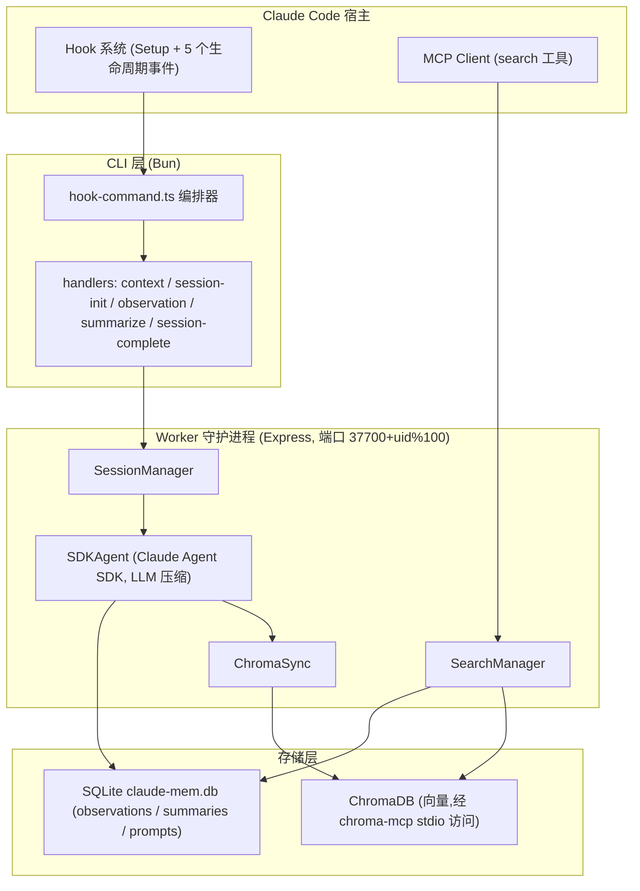

# claude-mem 参考分析

> 仓库:`submodules/claude-mem` | 分析日期:2026-08-06 | 上游:https://github.com/thedotmack/claude-mem

## 项目定位

claude-mem 是面向 Claude Code 的"持久记忆压缩系统"(TypeScript / Apache-2.0)。它通过 Claude Code 生命周期 hook 无感捕获每次工具调用,交给后台 Worker 内的 SDK Agent 用 LLM 压缩成结构化 observation,存入 SQLite + ChromaDB,并在新会话启动时自动注入上下文、通过 MCP 工具提供渐进式检索。默认形态是单人单机;`server-beta` 分支形态(代码已在 `src/server`、`src/storage/postgres`)将其扩展为 Postgres + BullMQ 的多租户团队记忆服务。

## 架构与核心流程

要点说明:

- **捕获链路**:`plugin/hooks/hooks.json` 注册 Setup、SessionStart、UserPromptSubmit、PostToolUse、PreToolUse(Read)、Stop 六类 hook;PostToolUse 标记 `async: true`,处理器 `src/cli/handlers/observation.ts` 只做转发,LLM 压缩全部异步在 Worker 完成,使用者无感。
- **永不阻塞**:`hook-command.ts` 的降级策略——传输类错误(ECONNREFUSED / 超时 / 5xx)一律 exit 0,Worker 不可用绝不阻塞 Claude Code 会话(见 `docs/architecture-overview.md` "Graceful Degradation")。
- **observation 结构**:`src/sdk/parser.ts` 从 LLM 响应中提取 `type / title / subtitle / facts[] / narrative / concepts[]`;`src/core/schemas/memory-item.ts` 的 Zod schema 进一步统一为含 `filesRead / filesModified / metadata` 的 MemoryItem。
- **隐私剥离**:`src/utils/tag-stripping.ts` 定义 `<private>`、`<system-reminder>`、`<claude-mem-context>` 等标签的统一剥离正则;入库前在 `src/services/worker/http/shared.ts`(tool_input/tool_response)、`src/services/sqlite/prompt-storage.ts`(用户 prompt)、`src/server/generation/providers/shared/prompt-builder.ts`(送 LLM 前)三处强制执行。
- **上下文注入时机**:SessionStart 时 `src/services/context/ContextBuilder.ts` 以只读方式打开 SQLite,渲染 header + timeline + summaries 并由 `TokenCalculator.ts` 计算 token 经济;UserPromptSubmit 时再走 `/api/context/semantic` 做语义补充注入。
- **server-beta 多租户**:`docs/server-architecture-and-team-vision.md` 描述每个事件携带 `api_key_id × actor_id × request_id` 身份三元组,落入租户隔离的 Postgres 仓库(`src/storage/postgres/*`),支持 team / project / scope / audit chain;API key 仅存 SHA-256 哈希(`docs/security.md`)。

## 亮点

- **hook 无感捕获 + 异步压缩**的完整工程实现:捕获(转发)与加工(LLM)彻底分离,PostToolUse 异步、失败静默降级,是"写路径永不打断使用者"的成熟范本(`plugin/hooks/hooks.json`、`src/cli/handlers/observation.ts`)。
- **渐进披露检索**:MCP 三层工作流 `search`(约 50-100 token/条索引)→ `timeline`(时间线上下文)→ `get_observations`(仅对筛选后 ID 取全文),官方宣称约 10 倍 token 节省(README "MCP Search Tools"、`src/servers/mcp-server.ts`)。
- **入库前统一隐私剥离**:所有进入存储与进入 LLM 的文本都过同一个 `stripTags`,并有标签计数上限告警,单点可审计(`src/utils/tag-stripping.ts`)。
- **内容去重**:`SHA256(memory_session_id + title + narrative)[:16]` 作为 content_hash,30 秒窗口内命中即返回已有 ID,防止 hook 重放产生重复记忆(`src/services/sqlite/observations/store.ts`)。
- **双 Session ID 设计**:`contentSessionId`(宿主侧不变)与 `memorySessionId`(Worker 重启即变)分离并由 SessionStore 映射,解决了捕获进程与加工进程生命周期不一致的问题(`docs/SESSION_ID_ARCHITECTURE.md`)。
- **模式/多语言可插拔**:`plugin/modes/` 定义 observation 类型集与生成语言(如 `code--zh`),记忆的分类体系本身是配置而非硬编码。

## 缺点与局限

- **无审核生命周期**:LLM 压缩出的 observation 直接生效进入检索,没有"候选→审核→生效→衰减→归档"环节;`observation_feedback` 表只做使用信号统计,质量与合规完全依赖生成端。
- **本地形态无 ACL**:单机 SQLite 模式下所有项目记忆同库,检索仅按 project 名过滤,无角色披露控制;server-beta 的 scope 也停留在 API key 授权级,离 (user, project, role) 级检索前过滤还有距离,且 server 形态自述仍处 beta。
- **隐私保护是"选择加入"式**:只剥离显式 `<private>` 标签,不做密钥/敏感信息自动检测;使用者忘记打标签,秘密就进库,对保密要求高的 IC 部门不够。
- **存储不可人审、不可 Git 治理**:记忆是 SQLite 行 + Chroma 向量,无法用 PR/diff 方式评审、回滚粒度差,与"Git 作为规范存储、失效不删除"的治理思路相反。
- **运行时依赖重且脆弱**:依赖 Bun、uv、chroma-mcp 子进程,hooks.json 中是数百字符的 bash 单行脚本(Windows 依赖 cygpath 转换),企业环境部署与安全评审成本高。

## 企业知识库搭建中的可参考部分

| 可参考机制 | 对应本方案设计点 | 采纳建议 |
|---|---|---|
| PostToolUse 异步捕获 + 传输错误一律 exit 0 的降级策略 | 无感捕获(hook)、写路径永不打断使用者 | 直接借鉴 |
| 捕获(转发)与加工(LLM 压缩)分离的 Worker 队列架构(PendingMessageStore) | Memory Gateway 写路径后台异步 | 直接借鉴 |
| observation 结构 `type/title/facts/narrative/concepts` + Zod MemoryItem schema | 记忆条目 Schema、颗粒度 L0-L3(facts≈L1、narrative≈L2) | 改造后用(补充 scope/ACL/生命周期字段) |
| search → timeline → get_observations 三层渐进披露 MCP 工具 | 读路径 MCP 接口与 token 经济 | 直接借鉴 |
| `stripTags` 入库前单点隐私剥离 + `<private>` 标签约定 | Memory Firewall 写入分诊 | 改造后用(标签仅作兜底,需叠加自动敏感信息检测与分诊规则) |
| content_hash 去重(SHA256 前 16 位 + 时间窗口) | 候选记忆去重 | 直接借鉴 |
| server-beta 身份三元组 `api_key_id × actor_id × request_id` + 租户隔离仓库 + audit chain | (user, project, role) 令牌、审计链路 | 仅作对照(思路一致,但本方案以自建 Gateway + Git 实现,不复用其 Postgres 栈) |
| 双 Session ID 映射、优雅关闭、孤儿进程回收等工程细节 | Gateway 可靠性设计 | 仅作对照 |
| `plugin/modes/` 将 observation 分类体系做成可配置模式 | 角色模板/建库引导 | 改造后用 |
