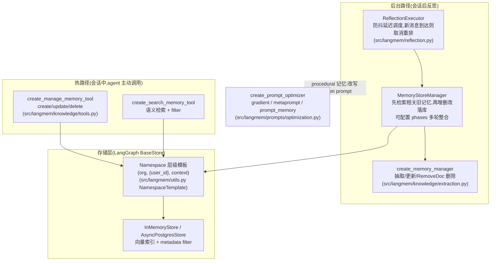
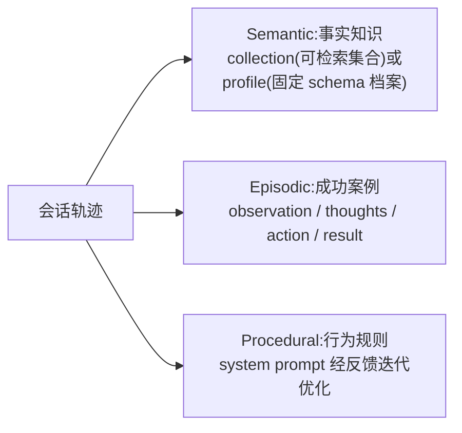

# LangMem 参考分析

> 仓库:`submodules/langmem` | 分析日期:2026-08-06 | 上游:https://github.com/langchain-ai/langmem

## 项目定位

LangMem 是 LangChain 官方的 agent 长期记忆 SDK:提供"与存储无关的函数式核心"(记忆抽取、整合、prompt 优化)加上与 LangGraph `BaseStore` 的原生集成。它不是服务而是库,定位是让开发者在自己的 LangGraph 应用里拼装记忆能力:热路径上 agent 主动读写记忆工具,后台由 memory manager 反思会话并整合记忆。

## 架构与核心流程

记忆类型分层(概念模型,`docs/docs/concepts/conceptual_guide.md`):

要点说明:

- **双通道写入是一等设计**:热路径工具(`knowledge/tools.py`)让 agent 在对话中即时记忆,`actions_permitted` 可裁剪为只允许 create;后台通道由 `ReflectionExecutor`(`reflection.py`)接收 `submit(payload, after_seconds=N)`,同 thread 新消息到达会取消未执行任务重新计时——即"会话安静下来才反思",避免重复处理;
- **写前先查再整合**:`MemoryStoreManager`(`knowledge/extraction.py`)每次落库前生成检索 query 召回相关旧记忆(`query_limit` 控制),交给 LLM 决定是新增、更新还是用 `RemoveDoc` 标记删除,天然做去重与冲突消解;`phases` 参数支持追加"去重/浓缩/泛化"多轮整合;
- **Namespace 模板即多租户**:`NamespaceTemplate`(`utils.py`)支持 `("org", "{user_id}", "context")` 这类运行时变量注入,同一套工具按 config 落入不同用户/团队命名空间;检索限定在命名空间内;
- **schema 化记忆**:`create_memory_manager` 接受 pydantic schema 列表(如 Profile、Episode),抽取结果结构化落库,profile 型按 schema 打 patch 更新而非追加;
- **procedural 记忆 = prompt 优化**:`create_prompt_optimizer`(`prompts/optimization.py`)提供 gradient / metaprompt / prompt_memory 三种算法,从(轨迹, 反馈)对中改写 system prompt,把"行为规则"沉淀为可演进资产;
- **短期记忆独立处理**:`short_term/summarization.py` 的 `summarize_messages` + `RunningSummary` 做上下文窗口内的滚动摘要,超出 token 预算时把旧消息压缩为 running summary,与长期记忆存储解耦,对应本方案 Runtime 作用域"不入库"的临时状态;
- **热路径与后台的权衡表**内置于概念文档(`conceptual_guide.md`):Active 形成即时但增加交互延迟,Background 形成零延迟但更新滞后——这正是本方案"写路径后台异步、永不打断使用者"的理论依据。

集成分两层(`conceptual_guide.md` 的 Integration Patterns):Core API 是无副作用的纯函数(memory manager、prompt optimizer),可脱离任何数据库使用;Stateful 层才绑定 `BaseStore` 提供持久化。这种"算法与存储分离"的分层,使其抽取/整合能力可以最小代价移植到自建网关的治理层。

## 亮点

- **函数式核心与存储解耦**:抽取/整合逻辑是纯 Runnable,可脱离 LangGraph 用于任何存储,便于移植进自建网关(`knowledge/extraction.py`);
- **防抖式后台反思**:`after_seconds` 延迟 + 新消息取消重排的调度语义,是"会话收尾自动捕获"的成熟实现参照(`reflection.py`);
- **先检索后写入**的整合流程内置去重与更新判断,避免记忆库膨胀(`MemoryStoreManager.ainvoke`);
- **semantic/episodic/procedural 三分类**清晰划分了"事实、经验、行为规则"三种资产的抽取与消费方式(`docs/docs/concepts/conceptual_guide.md`);
- **namespace 模板**用一行配置表达"组织 → 用户 → 场景"层级隔离,工具与命名空间绑定后 agent 无法越界写(`utils.py`);
- **manage_memory 工具的 instructions 可注入**,写入时机策略(何时该记)以 prompt 形式外置可调(`knowledge/tools.py` 默认 instructions)。

## 缺点与局限

- **库而非服务,没有权限执行点**:namespace 隔离靠调用方 config 传参,属"约定"而非"授权",无身份认证、无检索前 ACL,企业保密场景必须外包一层服务端强制;
- **绑定 LangGraph 生态**:BaseStore、Runnable、langgraph_sdk 深度耦合,与本方案"Agent 无关、仅依赖 MCP"的目标冲突,只能移植其算法与流程;
- **写入零审核**:热路径与后台整合的结果都直接生效,`RemoveDoc` 是物理删除,无候选状态、无人审、无失效保留,不满足"候选 → 审核 → 生效 → 归档"生命周期;
- **无生命周期管理**:记忆条目只有 created_at/updated_at,没有 TTL、衰减、置信度、使用反馈等字段,长期运行的记忆质量依赖每次整合时 LLM 的判断;
- **无跨命名空间披露模型**:命名空间之间完全隔离,表达不了"下游项目可见 interface 级"这类分级披露。

## 企业知识库搭建中的可参考部分

| 可参考机制 | 对应本方案设计点 | 采纳建议 |
|-----------|----------------|---------|
| 热路径工具 + 后台反思的双通道写入 | 写路径:hook/会话收尾 memory_capture 异步上报 + memory_propose 显式申请 | 直接借鉴:通道划分与本方案一一对应 |
| ReflectionExecutor 防抖调度(after_seconds、新消息取消重排) | 会话观察批量上报的触发时机、Firewall 批处理 | 直接借鉴:网关 capture 队列的调度语义照搬 |
| 先检索相关旧记忆再决定增/改/删(MemoryStoreManager) | Memory Firewall 的冲突检测与去重 | 改造后用:判断逻辑保留,delete 改为置 `invalid_at`(失效不删除),变更进 candidate 而非直接生效 |
| Namespace 层级模板 `("org", "{user_id}", ...)` | 四层作用域 Org/Project/User/Runtime 与个人命名空间 | 改造后用:命名空间结构借鉴,但变量必须由网关从令牌解析注入,不许客户端自报 |
| schema 化记忆抽取(pydantic Profile/Episode) | 记忆条目 Schema(type/scope/disclosure/granularity 字段校验) | 直接借鉴:抽取时即产出符合 4.2 节 Schema 的结构化条目 |
| semantic/episodic/procedural 三分类 | 记忆 type 字段(technical/architecture/principle)与 L0-L3 颗粒度 | 仅作对照:分类维度启发 type 设计,episodic 的 O/T/A/R 结构可用于"踩坑经验"模板 |
| create_prompt_optimizer 从反馈迭代规则 | Git 记忆库 rules/ 目录的演进、q_value 使用反馈闭环(Phase 3) | 仅作对照:规则改写产物必须走 Memory PR 人审,不可自动生效 |
| manage_memory 工具的可注入 instructions | MCP 工具 description 引导写入时机(能力降级表) | 直接借鉴:默认 instructions 文本可作 memory_capture 工具描述的底稿 |
