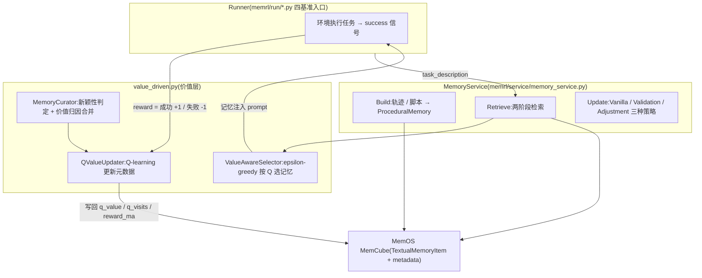
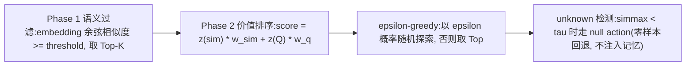

# MemRL 参考分析

> 仓库:`submodules/MemRL` | 分析日期:2026-08-06 | 上游:https://github.com/MemTensor/MemRL

## 项目定位

MemRL(论文 arXiv:2601.03192)是一个研究型框架:让 Agent 不改模型权重、仅靠对情景记忆(episodic memory)做运行时强化学习实现"自进化"。核心思想是把每条经验记忆当作一个可选动作,用环境反馈(任务成败)更新其 Q-value,再用 Two-Phase Retrieval(先语义过滤、再按价值排序)压制检索噪声、筛出高效用策略。在 HLE、BigCodeBench、ALFWorld、LifelongAgentBench 四个基准上验证,底层记忆存储复用 MemOS(MOS/MemCube)。

## 架构与核心流程

要点说明:

1. **经验结构**:`memrl/service/procedural_memory.py` 定义 `MempMetadata`——task_description、memory_type(trajectory/script/procedure)、build/retrieve/update 三策略、confidence_score、retrieval_count、version 等;写入时以 task_description 作为唯一检索键(embedding),完整轨迹/脚本放在 `metadata.full_content`,检索键与内容解耦(`memory_service.py` build 段)。
2. **Q 值初始化区分成败**:`memory_service.py` 写入记忆时,成功经验初始化为 `q_init_pos`、失败经验为 `q_init_neg`,并落 `q_visits`、`reward_ma`、`last_used_at` 等价值元数据——失败经验不删除,而是带低 Q 入库参与后续排序。
3. **两阶段检索**:`memory_service.py` 的 `retrieve_query`(1254 行起)先对所有记忆键算余弦相似度、按 threshold 过滤取 Top-K,再对候选做 z-score 标准化后按 `sim_z*w_sim + q_z*w_q` 混合打分(1439-1460 行);`retrieve_value_aware` 则走 `value_driven.py` 的 `ValueAwareSelector`(按 Q 降序、相似度 tie-break、ε-greedy、可选 q_min 门槛过滤)。
4. **Q-value 更新公式**:`value_driven.py` 的 `QValueUpdater.update`:`new_q = (1-α)*old_q + α*(reward + γ*next_max_q)`(单步默认 γ=0),同时维护奖励的 EMA(`reward_ma`)与访问计数,只改 metadata 不动检索键;可选 `q_floor` 防止 Q 无限下探。
5. **价值归因与去重**:`MemoryCurator.find_merge_target` 在新任务成功时检索最相似记忆(相似度 ≥ novelty_threshold=0.85 视为非新颖),通过 `attribute_reward` 给既有记忆小幅加 Q(gain=0.1×reward)而非新增条目,抑制记忆库膨胀。
6. **奖励闭环由 Runner 驱动**:`memrl/run/llb_rl_runner.py` 每个任务先检索注入(575-660 行,记录 similarity_z/q_z/score 全程 trace),任务结束由 `_session_success` 判定成败,再对本次用到的记忆逐条回写 Q。

## 亮点

1. **q_value 更新公式简洁可落地**:单步 Q-learning + EMA 平滑,全部状态存在记忆条目 metadata 里,无需独立 RL 基础设施,可直接嫁接到任何带 metadata 的存储。
2. **两阶段"相关性≠有用性"分离**:语义相似只做初筛,最终排序由历史效用主导,直接命中"检索到的不一定是好记忆"这一痛点,且 z-score 标准化让两个量纲可加权融合。
3. **unknown 检测 / null action**:最高相似度低于 τ 时干脆不注入记忆、走零样本,承认"没有合适记忆"也是一种正确决策,避免强行注入噪声。
4. **失败经验保留而非丢弃**:失败轨迹以负初始 Q 入库,配合 `AdjustmentUpdater` 的反思生成(`updater.py` `_generate_reflection`),失败也是资产。
5. **价值归因合并**:成功归因给已有高相似记忆而非重复建条,从写入侧控制记忆库规模。
6. **全程可追溯**:检索参数、每条候选的 sim/q/score、奖励更新都写入 JSONL trace(`memrl/trace/`),便于离线分析记忆 ROI。

## 缺点与局限

1. **单用户单库,无权限概念**:所有操作围绕一个 `user_id` 和默认 MemCube,没有租户隔离、可见性、ACL,多人共享记忆时"谁的反馈更新谁可见的 Q"完全未定义。
2. **奖励信号依赖可自动判定的任务成败**:四个基准都有明确 ground truth;企业开发任务大多没有即时、客观的成功信号,需要用弱信号(用户纠正、记忆被引用后未回滚等)替代,效果会打折。
3. **ε-greedy 探索不适合生产**:以固定概率随机注入非最优记忆,在保密与稳定性要求高的企业环境里等于主动引入风险,只能在离线评估中使用。
4. **无生命周期治理**:没有审核、衰减、归档、TTL;低 Q 记忆只是排序靠后,永远留在候选集里参与计算,库会无界增长(Curator 只缓解写入侧)。
5. **工程成熟度低**:研究代码,含对 MemOS 版本缺陷的运行时 monkey-patch(`memory_service.py` 开头对 `memos.utils.timed` 的热修),大量 try/except 吞异常,不能直接生产化,只能取其算法。

## 企业知识库搭建中的可参考部分

| 可参考机制 | 对应本方案设计点 | 采纳建议 |
| :--- | :--- | :--- |
| `QValueUpdater` 更新公式 `(1-α)Q+α·reward` 及 metadata 存储方式(q_value/q_visits/reward_ma/last_used_at) | §8 使用后价值反馈:`Q_new=(1-α)Q_old+α·reward`;schema 中 `usage.q_value` | 直接借鉴(设计公式即源于此;metadata 字段可整组照搬) |
| 两阶段检索:相似度初筛 → z-score 混合打分(sim 权重 + Q 权重) | §8 调用时排序 = 语义相关性 + 时效 + 权威性 + q_value | 直接借鉴(把 z-score 融合扩展为四因子加权) |
| unknown 检测(simmax < τ 则不注入) | 读路径注入门槛;降级策略(无把握时零注入优于错误注入) | 直接借鉴 |
| 失败经验负 Q 入库 + 反思生成(AdjustmentUpdater) | 失效不删除(Stale/Archived 仍可查);候选记忆捕获 | 改造后用(负 Q 对应加速进入 Stale,反思文本可作为归档备注) |
| MemoryCurator 新颖性判定 + 价值归因合并(相似度≥0.85 不建新条) | Memory Firewall 写入分诊:去重 / 冲突检测 | 改造后用(阈值合并策略并入 Firewall,归因加 Q 接价值闭环) |
| 检索键(任务描述)与全文内容分离存储 | granularity 多颗粒度版本:L2 摘要作索引、L0/L1 作正文 | 改造后用 |
| ε-greedy 探索、q_floor、q_min 门槛等 RLConfig 超参 | Phase 3 价值闭环调参 | 仅作对照(探索机制不上生产;q_floor/q_min 可作为衰减阈值参考) |
| 全链路检索/奖励 JSONL trace | §10 风险对策之可审计性;记忆 ROI 核算 | 直接借鉴 |
