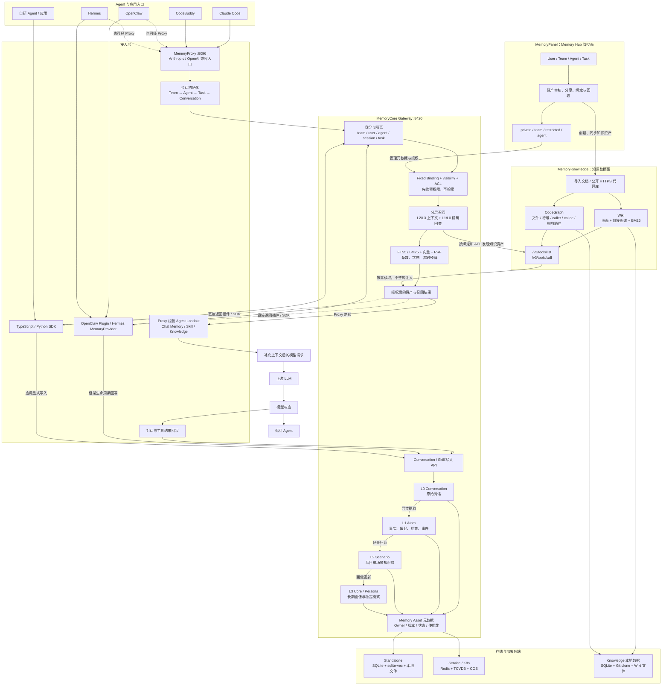

# TencentDB-Agent-Memory 参考分析

> 本地研究基线：`submodules/TencentDB-Agent-Memory`（个人 fork：`psiQAQ/TencentDB-Agent-Memory`，分支 `codex/fix-windows-line-endings`，提交 `c75ef5834eeacf17f2df8f84f7cf2d1747822de2`）
> 腾讯上游：<https://github.com/TencentCloud/TencentDB-Agent-Memory>
> 本次复核日期：2026-08-10

本文档记录当前本地 fork 的源码与部署能力。fork 中已出现但尚未进入腾讯上游稳定分支的功能，只能作为本仓库的实验基线，不能直接写成腾讯上游已经发布的能力。

## 项目定位

TencentDB Agent Memory 面向需要长期协作的 Agent 团队。它把记忆分成四类可管理资产：

- Chat Memory：从原始对话逐层提炼出的 L0-L3 记忆；
- Skill：从任务与工具调用中提取的可执行经验；
- Wiki：从文档生成的结构化页面和链接图谱；
- CodeGraph：代码文件、符号、调用关系与影响路径。

系统由四个主要模块组成：`MemoryCore` 保存、检索和提炼记忆；`MemoryProxy` 接管 Agent 的模型请求，在调用前注入记忆、调用后回写对话；`MemoryPanel` 管理 Team、User、Agent、Task、资产和权限；`MemoryKnowledge` 构建 Wiki 与 CodeGraph。TypeScript/Python SDK 以及 OpenClaw、Hermes 适配器提供直接接入路径。

这套实现与本仓库的目标高度重合：让多个成员和多种 Agent 复用项目经验，同时通过身份、可见性和 ACL 控制使用范围。后续工作以它为主要参考实现。本仓库其他参考项目的可取机制，以及仓库负责人提出的新想法，会先与腾讯上游的架构和 Roadmap 对照；适合开源复用的部分在个人 fork 中完成复现与验证后，以小步 PR 回馈上游。公司特有的身份、权限和部署信息不进入公共 PR。

## 整体架构与核心流程

下图以 Agent 的一次完整请求为主线，合并原文档中的 L0-L3、隔离、混合检索、ACL 和知识按需调用细节。Docker 一键部署时，`MemoryPanel` 与 `MemoryKnowledge` 合并为 `memory-hub` 镜像；源码边界仍然是两个模块。



### 一次请求如何流动

1. Claude Code、CodeBuddy 等客户端把模型请求发给 `MemoryProxy`。OpenClaw、Hermes 和自研 Agent 也可以通过插件、Provider 或 SDK 直接调用 Gateway。
2. Proxy 或适配器确定 Team、User、Agent、Task 和 Conversation。Core 在数据访问前检查隔离上下文、Fixed Binding、visibility 与 ACL。
3. Core 使用 L2/L3 恢复场景和长期画像，需要具体事实时再检索 L1/L0。关键词检索与向量检索通过 RRF 合并，并受条数、字符和超时预算限制。
4. Skill 与常用的 L2/L3 可以进入上下文；L0/L1 以及 Wiki、CodeGraph 更适合以工具形式按需读取，避免固定 Prompt 过长，也减少对上游 KV-cache 的破坏。
5. Proxy 将补充上下文后的请求转发给上游 LLM。响应返回 Agent，同时把真实主对话写入 L0；后台管线再提炼 L1 Atom、L2 Scenario 和 L3 Persona。
6. Panel 不参与每次模型推理。它负责维护人员、团队、Agent、Task、资产和授权，并调用 Knowledge Service 构建或同步 Wiki、CodeGraph。

## 模块边界与依赖

| 模块 | 主要职责 | 对外接口 | 依赖关系 |
| :--- | :--- | :--- | :--- |
| MemoryCore | L0-L3、Skill、元数据、鉴权、隔离、Gateway | `/v2/*`、推荐的 `/v3/*` | standalone 可独立运行；service 模式可接 Redis、TCVDB、COS |
| MemoryProxy | 模型协议转发、会话初始化、上下文注入、L0/Skill 回写 | `:8096`，Anthropic/OpenAI 兼容路径 | 没有 Core 时只能降级为普通转发，完整记忆链路依赖 Core |
| MemoryPanel | Team/User/Agent/Task 和资产治理 | Panel UI/API，默认 `:8125` | 调用 Core 管理元数据与 Skill，调用 Knowledge 管理知识资产 |
| MemoryKnowledge | Wiki、CodeGraph、知识检索工具 | Knowledge API，容器部署默认 `:8424` | 可独立启动，但资产登记和 Agent 授权依赖 Panel/Core |
| TypeScript/Python SDK | 封装 Gateway 数据面与部分管理面 API | v2/v3 Client | 适合自研 Agent；新接入优先 v3 isolation API |
| OpenClaw/Hermes 适配器 | 将框架生命周期和会话映射到 Gateway | Plugin / MemoryProvider | 可连接本地或远程 Gateway，也可选择 Proxy 路线 |

## 关键实现

1. **L0-L3 异步提炼管线**：`MemoryCore/src/core/record/l1-extractor.ts` 用一次 LLM 调用完成场景切分和记忆抽取，`l1-dedup.ts` 处理批量去重与冲突；`core/scene/scene-extractor.ts` 组织 L2 场景，`core/persona/persona-generator.ts` 生成 L3 画像。生成与检索采用同一套层级：L2/L3 恢复整体语境，细节回到 L1/L0。
2. **隔离条件下推到存储层**：`MemoryCore/src/core/store/isolation.ts` 要求写入携带 `IsolationContext`，查询使用 `IsolationFilter`；`buildIsolationWhere` 把条件编译为 SQL `WHERE`。权限不是召回后的遮盖逻辑。
3. **混合检索与预算控制**：`MemoryCore/src/core/tools/memory-search.ts` 并行执行 FTS5 关键词和向量检索，再通过 RRF 融合；嵌入不可用时可降级为纯 FTS。查询同时受结果数、字符数和超时限制。
4. **Fixed Binding 与 ACL**：Memory Asset 先按 Team、User、Agent、visibility 和固定绑定收窄，再进入召回。知识资源的读取调用 `acl/check`，删除操作会清理 Agent 绑定和 ACL。
5. **Proxy 分层注入**：`MemoryProxy` 支持 `/v1/chat/completions` 和 `/v1/messages`。L2/L3 与 Skill 可进入 system prompt，L0/L1 通过只读工具精确回查。Bridge 注入 `serviceToken`，不把服务凭据写进 LLM 可见内容。
6. **知识按需调用**：`MemoryKnowledge/src/engines/wiki` 构建页面和链接图，`engines/code` 构建代码关系；Agent 用 `/v3/tools/list` 发现能力，再用 `/v3/tools/call` 读取页面、源码或影响路径。
7. **v3 身份契约**：TypeScript SDK 的 v3 Client 显式接收 `teamId / agentId / userId / sessionId`。L0/L1 可按 session 隔离，L2/L3 保持 Team + Agent 级画像；新平台接入应优先使用 v3，而不是继续扩展宽松的 v2 语义。

## 部署和使用

### 本地演示：Docker 三件套

推荐入口是 `deploy/global-images`。它启动三个公开镜像：

| 容器 | 默认端口 | 内容 |
| :--- | :--- | :--- |
| `tdai-memory-core` | `8420` | Memory Gateway、记忆与元数据 |
| `tdai-memory-hub` | `8125` / `8424` | Panel UI + Knowledge API |
| `tdai-proxy` | `8096` | Coding Agent 的模型 API 入口 |

```bash
cd submodules/TencentDB-Agent-Memory/deploy/global-images
cp .env.example .env

# 填写 MEMORY_LLM_* 与 PROXY_UPSTREAM_* 两组模型配置后执行
./verify.sh
./start-all.sh
```

`MEMORY_LLM_*` 供记忆提炼、embedding 和 Wiki 处理使用，`PROXY_UPSTREAM_*` 是 Agent 主对话的真实上游。这两组配置可以相同，也可以分开选模型。生产或多人联调前必须替换默认 Gateway key、admin username 和 admin user key。

服务启动后，操作顺序是：

1. 打开 `http://localhost:8125/`，使用初始化的 admin `user_key` 登录；
2. 创建业务用户、Team、Agent 和 Task；
3. 导入文档、公开 HTTPS 代码库或历史会话，等待 Wiki/CodeGraph 进入 `ready`；
4. 给 Agent 绑定需要的 Chat Memory、Skill、Wiki 和 CodeGraph；
5. 用业务用户的 `user_key` 配置 Agent 客户端，经 `http://127.0.0.1:8096/<agent-source>/default` 访问 Proxy；
6. 新会话确认 Team、Agent、Task，随后观察 L0-L3 和 Skill 的生成情况。

Claude Code 示例：

```bash
export ANTHROPIC_BASE_URL=http://127.0.0.1:8096/claude-code/default
export ANTHROPIC_AUTH_TOKEN="<业务用户 user_key>"
claude --model "<PROXY_UPSTREAM_MODEL>"
```

### 服务化部署

`README.deployment.md` 还提供 service 模式：Gateway 可多副本运行，Redis 保存分布式状态，TCVDB 保存向量，COS 保存文件资产，并可部署到 K8s/TKE。这条路线适合多用户、多 Agent 和跨机器共享，但需要补齐 Secret 管理、网络边界、备份恢复、审计和容量评估，不能把本地三容器配置直接暴露到生产网络。

### 系统平台边界

| 平台 | 当前结论 |
| :--- | :--- |
| Linux x86_64 | Docker 镜像支持 `linux/amd64` |
| Linux ARM64 | Docker 镜像支持 `linux/arm64` |
| macOS | 一键脚本列为支持宿主，可使用 Docker Desktop、Colima 或 OrbStack |
| Kubernetes/TKE | 有 service 模式配置，面向服务化部署 |
| Windows Agent 客户端 | Claude Code、CodeBuddy 等可以连接本机、WSL、局域网或远程 Proxy |
| Windows 服务端 | 一键脚本没有把 Windows 列为正式宿主；可尝试 Docker Desktop + Linux 容器，但需单独验证 |
| Windows 原生源码运行 | Node 模块要求 Node.js 22+，但原生依赖和 Bash 安装/测试脚本尚未形成完整 Windows 支持合同 |

当前 fork 的 `.gitattributes` 已保护 Bash 与 dotenv 文件为 LF。本机静态检查确认 `deploy/global-images` 的 7 个 Bash 脚本可通过 `bash -n`，但当前 Windows 主机没有 `docker` 命令，因此尚无容器启动和 E2E 结果。部署计划和脚本语法不能替代真实运行证据。

## Agent 平台支持

以下状态以本地 fork `c75ef58` 的文档和代码为准，并不自动代表腾讯上游稳定版的发布范围。

| Agent/平台 | 接入方式 | 当前边界 |
| :--- | :--- | :--- |
| OpenClaw | v3 客户端插件；也可经 Proxy | 第一方适配；`hooks.*` 配置受 OpenClaw 版本约束 |
| Hermes | 自管理 Gateway Provider、外部 Gateway Provider 或 Proxy | Proxy 路线需预设 task 和 conversation header |
| Claude Code | Anthropic API 经 MemoryProxy | 当前 fork 的主要 Coding Agent 演示路线 |
| CodeBuddy | 自定义模型经 MemoryProxy | 4.10.2-4.10.4 有已知 header 问题，需使用其它版本 |
| 自研 TypeScript Agent | TypeScript SDK | 同时支持 v2/v3，新接入推荐 v3 |
| 自研 Python Agent | 同步/异步 Python SDK | 同时支持 v2/v3；部分管理面能力仍少于 TypeScript SDK |
| 其他 OpenAI-compatible Agent | 经 Proxy 兼容接入 | Proxy 只识别既有 `agent-source`；伪装接入不等于正式适配 |
| Codex、Dify 等 | 暂无本地稳定专用适配 | 可作为后续贡献方向，不能列为已支持 |

腾讯上游公开页面目前仍以 OpenClaw、Hermes 为主要入口。跨平台适配可跟踪上游 issue [#235](https://github.com/TencentCloud/TencentDB-Agent-Memory/issues/235) 和 Claude Code/Codex 适配 PR [#392](https://github.com/TencentCloud/TencentDB-Agent-Memory/pull/392)。引用这些链接时应重新检查实时状态。

## 亮点

1. **L0-L3 已形成完整管线**：对话录制、场景切分、去重冲突和画像生成均已落到源码与指标。
2. **隔离在写入和查询阶段生效**：存储层拒绝缺少身份维度的写入，查询条件下推，降低跨用户或跨 Agent 串数据风险。
3. **记忆按 Agent 配装**：Fixed Binding + ACL 让不同 Agent 获得不同 loadout，符合企业团队的最小披露需求。
4. **注入策略考虑上下文成本**：稳定的 L2/L3 与 Skill 可预注入，L0/L1 和大体量知识走工具查询。
5. **Skill 有资产生命周期**：个人 Skill 可以保持私有，经过审核后分享给 Team，再绑定到指定 Agent。
6. **适合存量项目冷启动**：文档、代码库和历史会话可以分别转成 Wiki、CodeGraph、Skill 和 Chat Memory。

## 缺点与局限

1. **角色模型仍偏粗**：Team 内主要是 Admin/Member。restricted ACL 能回答“是否可读”，还不能根据 PM、开发、测试等角色返回不同颗粒度。
2. **治理承诺与部分实现存在距离**：`MemoryPanel/src/panel/domain/chat-memory-governance.ts` 仍有演示期字段落在 `Agent.metadata_json`；部分默认共享行为需要在保密场景中重新核验。
3. **缺少记忆价值闭环**：资产记录 usage count，但还没有稳定的任务成败反馈、效用更新、衰减和归档机制。长期运行可能积累噪声。
4. **完整部署和信任面较重**：四个源码模块以及 Redis、TCVDB、COS 等服务化依赖会增加运维成本。Proxy 经手模型凭据和完整对话，必须纳入审计、脱敏和故障域设计。
5. **面板审核不能代替 Git 审计**：资产有版本和状态，但没有天然等价于代码 PR 的可评审 diff。公司项目仍需要 Git 侧的知识源和回滚记录。
6. **跨平台能力仍在演进**：本地 fork 已有 Claude Code/CodeBuddy Proxy 路线，但腾讯上游的公开支持面、安装脚本和 E2E 矩阵仍需逐项确认。

## 作为后续参考目标

从本次复核开始，TencentDB Agent Memory 是本仓库后续演示、试点和上游贡献的主要参考实现。工作分三条线推进。

### 上游贡献

1. 先在 `psiQAQ/TencentDB-Agent-Memory` fork 复现问题，记录上游基线提交、系统、命令、端口和真实输出；
2. 一个 PR 只解决一个可验证问题，优先提交 Windows/LF 兼容、部署探针、Agent 适配、错误信息和 E2E 等通用改进；
3. PR 附复现步骤、自动化测试或静态检查、升级/回滚影响，不把实验计划写成运行结论；
4. 公司域名、账户、内网地址、模型密钥、组织结构和私有数据只保留在本仓库的非公开配置中；
5. 上游已经有更合适实现时，改为补文档、测试或 issue 证据，不为保持本地方案而扩大补丁。

其他参考文档和负责人构想按下表分流：

| 内容类型 | 处理方式 |
| :--- | :--- |
| 与上游架构一致、可由测试证明的通用修复或能力 | 在个人 fork 实现并验证，提交单一目标 PR |
| 可能改变 API、权限模型或部署边界的设计 | 先提交 issue 或 design proposal，与维护者确认后再写代码 |
| 其他记忆项目中的亮点 | 先说明来源、适用条件和相对现状的增量，不直接照搬实现 |
| 公司身份、内网、审批和数据治理需求 | 留在本仓库或公司内部扩展层，不进入公共上游 |

### 演示准备

1. 固定三个镜像版本和 submodule SHA，禁止演示环境依赖漂移的 `latest`；
2. 准备可重复导入的公开文档、公开代码库和两类 Agent 身份，展示私有资产、团队共享和定向绑定的差异；
3. 演示完整闭环：创建 Team/Agent/Task → 导入知识 → 首轮召回 → 对话回写 → L0-L3/Skill 生成 → 新会话继承；
4. 把 LLM 付费调用与离线静态检查分开，真实调用前显式确认模型、预算、凭据和数据边界；
5. 保存健康检查、容器日志、关键 API 响应和演示版本，出现故障时能判断是 Agent、Proxy、Core、Knowledge 还是上游 LLM。

### 公司项目团队部署

1. 先做单个项目、少量成员的隔离试点，验证 Team/User/Agent/Task 映射、ACL 和离职/转交流程；
2. 将 Gateway、Proxy、Panel 和 Knowledge 放入明确的网络区，Proxy 不直接暴露公网；密钥进入 Secret 系统，不使用本地默认值；
3. 接入公司身份系统前先定义 User、Team、Role、Agent 的映射与审批人，避免把登录身份直接等同于业务授权；
4. 项目知识以 Git 为可审计事实源，Memory Hub 负责动态召回和装配。高风险共享变更仍走 PR；
5. 上生产前补齐备份恢复、数据删除、日志脱敏、权限回归、容量、延迟和故障降级验证。

## 企业知识库搭建中的可参考部分

| 可参考机制 | 对应本仓库设计点 | 采纳建议 |
| :--- | :--- | :--- |
| L0-L3 异步提炼、场景切分和冲突检测 | granularity L0-L3；Memory Firewall | 直接借鉴管线边界，提取质量和成本需用本项目数据验证 |
| IsolationContext 强制写入 + IsolationFilter 查询下推 | 检索前 ACL；身份令牌 | 直接借鉴存储层约束，不允许只在 UI 或 Prompt 层过滤 |
| visibility + acl/check + 删除级联 | 角色和披露矩阵 | 改造后使用，叠加按角色控制披露颗粒度 |
| L2/L3/Skill 注入，L0/L1/Knowledge 工具化 | 无感读路径与上下文预算 | 直接借鉴分层策略；是否全量经过 Proxy 由部署信任边界决定 |
| FTS5/BM25 + 向量 + RRF | `memory_recall` 排序 | 直接借鉴，并保留纯关键词降级路径 |
| Skill 私有、审核、共享和 Agent 绑定 | 候选 → 审核 → 生效 | 改造后使用；高风险共享动作接入 Memory PR |
| Memory Hub 的 Owner/版本/状态/可见性/使用数 | 薄控制台 | 参考字段和操作流，不重复建设可以由 Git/现有平台承担的能力 |
| 文档/代码/会话冷启动导入 | 项目记忆初始化 | 演示阶段采用；进入公司数据前补齐凭据、脱敏和删除验证 |
| Bridge 注入 serviceToken | 令牌保护 | 直接借鉴，凭据不得进入 LLM 可见 Prompt 和日志 |
| Docker 三件套与 service/K8s 两级部署 | 演示环境与团队环境分层 | 演示使用 standalone；真实团队部署必须重新做安全和运维评审 |
