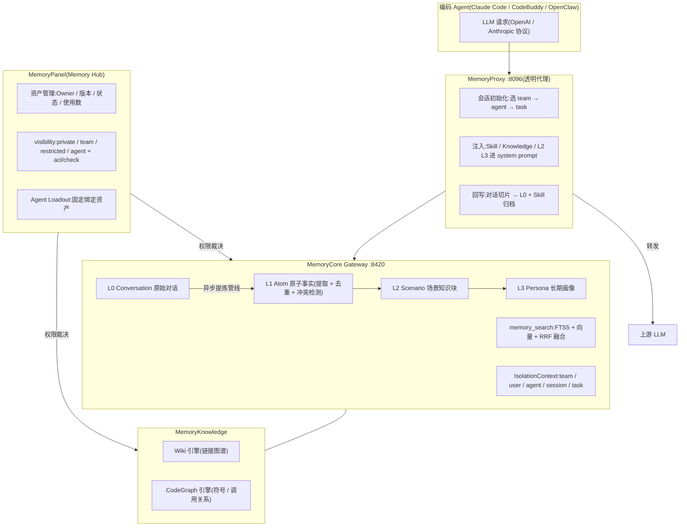

# TencentDB-Agent-Memory 参考分析

> 仓库:`submodules/TencentDB-Agent-Memory`(检出分支 `feat/server_team`) | 分析日期:2026-08-06 | 上游:https://github.com/TencentCloud/TencentDB-Agent-Memory

## 项目定位

腾讯云开源的 Agent 团队记忆系统,把"记忆"扩展为四类可管理的 Memory Asset:Chat Memory(对话记忆,L0-L3 分层)、Skill(可执行经验)、Wiki(文档知识图)、CodeGraph(代码符号与调用图)。由四个服务组成:MemoryCore(存储与 L0-L3 提炼管线)、MemoryKnowledge(Wiki/CodeGraph 引擎)、MemoryPanel(团队与资产管理面板,即 Memory Hub)、MemoryProxy(透明 LLM 代理,负责无感注入与回写)。目标场景与本方案高度重合:多 Agent、多成员团队共享经验,同时以 visibility + ACL 控制"谁能用哪份记忆"。

## 架构与核心流程

要点说明:

1. **L0→L3 异步提炼管线**:L0 原始对话落库后,由后台管线逐层提炼——`MemoryCore/src/core/record/l1-extractor.ts` 用单次 LLM 调用完成"场景切分 + 记忆抽取",再经 `l1-dedup.ts` 做批量冲突检测;`core/scene/scene-extractor.ts` 组织 L2 场景;`core/persona/persona-generator.ts` 用四层深扫模型生成 L3 画像。生成与检索都分层:L2/L3 供快速上下文引导,细节回落 L1/L0。
2. **强制三维租户隔离**:`MemoryCore/src/core/store/isolation.ts` 规定所有 L0/L1/Profile 写入必须携带完整 `IsolationContext`(user_id、agent_id、session_id,可选 team_id/task_id),查询必须传 `IsolationFilter`,由 `buildIsolationWhere` 把隔离条件下推为 SQL WHERE——与本方案"权限条件作为检索 filter 下推、严禁先召回再遮盖"同构。
3. **混合检索 + 预算限流**:`MemoryCore/src/core/tools/memory-search.ts` 实现 FTS5 关键词 + 向量嵌入并行检索、RRF 融合,并自动降级(无嵌入时纯 FTS);检索结果受条数、字符预算、超时三重上限约束,防止记忆挤爆上下文窗口。
4. **可见性与 ACL 裁决**:README 定义 `private / team / restricted / agent` 四档 visibility;`MemoryPanel/src/panel/http/routes/knowledge/common.ts` 中知识资源读取先走 `acl/check`(caller 对 asset 是否有指定 action 权限),资产删除级联清理 Agent 绑定与 ACL。角色分两层:全局 System Admin + 团队 Admin/Member,Owner 自动拥有自己资产的管理权。
5. **透明代理实现无感读写**:`MemoryProxy/README.md` 描述其在 `/v1/chat/completions`、`/v1/messages` 转发前后完成会话初始化、记忆注入、对话回写、鉴权与用量上报;注入策略讲究——L2/L3 与 Skill 注入 system prompt,L0/L1 以只读工具形式暴露给模型按需查询,避免上游 KV-cache 失效;Skill Bridge 转发时注入 serviceToken,凭证不出现在 LLM 可见的 prompt 中。
6. **知识按需调用而非整体注入**:`MemoryKnowledge/src/engines/wiki`(链接图谱、graph-search)与 `engines/code` 把文档和代码索引成资产,Agent 通过 `/v3/tools/list` 发现能力、`/v3/tools/call` 按需读取页面、源码或影响路径。

## 亮点

1. **L0-L3 分层被完整工程化**:从对话录制、LLM 场景切分抽取、去重冲突检测到画像生成的全链路都有落地代码与延迟指标上报(`core/report/metric-tracking-l1-latency.ts` 等),不是概念图。
2. **写入即隔离的硬约束**:`assertIsolation` 在存储层强制拒绝缺失身份维度的写入,隔离不依赖上层自觉,权限模型内建于数据面。
3. **"记忆是装备而非全局 prompt"**:Fixed Binding + ACL 先按 Team/User/Agent/visibility 收窄权限范围再检索,不同 Agent 获得不同 loadout,直接回应"检索前过滤"这一企业刚需。
4. **注入策略考虑了 KV-cache 经济性**:L2/L3 进 system prompt、L0/L1 做成工具,兼顾冷启动上下文与精确回查,是少见的工程细节。
5. **Skill 有完整生命周期**:个人 Skill 默认私有,经审核后共享给团队并分配给指定 Agent——"private → review → team"与本方案"候选 → 审核 → 生效"同型。
6. **冷启动导入**:代码库、文档、历史会话可直接导入并自动加工为 CodeGraph/Wiki/Skill+Chat Memory,对存量项目接入友好。

## 缺点与局限

1. **角色模型过粗**:团队内仅 Admin/Member 两档,没有"按角色决定披露颗粒度"的机制(如 PM 只见 L2/L3 摘要、工程师见 L1 事实),restricted ACL 只回答"能不能读",不回答"读到多细"。
2. **治理实现尚不成熟**:`MemoryPanel/src/panel/domain/chat-memory-governance.ts` 自述"后端 schema 还没落真字段,演示阶段塞进 Agent.metadata_json";且 `DEFAULT_CHAT_MEMORY_REL.memory_shared_with_team = true`(本期 UI 锁定共享),与 README"private by default"的承诺存在落差——保密场景不能照搬其默认值。
3. **缺少记忆价值闭环**:资产有 usage counts,但没有基于使用结果的 q_value 反馈、衰减与归档机制;记忆只会累积,长期噪声治理缺位。
4. **部署与信任面偏重**:四个服务 + Redis/COS/ClickHouse/Kafka 等可选依赖,且 MemoryProxy 要求全部 LLM 流量过代理——在企业里意味着代理成为高敏单点,凭证、对话全量经手,审计与合规成本高。
5. **无 Git 化审计链**:资产有版本号与状态,但记忆变更没有类似 Memory PR 的可评审 diff 流程,人审依赖面板操作,难以复用企业已有的代码评审文化。

## 企业知识库搭建中的可参考部分

| 可参考机制 | 对应本方案设计点 | 采纳建议 |
| :--- | :--- | :--- |
| L0-L3 分层提炼管线(异步、单次 LLM 场景切分+抽取、批量冲突检测) | granularity L0-L3 四级颗粒度;Firewall 冲突检测 | 直接借鉴(设计已引用;l1-extractor 的"一次调用完成切分+抽取"可降本) |
| IsolationContext 强制写入 + IsolationFilter 查询下推 | 检索前 ACL 过滤、filter 下推、(user, project, role) 令牌 | 直接借鉴(存储层 assertIsolation 模式值得照搬) |
| visibility 四档 + acl/check 资源读门控 + 删除级联清 ACL | 角色-披露矩阵、检索前 ACL | 改造后用(需叠加"按角色定披露颗粒度",其模型只有读/不读) |
| 透明代理注入:L2/L3 进 system prompt、L0/L1 做只读工具 | 无感使用:读路径注入策略 | 改造后用(注入分层策略直接搬;全量 LLM 代理改为 MCP 工具形态,降低信任面) |
| FTS5+向量+RRF 混合检索、条数/字符/超时三重预算 | memory_recall 检索排序与上下文预算 | 直接借鉴 |
| Skill "私有→审核→团队共享→绑定 Agent" 流程 | 候选记忆→审核→生效生命周期;Git 人审 | 改造后用(审核动作从面板改为 Memory PR) |
| Memory Hub 资产元数据(Owner/版本/状态/可见性/使用数) | 管理平面薄控制台 §11 | 改造后用(字段设计可参考,不建重面板) |
| 冷启动导入(代码库→CodeGraph、文档→Wiki、会话→Skill/Memory) | Git 项目记忆库初始化、存量知识接入 | 仅作对照(Phase 2+ 再评估,依赖其引擎栈较深) |
| serviceToken 由 Bridge 注入、凭证不进 LLM 可见 prompt | 令牌保护、密钥禁写清单 | 直接借鉴 |
