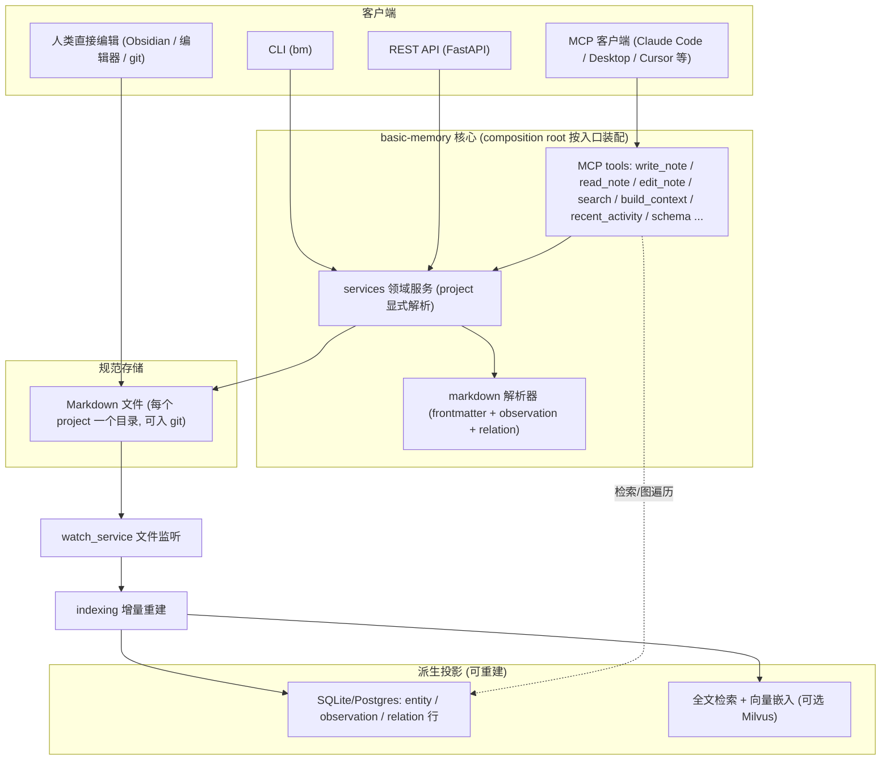

# basic-memory 参考分析

> **状态：Snapshot** | 上游：https://github.com/basicmachines-co/basic-memory | 分析日期：2026-08-06 | 版本边界：当时的公开默认分支，未记录 immutable commit。

## 项目定位

basic-memory 是一个 local-first 的知识管理系统(Python 3.12+ / AGPL-3.0):人和 AI 通过 MCP 读写同一批纯 Markdown 文件,文件是唯一规范存储(source of truth),数据库、全文索引、向量索引全部是可重建的派生投影(projection)。笔记内的 observation 行与 wikilink relation 行被解析为项目级知识图谱,支持 `memory://` 语义寻址与语义检索;另有基于同一 OSS 引擎的 Cloud/Teams 托管形态。

## 架构与核心流程

要点说明:

- **领域模型以 Project 为隔离边界**:`docs/DOMAIN_MODEL.md` 明确"每个 entity/observation/relation/搜索记录恰好属于一个 project";项目级解析"绝不返回其他 project 的实体",跨项目 wikilink 必须显式限定目标项目且"托管调用方需对目标项目单独授权"(Resolution Contracts 一节)。
- **笔记格式即 schema**:`NOTE-FORMAT.md` 定义 observation 行 `- [category] content #tag (context)` 与 relation 行 `- relation_type [[Target]] (context)`;frontmatter 携带 `title/type/tags/permalink/schema`,非标准字段进 `entity_metadata` 并可检索。
- **Markdown 为规范、索引为投影**:投影"必须能从规范 Markdown 状态重建或对账","删除或重建索引不得改动规范内容"(`docs/DOMAIN_MODEL.md`);同步/重建实现在 `src/basic_memory/index/`(watch_service、change 检测)与 `src/basic_memory/indexing/`(batch_indexer、forward_reference_resolution 等约 30 个 runner)。
- **MCP 接口**:`src/basic_memory/mcp/tools/` 提供 write_note、edit_note、search、build_context(基于 `memory://` URL 续接上下文,支持通配符)、recent_activity、schema、project_management 等;每个工具带行为注解(read-only / destructive / idempotent),README 称之为 progressive tool discovery。
- **Picoschema 轻量模板治理**:schema 本身也是一篇 `type: schema` 的笔记,校验模式 warn/strict/off,并支持 `bm schema infer`(按 observation 频率反推 schema)与 `bm schema diff`(漂移检测)(`NOTE-FORMAT.md` Schemas 一节、`src/basic_memory/picoschema/`)。
- **双写权威切换**:本地文件优先(file-first)与云端 DB-first 两条接受路径由 `NoteContent` 记录物化状态(pending/writing/synchronized/failed/blocked),保证"接受的字节"与落盘字节最终一致(`docs/DOMAIN_MODEL.md` NoteContent 一节)。

## 亮点

- **"Markdown 规范存储 + 可重建投影"的完整落地**:与本方案"Git 为准、索引可再生"的双层存储假设几乎同构,且给出了 move/delete/外部变更三种对账流程的清晰不变量(`docs/DOMAIN_MODEL.md`)。
- **人机同写一份文件**:AI 经 MCP 写、人经编辑器/git 写,watch + 增量索引双向收敛,天然兼容 PR 评审、git blame 等治理手段(`src/basic_memory/index/watch_service.py`)。
- **observation/relation 行级语法**成本极低又结构充分:一行一条分类事实,聚合成知识图谱,支持 forward reference(先引用后创建)自动回填(`src/basic_memory/indexing/forward_reference_resolution.py`)。
- **memory:// 语义寻址 + build_context**:permalink 稳定标识配合通配符匹配,让"继续上次话题"变成一次确定性的图遍历而非模糊检索(`src/basic_memory/mcp/tools/build_context.py`)。
- **Picoschema 推断与漂移检测**:从存量笔记统计反推模板、跟踪字段使用率变化,为"记忆库结构治理"提供了低摩擦的演进机制。
- **稳定身份设计**:`external_id` 在移动/改名后不变,`file_path`/`permalink` 按策略演化,标题只是展示元数据——引用不因重组而断裂(`docs/DOMAIN_MODEL.md` Entity 一节)。

## 缺点与局限

- **项目内无细粒度 ACL**:project 是唯一隔离边界,项目内所有笔记对所有可达者一视同仁;没有角色披露矩阵,无法表达"同项目内 DV 工程师只见脱敏结论"这类需求,Teams 形态也是整 workspace 共享。
- **无写入分诊与审核生命周期**:agent 通过 write_note 直接落规范文件即刻生效,没有候选区、人审、衰减、归档概念;`redaction.py` 只对配置项里的密钥做脱敏展示,不覆盖笔记内容本身的敏感信息。
- **面向个人/小团队的记忆形态**:observation 依赖使用者或 agent 主动书写规范格式,没有 hook 级无感捕获链路;多人高频并发写同一项目时依赖文件同步与 NoteContent 冲突检测,缺乏企业级写冲突治理。
- **AGPL-3.0 许可**:若企业在其代码基础上二次开发并对内网提供网络服务,需评估 AGPL 传染条款;直接借鉴其格式约定与领域模型则无此问题。
- **检索无权限过滤概念**:search/build_context 在 project 范围内全量可见,"检索前 ACL 过滤"需要完全自建。

## 企业知识库搭建中的可参考部分

| 可参考机制 | 对应本方案设计点 | 采纳建议 |
|---|---|---|
| Markdown/git 为规范存储,DB/全文/向量索引为可重建投影 | Git 双层存储、索引可再生 | 直接借鉴 |
| 外部文件变更 → 解析 → 整体替换投影的对账流程与不变量 | Git 同步后索引重建、失效不删除(靠 git 历史回溯) | 直接借鉴 |
| Project 隔离 + Resolution Contracts(跨项目引用需对目标项目单独授权) | 四层作用域(Org/Project/User/Runtime)、检索前 ACL 过滤 | 改造后用(其边界止于 project,需下探到角色/条目级) |
| observation 行 `- [category] content #tag (context)` 与 relation 行语法 | 记忆条目 Schema、颗粒度 L0-L3(单行事实≈L1,整篇笔记≈L2/L3) | 改造后用(叠加 scope/密级/生效状态字段) |
| Picoschema 模板 + schema infer/drift 漂移检测 | 角色模板建库引导、记忆库结构治理 | 改造后用 |
| `memory://` permalink 寻址 + build_context 图遍历续接上下文 | Memory Gateway 读路径 MCP 接口 | 直接借鉴 |
| 稳定 external_id 与可变 file_path/permalink 分离 | 记忆条目标识(生命周期状态变更、归档移动不破坏引用) | 直接借鉴 |
| MCP 工具行为注解(read-only/destructive/idempotent) | Gateway MCP 工具设计 | 直接借鉴 |
| NoteContent 的 DB-first 接受 + 物化状态机 | 写路径"候选记忆→审核→生效"落盘的一致性实现 | 仅作对照(本方案以 Git 分支/PR 承担该状态机) |
