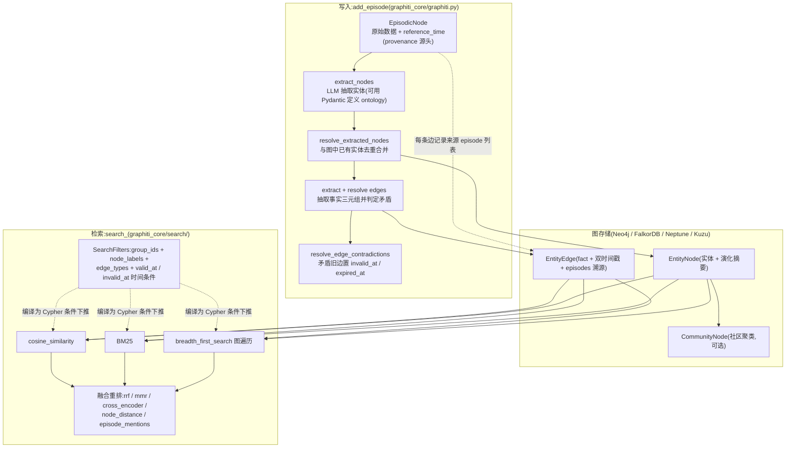

# Graphiti 参考分析

> **状态：Snapshot** | 上游：https://github.com/getzep/graphiti | 分析日期：2026-08-06 | 版本边界：当时的公开默认分支，未记录 immutable commit。

## 项目定位

Graphiti 是 Zep 开源的时序上下文图谱(temporal context graph)引擎:把对话与业务数据作为 episode 持续摄取,由 LLM 抽取实体(节点)与事实(边),每条事实携带有效期窗口——信息变化时旧事实被"失效"而非删除,支持"现在什么为真 / 某时点什么为真"的历史查询。检索融合语义、BM25 与图遍历三路召回,不依赖 LLM 做检索期摘要。附带官方 MCP server,是"自建 Memory Gateway"最接近的开源原型之一。

## 架构与核心流程

事实失效(bi-temporal)流程:

要点说明:

- **双时间轴**:`graphiti_core/edges.py` 的 `EntityEdge` 同时携带事实时间线(`valid_at`/`invalid_at`,事实何时开始/停止为真)与系统时间线(`created_at`/`expired_at`,记录何时入库/被判失效),两轴独立——这正是本方案 Schema 中 `invalid_at 失效不删除(Graphiti 模式)`的出处;
- **矛盾自动失效**:`graphiti_core/utils/maintenance/edge_operations.py` 的 `resolve_edge_contradictions`(约 538 行起)在新边落库时把矛盾旧边 `invalid_at = resolved_edge.valid_at`、`expired_at = utc_now()`,并对 LLM 返回的矛盾索引做越界校验;
- **group_id 分区**:所有 Node/Edge 基类都有 `group_id: str = Field(description='partition of the graph')`(`nodes.py`/`edges.py`),`add_episode` 中 group_id 直接映射为数据库名(`self.driver.clone(database=group_id)`),检索按 `group_ids` 过滤——一个 group 即一个完全隔离的图空间;
- **检索配方化**:`graphiti_core/search/search_config.py` 定义三路召回方法与五种 reranker 的组合矩阵,`search_config_recipes.py` 预置 `COMBINED_HYBRID_SEARCH_RRF/MMR/CROSS_ENCODER` 等配方;`search_filters.py` 把 `node_labels`/`edge_types`/`valid_at` 等过滤条件编译进 Cypher 查询(检索前下推,非事后过滤);
- **全链路溯源**:每条边保存 `episodes: list[str]`(产生它的原始 episode uuid),episode 本身完整保留原文,派生事实可回溯到源数据;
- **MCP server**:`mcp_server/` 提供 add_episode/search 等工具,以 `--group-id` 做命名空间,是"agent 通过 MCP 读写记忆"的可运行参照。

## 亮点

1. **双时间戳模型完整可抄**:事实时间与系统时间分轴,失效置位而非删除,历史可查(`graphiti_core/edges.py`)——本方案 4.2 节 Schema 已直接引用。
2. **矛盾处理有明确算法而非纯 prompt**:LLM 只负责指认矛盾,失效时间的推导、越界索引防御、时间窗不重叠判断都在代码里(`edge_operations.py` 的 `resolve_edge_contradictions`)。
3. **检索融合体系化**:三路召回 × 五种 reranker 可配置组合,RRF 无需调参即可用,cross-encoder 作为精排上限(`search/search_config*.py`)。
4. **过滤条件编译下推**:SearchFilters 生成参数化 Cypher 条件,天然满足"检索前过滤"而非"召回后遮盖"(`search/search_filters.py`)。
5. **prescribed + learned 双模式 ontology**:实体/边类型可用 Pydantic 模型预先声明(`add_episode` 的 `entity_types`/`edge_types` 参数),也可让结构从数据中涌现,适合从"先跑起来"演进到"规范建模"。
6. **episode 溯源设计**:原始数据永久保留为 ground truth,派生事实全部可回链,对"记忆可问责"是现成范式。

## 缺点与局限

1. **基础设施重**:必须运行图数据库(Neo4j/FalkorDB/Neptune),与本方案"Phase 1-2 仅 Postgres+pgvector、图数据库延后到 Phase 3 且需真实需求证明"的选型原则冲突;运维与学习成本对部门级团队偏高。
2. **group_id 是全有或全无的隔离**:分区即独立数据库,没有角色、披露等级或跨分区受控共享——无法表达"下游项目可见 interface 级事实"这类沿依赖链的裁剪披露,多项目共享需在其上另建一层。
3. **写入成本高且要求串行**:每个 episode 要经历实体抽取、去重、边抽取、矛盾判定多次 LLM 调用,官方文档明确要求 episode 逐个 await 顺序摄取(`add_episode` docstring),高并发团队场景需自建队列。
4. **失效判定无人工兜底**:矛盾失效完全由 LLM 指认自动执行,没有候选/审核通道;误判失效会静默改变"当前为真"的答案,企业治理场景必须在外层加审核。
5. **无身份、权限与审计概念**:没有用户体系、ACL 或访问日志,安全边界完全依赖调用方与部署隔离;OSS 版检索性能也需自行调优(README 的 Zep vs Graphiti 对照表自认)。

## 企业知识库搭建中的可参考部分

| 可参考机制 | 对应本方案设计点 | 采纳建议 |
|---|---|---|
| valid_at/invalid_at + created_at/expired_at 双时间轴(`edges.py`) | 4.2 Schema 的 invalid_at 失效不删除、生命周期 Active→Archived | 直接借鉴(字段语义原样采用,落在 Postgres 列上) |
| `resolve_edge_contradictions` 矛盾失效算法(`edge_operations.py`) | Firewall 冲突检测、"被新记忆显式取代"转档 | 改造后用(LLM 指认 + 代码置位保留,但失效动作进审核/通知而非静默执行) |
| 三路召回 + RRF/MMR/cross-encoder 融合配方(`search/`) | memory_recall 排序公式(语义+时效+权威+效用) | 改造后用(Phase 1 取 semantic+FTS+RRF 最小组合,图遍历路留到 Phase 3) |
| SearchFilters 编译下推(`search/search_filters.py`) | 检索前 ACL 过滤、权限条件作为 filter 下推 | 直接借鉴思想(把 disclosure/role/granularity 编成同样的下推条件) |
| episode 溯源(边保存来源 episode 列表) | Schema 的 source.ref、返回内容附来源标注 | 直接借鉴 |
| group_id 图分区 | project_id 命名空间、嵌入按披露等级分索引 | 仅作对照(隔离粒度太粗,本方案需 project × disclosure 二维) |
| Pydantic 自定义 ontology(entity_types/edge_types) | 记忆 type/tag 体系、角色模板 tag 白名单 | 改造后用(用于定义 IC 领域实体如 IP/接口/工艺角) |
| 官方 MCP server(`mcp_server/`) | Memory Gateway 的 MCP 工具面(recall/capture) | 改造后用(工具形态与参数设计参考,权限层完全自建) |
| 实体图谱 + CommunityNode 聚类 | Phase 3 可选的 Graphiti 式关系图谱 | 仅作对照(多跳依赖查询成为真实需求后再评估) |
