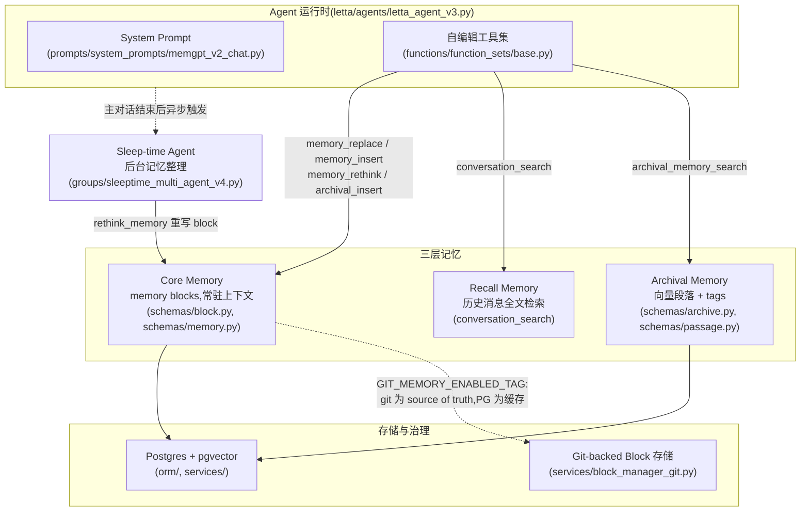

# Letta 参考分析

> **状态：Snapshot** | 上游：https://github.com/letta-ai/letta | 分析日期：2026-08-06 | 版本边界：当时的公开默认分支，未记录 immutable commit。

## 项目定位

Letta(前身 MemGPT)是"有状态 agent"服务端框架:agent 通过自编辑工具自主管理自己的上下文记忆,记忆随 agent 持久化在服务端(FastAPI + Postgres),跨会话不丢失。本仓库是其 legacy 服务器(Letta V1 API),活跃开发已迁至 letta-code,但记忆机制的完整实现均在本仓库。其核心思想:把"记忆管理"本身变成 agent 可调用的工具,让 LLM 像操作系统管理内存分页一样,在有限上下文窗口内换入换出信息。

## 架构与核心流程

要点说明:

- **Memory Block 是核心抽象**:每个 block 有 `label`、`value`、`description`、字符上限 `limit`、`read_only` 标志(`letta/schemas/block.py`);`Memory` 类负责把全部 block 渲染进 system prompt 的 `<memory_blocks>` 区(`letta/schemas/memory.py` 的 `_render_memory_blocks_standard`),即"常驻上下文、有预算约束"的记忆;
- **自编辑工具演进了两代**:早期 `core_memory_append/replace`,新版 `memory_replace / memory_insert / memory_apply_patch / memory_rethink / memory_finish_edits`(`letta/functions/function_sets/base.py`),精确字符串替换 + 行号插入 + patch,设计参照 Anthropic computer-use 的 text editor 工具,大幅降低 LLM 改写出错率;
- **三层记忆分工明确**:core(常驻)/ recall(历史消息可搜)/ archival(向量库 + `tags` 过滤,`Archive` 可在多个 agent 间共享,见 `letta/schemas/archive.py` 注释);system prompt 明确教 agent 何时该查哪层;
- **多 agent 共享 block**:`letta/orm/blocks_agents.py` 是 block 与 agent 的多对多关系表,同一 block 挂到多个 agent 即实现共享记忆,一处更新处处生效;
- **Sleep-time agent**:`letta/groups/sleeptime_multi_agent_v*.py`(已迭代到 v4)在主 agent 回合结束后异步唤起后台 agent,用 `rethink_memory` 工具把 block 整理重写为"有条理、无过时信息"的版本,主对话零延迟感知;
- **Git-backed 记忆存储**:带 `git-memory-enabled` 标签的 agent,block 写操作先落 git(对象存储中的裸仓库,`letta/services/memory_repo/git_operations.py` 直接调 git CLI),再同步 Postgres 作读缓存(`letta/services/block_manager_git.py`),获得完整版本历史;
- **git 记忆的文件映射**:`letta/services/memory_repo/` 下 `block_markdown.py` 把 block 序列化为 markdown、`path_mapping.py` 把 block label 映射为仓库内路径,git-enabled agent 的 system prompt 还会额外渲染 `memory_filesystem` 区(`schemas/memory.py` 的 `ContextWindowOverview`),让 agent 以"文件系统"心智模型操作记忆。

读写路径概述:读路径上,agent 每步都携带 core memory(常驻),需要更多信息时主动调 `conversation_search`(recall)或 `archival_memory_search`(archival);写路径上,agent 用自编辑工具即时改 core memory,或 `archival_memory_insert` 落向量段落,主对话结束后 sleep-time agent 再异步做一轮整理。整个链路无审核、无候选态,写入即生效。

## 亮点

- **"记忆即工具"的自编辑范式**:agent 用统一的编辑工具改写自身记忆,机制简单且与模型无关(`functions/function_sets/base.py`);
- **常驻记忆有硬预算**:block 的 `limit` 字符上限强制记忆精炼,超限必须先 `rethink`,天然对抗上下文爆炸(`constants.py` 的 `CORE_MEMORY_BLOCK_CHAR_LIMIT`);
- **Sleep-time 后台整理**将"写记忆的延迟成本"移出交互路径,与主 agent 通过共享 block 解耦(`groups/sleeptime_multi_agent_v4.py`);
- **Git 作为记忆的 source of truth + DB 作缓存**的双写架构已被其生产验证,证明"git 管版本、DB 管快读"工程上可行(`services/block_manager_git.py`);
- **Archival 记忆带 tags 与可共享 Archive**,检索支持向量 + 标签过滤组合(`schemas/passage.py` 的 `tags` 字段);
- **Identity 模型**支持把外部用户身份(`identifier_key`)与 agent/block 关联,为多租户个性化提供挂点(`schemas/identity.py`)。

## 缺点与局限

- **记忆以 agent 为中心而非以组织知识为中心**:记忆属于某个 agent(或共享给几个 agent),没有"项目/部门知识库"的一等概念,多人多项目场景需要自行在 block/archive 之上搭建作用域模型;
- **写入零治理**:agent 自编辑立即生效,无候选队列、无人审通道、无防火墙式内容分诊,错误或敏感内容直接进入记忆,对 IC 保密场景不可接受;
- **权限颗粒度粗**:只有 organization/user 两级隔离加 block 级 `read_only`,没有角色-披露矩阵、没有检索前 ACL 过滤,无法表达"下游项目只见 interface 级"这类需求;
- **平台绑定重**:agent 必须运行在 Letta 服务器内才能享受其记忆机制,与本方案"Agent 无关、仅依赖 MCP"的目标冲突,只能借其机制不能直接用其平台;
- **删除即删除**:block 改写与 passage 删除不保留失效版本(git-backed 模式除外),缺少 `invalid_at` 式的可追溯失效。

## 企业知识库搭建中的可参考部分

| 可参考机制 | 对应本方案设计点 | 采纳建议 |
|-----------|----------------|---------|
| Git 为 source of truth + Postgres 缓存的双写(`block_manager_git.py`) | 双层存储:Git 项目记忆库 + 动态库存索引;冲突以 Git 为准 | 直接借鉴(其 git CLI + 对象存储的实现可作网关索引同步的参照) |
| Memory block 的 label/description/limit 结构 | 记忆注入预算 ≤2k tokens、颗粒度 L0-L3 裁剪 | 改造后用:limit 用于 recall 返回的分层预算,description 用于告诉 agent 各段记忆用途 |
| 精确编辑工具集(`memory_replace/insert/apply_patch/rethink`) | memory_propose 显式记忆申请、候选记忆的修订 | 改造后用:作为网关 MCP 工具的接口设计范本,但写入改为进 candidate 队列而非立即生效 |
| Sleep-time agent 异步整理 | 写路径后台异步(Firewall 分诊、衰减归档任务) | 改造后用:整理动作保留,但输出走审核通道;衰减/归档 job 可仿其触发模型 |
| core/recall/archival 三层 + system prompt 引导查询时机 | AGENTS.md 引导 agent 调用 memory_recall 的话术 | 直接借鉴其 prompt 写法(`prompts/system_prompts/memgpt_v2_chat.py`) |
| 多 agent 共享 block(`orm/blocks_agents.py`) | Org/Project 作用域记忆被多人多 agent 共享 | 仅作对照:共享靠挂载而非 ACL,本方案必须在网关侧做检索前过滤 |
| Archive tags + 向量检索组合(`schemas/passage.py`) | 动态记忆库 pgvector 检索 + filter 下推 | 直接借鉴:把 scope/disclosure/granularity 作为同类 filter 字段 |
| Identity 关联外部身份(`schemas/identity.py`) | (user, project, role) 三元组令牌 | 仅作对照:其身份只做关联不做鉴权,本方案权限必须在服务端强制 |
