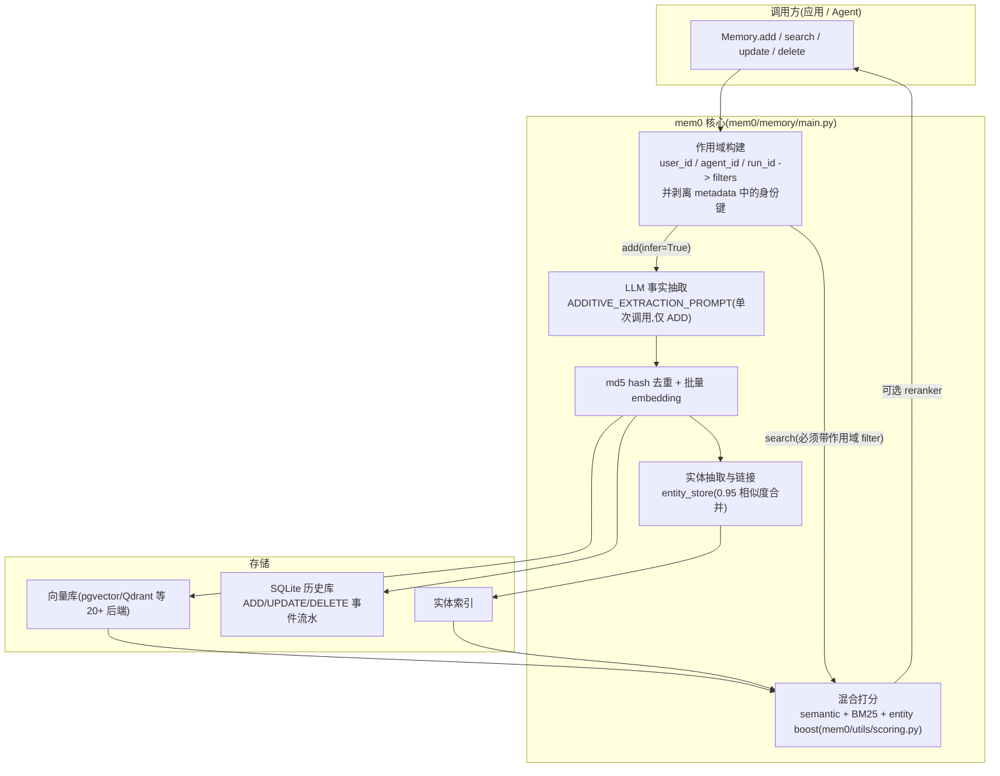
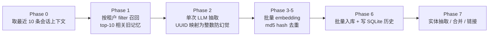

# mem0 参考分析

> **状态：Snapshot** | 上游：https://github.com/mem0ai/mem0 | 分析日期：2026-08-06 | 版本边界：当时的公开默认分支，未记录 immutable commit。

## 项目定位

mem0 是面向个性化 AI 的"记忆层"SDK 与托管平台(YC S24),核心能力是从对话中用 LLM 抽取原子事实、写入向量库,并以 user/agent/run 三种 id 划分租户作用域供检索注入。2026 年 4 月的 v3 算法改为"单次 LLM 调用、只 ADD 不 UPDATE/DELETE"的累加式写入,配合多信号混合检索(语义 + BM25 + 实体匹配),在 LoCoMo/LongMemEval 上大幅提分。开源 SDK 是其托管平台的子集,时间推理等能力仅平台可用(OSS 中 `timestamp`/`reference_date` 参数直接抛错)。

## 架构与核心流程

写入管线(v3,`mem0/memory/main.py` 的 `_add_to_vector_store`,分 7 个 Phase):

要点说明:

- **单次 ADD-only 抽取**:`mem0/configs/prompts.py` 的 `ADDITIVE_EXTRACTION_PROMPT` 要求产出"自包含、带上下文"的事实,依赖旧记忆列表做提示级去重与 `linked_memory_ids` 关联;旧版 `DEFAULT_UPDATE_MEMORY_PROMPT`(ADD/UPDATE/DELETE/NONE 四操作决策)仍保留在同文件中,可作冲突处理逻辑的对照样本;
- **作用域即安全边界**:`add`/`search` 强制要求 `user_id`/`agent_id`/`run_id` 至少其一(`main.py` 的 `ENTITY_PARAMS` 校验);`_strip_identity_keys` 明确禁止通过 metadata 改写租户身份字段(对应上游 issue #4490/#6277/#6655 的越权修复),search 时作用域作为 filter 下推到向量库查询;
- **混合检索融合**:`mem0/utils/scoring.py` 的 `score_and_rank` 将语义分、sigmoid 归一化的 BM25 分(参数随查询词数自适应)与实体命中加成(权重 0.5)相加归一;threshold 只 gate 语义分,防止关键词/实体把低相关结果抬进来;可选 reranker(`mem0/configs/rerankers/`);
- **审计流水**:每条记忆的 ADD/UPDATE/DELETE 事件写入 SQLite 历史库(`mem0/memory/storage.py`,`batch_add_history`),记录 old/new 文本与时间,提供最小溯源能力;
- **过期机制**:`add(expiration_date=...)` 写入过期日,`search`/`get_all` 默认隐藏过期条目,`show_expired=True` 才返回(`main.py` 的 `_normalize_expiration_date`)——是"隐藏而非删除"的简化 TTL;
- **元数据过滤算子**:search filters 支持 `eq/ne/in/nin/gt/lt/contains` 与 `AND/OR/NOT` 组合(`main.py` 的 `_process_metadata_filters`),并翻译成各向量库原生 filter,是"权限条件下推"的现成实现样式。

## 亮点

1. **写入即治理的作用域纪律**:身份字段只能来自实体参数、不能被 metadata 覆写,且检索强制带作用域 filter——与本方案"严禁先召回再遮盖"的原则同构(`mem0/memory/main.py`)。
2. **ADD-only + 双层去重**:LLM 提示级去重(旧记忆作为参照)加 md5 精确去重,把"写入决策"从多操作博弈简化为累加,降低 LLM 误删风险(README "New Memory Algorithm" 一节)。
3. **抽取 prompt 工程成熟**:few-shot 边界示例(闲聊输出空列表)、Observation Date 作唯一时间锚点、attributed_to 归因、"不得从系统消息取事实"等约束,可直接改写为工程知识版(`mem0/configs/prompts.py`)。
4. **混合打分的实现细节可抄**:BM25 sigmoid 归一化参数按查询长度分档、threshold 前置 gate、信号数自适应分母,都是低成本可移植的排序技巧(`mem0/utils/scoring.py`)。
5. **存储后端全面抽象**:20+ 向量库统一在 `VectorStoreFactory` 之后(含 pgvector),敏感配置字段有专门的 redact 清单(`main.py` 的 `_SENSITIVE_FIELDS_EXACT`)。
6. **历史流水表**:所有记忆变更事件落 SQLite,可查每条记忆的演变史(`mem0/memory/storage.py`)。

## 缺点与局限

1. **租户模型是平的**:只有 user/agent/run 三个并列 id,没有组织/项目/角色层级,没有披露等级与跨项目共享概念——多人共享一份项目记忆时要么共用 id(无个体隔离)要么各存一份(无共享),与 IC 部门"(user, project, role) + disclosure"需求差距最大。
2. **写入无审核通道**:LLM 抽取结果直接入库生效,没有候选队列、人审或防火墙位;抽取 prompt 面向个人助理场景(饮食偏好、行程),对"什么值得存"的判断不适配工程决策/踩坑类知识。
3. **ADD-only 回避而非解决冲突**:新旧矛盾事实并存,依赖检索时的时间排序(且时间推理为平台专属),OSS 用户拿不到矛盾失效能力;无 invalid_at 概念,过期只有整条 expiration_date。
4. **开源/商业能力裂缝即供应商绑定风险**:README 明示平台含"proprietary optimizations",OSS 中 temporal 参数直接抛错引导上云;默认开启 telemetry(`mem0/memory/telemetry.py`),企业内网部署需显式关闭。
5. **无权限与审计体系**:filter 是"调用方自觉传对参数",服务端没有身份认证、ACL 校验或访问审计——直连模式下任何持有实例的代码都能查任何 user_id 的记忆。

## 企业知识库搭建中的可参考部分

| 可参考机制 | 对应本方案设计点 | 采纳建议 |
|---|---|---|
| 身份字段与 metadata 隔离、作用域 filter 强制下推(`main.py`) | 检索前 ACL 过滤、"严禁先召回再遮盖" | 直接借鉴(在网关侧实现,filter 由 token 解析而非调用方声明) |
| ADD-only 单次抽取 + hash/提示双层去重 | memory_capture → Firewall 候选管道 | 改造后用(抽取仍单次,但产物进 candidate 队列而非直接生效) |
| `ADDITIVE_EXTRACTION_PROMPT` 的结构(few-shot 空例、时间锚点、归因、去重参照) | Firewall 的"必写/禁写"规则与提炼 prompt | 改造后用(把个人偏好类目替换为决策/纠正/踩坑类目) |
| 旧版 ADD/UPDATE/DELETE/NONE 决策 prompt(`configs/prompts.py`) | Firewall 冲突检测 | 仅作对照(本方案冲突处理走 invalid_at 失效,不做 LLM 直接删除) |
| semantic+BM25+entity 混合打分与归一化(`utils/scoring.py`) | memory_recall 排序(语义相关性项) | 直接借鉴(Phase 1 可先仅 semantic+FTS 两信号) |
| 元数据过滤算子体系(AND/OR/NOT 下推翻译) | disclosure/granularity/scope 作为结构化 filter | 直接借鉴实现样式 |
| expiration_date + show_expired(隐藏不删除) | TTL 按 type 区分、Stale 不参与默认检索 | 改造后用(TTL 到期转 stale 状态而非布尔隐藏) |
| SQLite 历史事件流水(`memory/storage.py`) | 动态库条目溯源(Git 侧已有 blame) | 改造后用(动态库以 Postgres 事件表实现同等审计) |
| pgvector 等后端抽象与配置脱敏清单 | Phase 1-2 Postgres+pgvector 选型 | 仅作对照(自建网关无需多后端抽象) |
