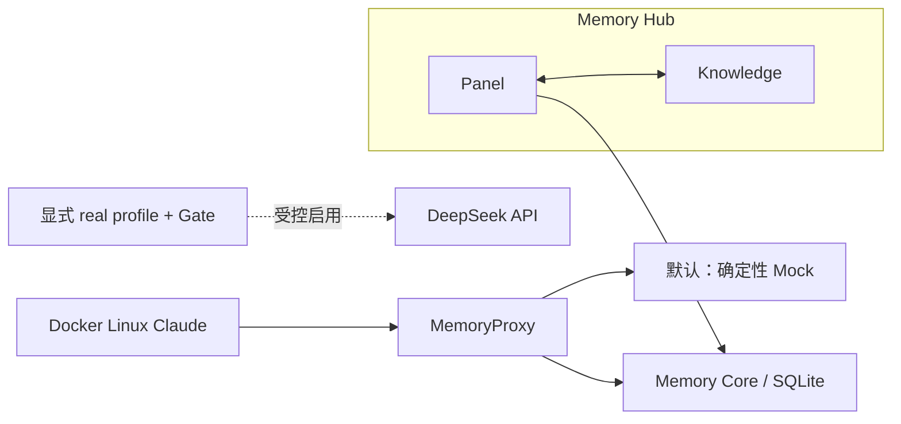

# Docker-first 多客户端记忆实验规格

**状态：** Static（编排与业务流尚未运行）
**范围：** 私有根仓库的本地实验；不替代 TencentDB 公共派生仓库中的独立修复与测试。

## 目标与边界

默认路径提供无付费、确定性 Mock 驱动的 Docker Compose 实验环境，用于验证 MemoryCore、Memory Hub、MemoryProxy、Windows 10 原生 Claude 与一个隔离 Docker Linux Claude 的协作。Codex、WSL、Win11 和局域网验证均后置。真实 DeepSeek 仅能在显式载入 `compose.real.yaml`、启用 `real-claude` profile 且通过付费 Gate 后使用。

> **Docker Compose**：用一组 YAML 文件统一定义、连接和启动多个 Docker 容器的工具。

> **MemoryProxy**：Claude 客户端访问模型和记忆能力的受控入口，负责认证、记忆注入、路由和请求转发。

> **MemoryCore**：保存和处理记忆的核心服务；本实验默认把数据存入本地 SQLite 文件。

> **Memory Hub**：由 Panel 管理界面与 Knowledge 知识服务组成的应用层；Panel 访问 MemoryCore，并与 Knowledge 互通。

> **profile**：Docker Compose 中需要显式选择才会启用的一组可选服务或配置。

> **付费 Gate**：真实模型调用前必须通过的前置检查，包括用户授权、secret 文件、预算和调用轮数限制；任一条件缺失即拒绝运行。

> **SQLite**：把结构化数据保存在单个本地文件中的轻量数据库，本阶段不需要单独部署数据库服务器。

> **Mock**：按固定输入返回固定响应的本地模拟服务，用来验证调用契约而不访问外部模型或产生费用。

默认图表示 MemoryProxy 直接连接 MemoryCore 或 Mock；Memory Hub 是 Panel 与 Knowledge 的组合，Panel 连接 MemoryCore，并与 Knowledge 互通。Windows 10 原生 Claude 与图中的 Docker Linux Claude 都只经 MemoryProxy 使用记忆系统用户 key；真实模型 key 仅由服务端从工作区外 secret 文件读取，绝不进入 Claude 模板、Compose 展开结果、日志或实验报告。当前旧 key 禁止调用。

## 分层与默认行为

| 层 | 文件 | 默认行为 | 当前状态 |
| -- | -- | -- | -- |
| Base | `compose.yaml` | Core、Hub、Proxy、Mock、隔离客户端与测试工具 | Not Run |
| Hardened | `compose.hardened.yaml` | Proxy 持久卷和 loopback 最小端口暴露 | Not Run |
| Real | `compose.real.yaml` | 仅在付费 Gate 通过时接入真实 DeepSeek | Not Run |

`docker compose up` 不得隐式启用 real profile。基础层保持 TencentDB standalone 的 SQLite/Core/Hub/Proxy 语义；不新增 PostgreSQL、独立 vector-db 或 Core Redis。Redis 仅可作为 Proxy 的可选 profile。

> **loopback**：只允许本机访问的网络地址，避免实验端口直接暴露给局域网中的其他设备。

> **vector-db / Redis**：前者是按向量相似度检索数据的专用数据库，后者是常用的内存键值服务；本阶段不把它们设为 Core 的必需组件。

## 客户端与模型契约

- Claude 模板从 `.claude/settings.template.json` 渲染到隔离 `CLAUDE_CONFIG_DIR`；其 `ANTHROPIC_BASE_URL` 必须指向 MemoryProxy，不得直接指向 DeepSeek。
- Proxy 的真实上游为 `https://api.deepseek.com/anthropic/v1`，模型为 `deepseek-v4-pro[1m]`。
- Core/Knowledge 的 OpenAI-compatible 上游为 `https://api.deepseek.com`，模型为 `deepseek-v4-flash`。
- 新脚本和行为修复采用 TDD；YAML/Markdown/JSON 只以解析、构建和链接检查作为静态证据。

> **OpenAI-compatible**：服务接口沿用 OpenAI API 的请求和响应格式，但后端模型可以来自其他供应商。

> **TDD**：测试驱动开发，先写能复现预期行为或缺陷的测试，再实现最小改动使测试通过。

## 可验证证据

每次运行在未跟踪的 `.runtime/runs/<run-id>/` 保存脱敏 manifest 与日志，并在 `docs/reproduction/<run-id>.md` 记录命令、退出码、SHA、时间、环境、预期与实际。当前尚未执行 Docker、网络、镜像构建或业务流验证，因此本规格不宣称任何运行成功。

> **manifest**：描述某次运行的版本、参数、状态和证据位置的结构化清单；脱敏后不包含 key。
