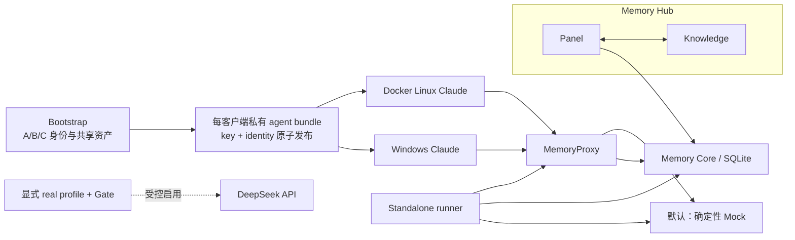

# Docker-first 多客户端记忆实验规格

> **Docker Compose**：用一组 YAML 文件统一定义、连接和启动多个 Docker 容器的工具。

> **Static Passed**：静态测试与 Compose 解析通过；不代表镜像或服务已经运行。

> **Current agent context: Engine Inaccessible**：本轮 Codex 执行环境能运行 Docker client，但无法访问 engine；这不代表用户会话中的 Docker Desktop 一定无法启动。

> **Runtime Not Run**：尚未执行服务启动、业务探针、Claude TUI 或真实模型请求。

> **付费 Gate**：真实模型调用前必须通过的前置检查，包括用户授权、工作区外 secret、host canonical 路径、预算声明和 turn 声明；任一条件缺失即拒绝启动。预算与 turn 只是审批输入和一致性比对，对 Claude、Proxy、Core、Knowledge 都不是请求计数器或硬上限。

**状态：** Static Passed；Current agent context: Engine Inaccessible；本轮 Build Not Run；Runtime Not Run；最近一次有证据的 Build 为 registry network 阶段 Failed
**范围：** 私有根仓库的本地实验；不替代 TencentDB 公共派生仓库中的独立修复与测试。

## 目标与边界

> **Mock**：按固定输入返回固定响应的本地模拟服务，用来验证调用契约而不访问外部模型或产生费用。

> **MemoryProxy**：Claude 客户端访问模型和记忆能力的受控入口，负责认证、记忆注入、路由和请求转发。

> **MemoryCore**：保存和处理记忆的核心服务；本实验默认把数据存入本地 SQLite 文件。

> **Memory Hub**：由 Panel 管理界面与 Knowledge 知识服务组成的应用层；Panel 访问 MemoryCore，并与 Knowledge 互通。

> **profile**：Docker Compose 中需要显式选择才会启用的一组可选服务或配置。

> **SQLite**：把结构化数据保存在单个本地文件中的轻量数据库，本阶段不需要单独部署数据库服务器。

> **L0/L1 oracle**：直接查询 Core 的对话层与原子记忆层来确认写入，不根据模型回答做猜测。

默认路径提供无付费、确定性 Mock 驱动的 Docker Compose 实验环境，用于验证 MemoryCore、Memory Hub、MemoryProxy、Windows 10 原生 Claude 与一个隔离 Docker Linux Claude 的协作。Codex、WSL、Win11 和局域网验证均后置。真实 DeepSeek 仅能在显式载入 `compose.real.yaml`、启用 `real-claude` profile 且通过付费 Gate 后使用。

默认图表示 Bootstrap 先创建隔离身份和共享资产，再由每个客户端私有目录用单个原子发布的 bundle 承载自己的 Memory 用户 key 与身份。Standalone runner 直接查询 Core 的权威 L0/L1 结果，并观察 Mock 的脱敏请求摘要；它不以模型回答或 health check 代替业务证据。Memory Hub 是 Panel 与 Knowledge 的组合，Panel 连接 MemoryCore，并与 Knowledge 互通。真实模型 key 仅由服务端从工作区外 secret 文件读取，绝不进入 Claude 模板、Compose 展开结果、日志或实验报告。当前旧 key 禁止调用。

## 分层与默认行为

> **loopback**：只允许本机访问的网络地址，避免实验端口直接暴露给局域网中的其他设备。

> **vector-db / Redis**：前者是按向量相似度检索数据的专用数据库，后者是常用的内存键值服务；本阶段不把它们设为 Core 的必需组件。

> **Sensitive named volume**：Docker 管理并跨普通 `down` 保留的数据卷；只要其中有 key、token、业务记忆、源码或用户工作文件，就按敏感存储管理。

| 层 | 文件 | 默认行为 | 当前状态 |
| -- | -- | -- | -- |
| Base | `compose.yaml` | Core、Hub、Proxy、Mock、隔离客户端与测试工具 | Static Passed / Runtime Not Run |
| Hardened | `compose.hardened.yaml` | Proxy 持久卷和 loopback 最小端口暴露 | Static Passed / Runtime Not Run |
| Real | `compose.real.yaml` | 仅在付费 Gate 通过时接入真实 DeepSeek | Static Passed / Runtime Not Run |
| Windows | `compose.windows.yaml` | 仅在 host path attestation 通过后生成 agent-a 项目配置 | Static Passed / Runtime Not Run |

`docker compose up` 不得隐式启用 real profile。基础层保持 TencentDB standalone 的 SQLite/Core/Hub/Proxy 语义；不新增 PostgreSQL、独立 vector-db 或 Core Redis。Redis 仅可作为 Proxy 的可选 profile。

## 客户端与模型契约

> **OpenAI-compatible**：服务接口沿用 OpenAI API 的请求和响应格式，但后端模型可以来自其他供应商。

> **TDD**：测试驱动开发，先写能复现预期行为或缺陷的测试，再实现最小改动使测试通过。

- Claude 模板从 `.claude/settings.template.json` 渲染到隔离 `CLAUDE_CONFIG_DIR`；其 `ANTHROPIC_BASE_URL` 必须指向 MemoryProxy，不得直接指向 DeepSeek。
- 每个客户端的 `.memory/agent-bundle.json` 只含当前客户端的 Memory 用户 key，以及 `service_id`、`team_id`、`user_id`、`agent_id`、`task_id`、`session_id`、`display_name` identity。文件以 `0600`、同目录临时文件和单次 rename 发布；settings renderer 一次读取该 bundle，只把 team/agent/task/session 转成四行 custom headers，key 只进入 `ANTHROPIC_AUTH_TOKEN`。
- Settings renderer 还按目标写入固定的 memory tool Proxy URL：Docker 为 `TDAI_MEMORY_PROXY_BASE_URL=http://memory-proxy:8096`，Windows 为 `http://127.0.0.1:8096`；拒绝模板预设外部 URL。Public fork 消费该运行时字段的最终实现尚未更新根 gitlink，所以当前仍是 Expected Blocked / Runtime Not Run。
- Memory bridge 每次请求显式携带 `x-tdai-agent-source: claude-code`、当前 session 与用户 bearer；不得从 raw session 字符串猜身份。该契约等待 public fork 最终实现后进行 runtime 验证。
- Proxy 的真实上游为 `https://api.deepseek.com/anthropic/v1`，模型为 `deepseek-v4-pro[1m]`。
- Core/Knowledge 的 OpenAI-compatible 上游为 `https://api.deepseek.com`，模型为 `deepseek-v4-flash`。
- Real Compose 继续把默认网络设为 `internal`；只有 Proxy、Core、Hub 额外加入可出网的 `egress-net`。Claude、bootstrap、runner 与各 Gate 不能直接访问外网。
- Real 配置分为不含 DeepSeek key 的 `real-core-config` 与 Proxy 私有的 `proxy-private-config`。后者只挂给 `real-config-init` 和 Proxy；Core/Hub 通过 Compose secret 读取 key，bootstrap/runner/Claude 不可间接读取 Proxy key。
- `runtime-config`/`real-core-config`、`bootstrap-state`、`claude-home-a/b/c` 与 `proxy-private-config` 持有 token 或 key；`core-data`、`hub-data`、`proxy-data` 与 `claude-workspace-a/b/c` 持有业务、会话、源码或用户数据。普通 `down`、宿主 secret 删除或轮换不会清除这些 sensitive named volumes。每个 run 必须使用唯一 Compose project；证据归档后只对该项目执行 `down -v --remove-orphans`，禁止全局 prune。
- 新脚本和行为修复采用 TDD；YAML/Markdown/JSON 只以解析、构建和链接检查作为静态证据。

## 可验证证据

> **manifest**：描述某次运行的版本、参数、状态和证据位置的结构化清单；脱敏后不包含 key。

每次运行在未跟踪的 `.runtime/runs/<run-id>/` 保存脱敏 manifest、runner JSON 与日志，并在 `docs/reproduction/<run-id>.md` 记录命令、退出码、SHA、时间、环境、预期与实际。Bootstrap 的 manifest 和 runner 证据都用同目录 `0600` 临时文件加 rename 发布；失败不留下被误认为完成的目标文件。Runner 结果只允许 status、count、latency 和不由 key 派生的证据 hash。Mock 对 header 与 body 只保存 `sensitive_value_seen`、`unexpected_credential_seen`、`memory_user_credential_seen` 三个布尔结果，不保存 key hash、前缀、长度、请求内容或 header 值；任何诱饵、Memory 用户 key 形态或内部 header 到达模型上游都会 fail-closed。当前 Compose 静态解析已通过；本轮因当前 agent context 无法访问 engine 而没有构建，最近一次有证据的构建受 Docker Hub registry 网络阻塞；`docker compose up`、业务流、故障恢复与 Claude 交互仍未运行，因此本规格不宣称任何运行成功。

Runner 的拒绝跟随链接检查发生在容器内目标路径。Docker 会先在宿主解析 `EVIDENCE_DIR` 再完成目录挂载，所以基础 Mock 运行仍信任本地账户和人工确认的宿主证据目录；该静态检查不能证明宿主 junction/symlink 已被阻止。

根 settings 静态契约已经为 Docker 与 Windows 分别生成容器内地址和 loopback 地址，解决单一烘焙 URL 的配置问题；但 public fork 使用 `TDAI_MEMORY_PROXY_BASE_URL` 的最终 commit 尚未更新根 gitlink。在此之前，Windows memory tool UX 仍标记为 Expected Blocked / Runtime Not Run，不把 renderer 测试等同于真实工具可用。
