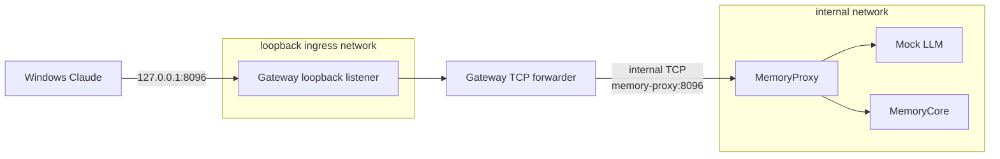

# Windows 宿主端口桥接设计

> **Loopback Gateway**：只在本机 `127.0.0.1` 接收 TCP 连接，并把字节原样转发到 Docker internal 网络中 MemoryProxy 的轻量容器；它不解析请求内容，也不保存凭证。

> **Internal network**：Docker 中只允许同一隔离网络内服务互通的网络。本项目用它阻止 Claude、Proxy、Core 和 Mock 默认访问宿主或公网。

> **TCP**：应用请求底层使用的可靠字节流协议。Gateway 只处理 TCP 连接，不理解 HTTP、Anthropic 或 Memory 协议。

> **Fail-closed**：上游不可达、参数非法或监听失败时，Gateway 直接拒绝或关闭连接，不尝试改用其他地址继续运行。

- 日期：2026-08-10
- 状态：方案 A 已获用户批准，等待书面规格复核后实施
- 触发运行：`windows-mock-20260810-093140-a664249f`
- 根仓库基线：`dd9ccc8`

## 问题与证据

Windows Mock 项目的 11 项 Mock Gate、12 项 Standalone Gate 和 agent-a 配置准备均已通过，但宿主 `127.0.0.1:8096` 没有生效。Compose 展开与容器 `HostConfig.PortBindings` 都声明了该端口，容器的生效端口表却为空；Docker Desktop 日志同时记录 internal 网络中的容器“没有可用于端口转发的容器 IP”。普通 bridge 对照使用同一 Mock 镜像并监听 `0.0.0.0` 时，宿主 `curl --noproxy '*'` 返回 HTTP 200。

因此，问题不在 MemoryProxy 的监听地址或 Claude 配置，而在“直接从 internal 网络发布宿主端口”这一编排假设。现有 `compose.hardened.yaml` 的静态测试没有覆盖真实 Windows 宿主端口。

## 目标与非目标

目标：

- Windows Claude 只能通过 `127.0.0.1:8096` 访问 MemoryProxy；
- MemoryProxy、MemoryCore、Mock 和 Claude 继续只连接 internal 网络；
- Gateway 不挂载 volume，不接收环境凭证，不写请求日志；
- 复用现有 `refine-memory-integration-tools:local` 镜像和 Node.js 标准库，不新增包、镜像或宿主服务；
- Windows headless 请求返回 `mock text`，且 Core L0 owner oracle 与列明的上游泄漏检查通过。

非目标：

- 不为 LAN、Win11、WSL Claude 或真实 DeepSeek 开放入口；
- 不增加 TLS。该入口固定绑定本机 loopback，LAN 前另行设计 TLS 与访问控制；
- 不让 Gateway 解释 HTTP、限流、缓存、认证或记忆协议；
- 不修改 public fork。修复只属于私有根仓库的 Docker 编排。

## 方案比较

| 方案 | 改动 | 安全边界 | 结论 |
| -- | -- | -- | -- |
| A：独立 Loopback Gateway | 一个标准库 TCP 转发器和一个 Compose service | Proxy 保持 internal；只有无持久凭证的 Gateway 接触非 internal 网络 | 采用 |
| B：Proxy 直接加入普通 bridge | 仅改 Compose networks | Proxy 获得额外外网出口，扩大持 Memory 用户数据服务的攻击面 | 拒绝 |
| C：Windows/WSL 宿主端口转发 | 修改宿主服务、路由或管理员配置 | 依赖机器状态，难以由 Compose 重建，跨平台差 | 拒绝 |

## 架构

非技术说明：Windows 只看见本机端口。Gateway 像一根只连接两个固定插口的网线，把请求交给隔离网络中的 Proxy；持有配置和数据的 Proxy 不加入可对外通信的网络。

## 组件与接口

新增 `tests/integration/tools/tcp-forward.mjs`：

- 固定从环境读取 `FORWARD_LISTEN_HOST`、`FORWARD_LISTEN_PORT`、`FORWARD_TARGET_HOST` 和 `FORWARD_TARGET_PORT`；
- 只接受 `0.0.0.0` 作为容器监听地址、`memory-proxy` 作为目标主机，以及合法的 1–65535 端口；
- 使用 Node.js `node:net` 建立双向 pipe；
- 任一方向发生 error 或 close 时销毁成对 socket；
- 启动成功只输出不含地址、请求或凭证的固定 ready JSON；
- 不输出 payload、header、连接目标、错误对象或稳定凭证派生值。

`compose.hardened.yaml` 新增 `loopback-gateway`：

- 使用现有 integration tools 镜像；
- `user: "10001:10001"`、`read_only: true`、`cap_drop: [ALL]`、`no-new-privileges:true`、`init: true`；
- 不声明 `environment` 中的 key、`secrets` 或 `volumes`；
- 同时连接 `default` internal 网络和新的 `loopback-ingress` 网络；
- 只有该 service 发布 `127.0.0.1:8096:8096`；MemoryProxy 不再声明宿主端口；
- 等待 MemoryProxy healthy 后启动，并以本地 TCP connect 检查自身监听。

`loopback-ingress` 必须是非 internal bridge，否则 Docker Desktop 不会分配宿主端口转发目标。该网络会使 Gateway 具备网络出口，这是已知剩余风险；Gateway 无持久 secret、无业务 volume、无命令执行接口，且代码只连接固定的 `memory-proxy:8096`。真实 DeepSeek、LAN 和生产部署不得复用这一结论代替更完整的网络策略。

## 错误处理

- 目标 Proxy 不可达：关闭客户端连接，不回退到其他 host 或端口；
- 客户端提前断开：立即销毁上游 socket；
- Gateway 监听失败：进程非零退出，Compose health 不得变为 healthy；
- Proxy 重启：已有连接失败，新连接只在 Proxy 恢复后成功；本轮只验证启动路径，重启恢复另属可靠性 Gate；
- 任何 payload、认证 header 或底层异常都不得写入 stdout/stderr。

## TDD 与验证

1. 先扩展 Compose 契约测试，要求 hardened 层由独立 Gateway 发布端口、Proxy 仍只在 internal 网络、Gateway 无 secret/volume/capability；在实现前运行并得到预期 RED。
2. 先新增转发器行为测试，使用本机临时 TCP echo server 验证双向字节流、非法配置和上游失败；模块不存在时得到预期 RED。
3. 写最小 `node:net` 实现和 Compose service，使聚焦测试 GREEN。
4. 运行完整根 Node suite、四组 Compose `config --quiet`、Bash/LF/UTF-8/secret/diff 检查。
5. 保留现有成功项目与失败项目不变；创建新的唯一 Windows Mock run，重新执行两级 Gate。
6. 宿主使用 `curl.exe --noproxy '*' http://127.0.0.1:8096/health` 验证真实端口，而不只检查 `docker port`。
7. 生成 run-specific、工作区外 Windows Claude config；确认全局 `.claude/settings.json` 元数据未改变。
8. Windows Claude `2.1.207` headless 必须返回 `mock text`；Mock Anthropic 观察增加至少 1、列明泄漏检查为 0、Core L0 提示命中至少 1 且 owner mismatch 为 0。
9. 最后由用户启动 Windows TUI 并确认界面与文本结果；streaming、tool use、thinking 和真实 DeepSeek继续保持 Not Run。

## 验收与提交边界

通过条件：

- 聚焦测试在旧实现 RED、修复后 GREEN；完整静态 Gate 通过；
- `docker inspect` 显示 MemoryProxy 没有宿主 PortBindings，Gateway 仅绑定 `127.0.0.1:8096`；
- Gateway 容器无 credential environment、secret、volume 或额外 Linux capability；
- Windows 宿主 health、Claude headless、Mock 观察和 Core L0 oracle 同时通过；
- 新运行报告明确 Gateway 的非 internal 网络剩余风险，不把本机 Mock 结果外推为企业安全通过。

提交拆分：

1. 独立设计规格；
2. TCP Gateway 测试与实现；
3. Compose 编排、静态测试与操作文档；
4. Windows runtime 证据与企业评估更新。

禁止 push、修改 remote、删除 volumes、运行真实 DeepSeek 或改动 public fork，除非用户另行授权。
