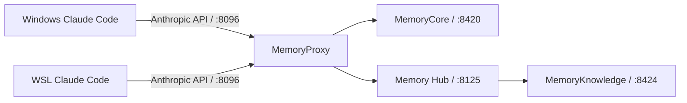

# TencentDB Agent Memory 本机复现规格

- **状态：** 已批准，等待用户确认 Windows Claude Code 启动入口后执行
- **日期：** 2026-08-08

## 目标

在不修改 TencentDB 源码的前提下，用一套本机 MemoryCore、Memory Hub、MemoryKnowledge 和 MemoryProxy，验证 Windows Claude Code 与 WSL Claude Code 能否作为两个独立 Agent 共享受控记忆，并留下可重复的运行证据。

## 已确认基线

- 根仓库：`3b4ae30`，分支 `main`，工作区干净。
- TencentDB fork：`fe3230f`，分支 `feat/server_team`，源码工作区干净。
- Windows Claude Code：`2.1.207`，启动器为 `C:\Users\ustcw\AppData\Roaming\npm\claude.cmd`。
- Windows 用户级 Claude 配置存在；本轮不读取、不修改其中的密钥。
- WSL：`Ubuntu-24.04` / WSL 2；当前启动失败，错误 `0x800705aa`（系统资源不足）。
- Docker Desktop 与 Docker CLI 未安装在常见 Windows 路径，`docker` 不在 PATH。
- `deploy/global-images/.env` 与 `.admin-key` 尚不存在，且均被 submodule 的 `.gitignore` 排除。

## 范围

### 本阶段包含

1. 用户确认 Windows Claude Code 可从根仓库进入正常交互会话。
2. 恢复 WSL 可启动状态，并确认 WSL 内 Claude Code 的安装状态。
3. 经用户确认后安装或指定 Docker 运行时。
4. 使用上游 `deploy/global-images` 脚本原样部署，不修改 fork 源码。
5. 创建一个业务用户、一个 Team、两个 Claude Agent 和一个共享 Task。
6. 分别验证 Windows/WSL Claude Code 的会话绑定、L0 回流、L1/L2/L3 处理、共享资产读取和重启持久化。
7. 产出脱敏复现报告。

### 本阶段不包含

- 不接入 Windows Codex；Codex 在下一阶段先接现有只读 `MemoryKnowledge` MCP。
- 不增加 PowerShell 安装脚本；只有确认 Windows 失败根因后才修改 fork。
- 不执行企业权限、Memory Firewall、Git Memory PR 或价值反馈改造。
- 不提交 `.env`、`.admin-key`、业务用户 key、LLM key 或完整原始对话。

## 架构与身份

服务运行在同一 Docker 环境中，Windows 和 WSL 通过宿主机可达地址访问同一个 `MemoryProxy`。

试点身份固定为：

| 类型 | 名称 | 用途 |
|---|---|---|
| 业务用户 | 当前操作者创建的 normal user | 与 admin 运维身份隔离 |
| Team | `refine-memory-lab` | 共享资产边界 |
| Agent | `windows-claude` | Windows Claude Code 归属 |
| Agent | `wsl-claude` | WSL Claude Code 归属 |
| Task | `phase0-cross-agent-smoke` | 两个 Agent 的共同验证任务 |

两个客户端使用同一业务用户和 Team，但选择不同 Agent；这样既能测试共享，又保留来源归属。

## 数据流与测试场景

1. Windows Claude Code 在共享 Task 中完成一个小型、无敏感信息的真实任务，产生唯一标记 `WINDOWS_FACT_20260808`。
2. 确认 L0 已记录，并等待 pipeline worker 完成至少一次 L1/L2 处理。
3. WSL Claude Code 进入同一 Team/Task、选择 `wsl-claude`，检索或使用 Windows 侧产生的共享资产。
4. WSL 侧产生第二个唯一标记 `WSL_FACT_20260808`。
5. Windows 侧新建会话，验证能够恢复允许共享的 WSL 侧信息。
6. 停止并重新启动容器，重复读取两个标记，验证持久化。

标记只用于本次实验，不包含密钥、个人隐私或公司项目内容。

## 失败处理

- Windows Claude Code 无法正常启动：停止，不进入 Proxy 配置。
- WSL 仍返回 `0x800705aa`：记录诊断，等待用户恢复系统资源或重启；不自动重启 Windows 服务。
- Docker 不可用：请求用户确认安装方案；不自行安装依赖。
- `verify.sh --skip-llm` 失败：修复本地环境或配置，不启动容器。
- LLM 通路验证失败：保留脱敏状态码和端点类型，不记录 key。
- 任一 Claude 客户端未完成会话绑定：先记录真实请求/响应形状，再决定是否在 fork 建修复分支。

## 产物

实际执行后创建：

- `docs/reproduction/2026-08-08-tencentdb-local-baseline.md`

报告必须包含环境版本、源码 SHA、镜像 digest、脱敏配置字段、执行命令、健康检查、两客户端结果、失败证据和结论。原始密钥与完整对话不得进入 Git。

## 验收标准

- Windows 和 WSL 均能访问同一组服务端口。
- 两个 Claude Code 会话分别绑定正确 Agent，且会话不会误复用。
- 至少一条 L0 记录和一次 pipeline worker 完成事件有运行证据。
- 两个唯一标记按系统当前权限模型实现预期共享。
- 容器重启后数据仍存在。
- 根仓库和 submodule 无意外源码修改，报告通过敏感值扫描和 Markdown 链接检查。
